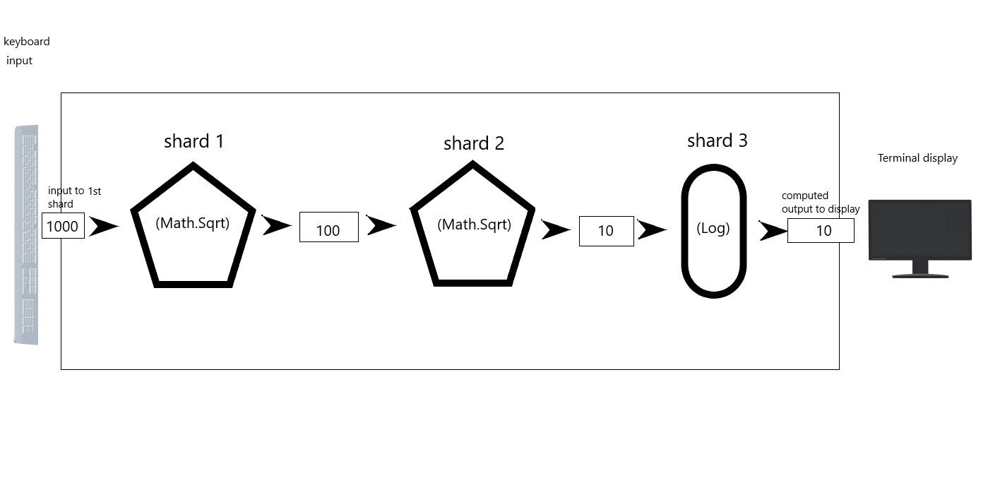

# Elements of Shards

In this section we look at how a Shards program is parsed and discuss the basic building blocks of the language.

## Shards core

The core shards language is a collection of all the existing [shards](https://docs.fragcolor.xyz/shards/), and a interconnected sequence of these shards gives us a valid Shards script (or source program).

### The shards

Assume we want to write a Shards script to compute the square root of the square root of a number and print the result to the terminal screen. 

Since we already have real shards that can do these, let's use them for illustration ([`(Math.Sqrt)`](https://docs.fragcolor.xyz/shards/Math/Sqrt/) can compute square root, [`(Log)`](https://docs.fragcolor.xyz/shards/General/Log/) can print to the terminal).

Figure 4




If place the 


## Mal/EDN layer
[appendix D - Mal/EDN](#appendix-d-maledn)

### Compose with `(Schedule)`

### Execute with `(Run)`

## Functions and shards

### Macros

`(def)`
`(defshard)`
`(defwire)`
`(defloop)`
`(defmesh)`

### Shards

### Wires

### Meshes

In Shards, the chunks of transformation logic (that the computer needs to transform data) come in two flavors:

* [function](https://docs.fragcolor.xyz/functions/)
* [shard](https://docs.fragcolor.xyz/shards/)

!!! note
    1. Shards is the programming language that we are discussing here whereas a *shard* is (written with a lower-case *'s'*) is an inbuilt utility that allows you to transform data.
    2. Shards includes over 500 shards and around 100 functions allowing you to manipulate data and compose logic the way that you want.
    3. With a few exceptions, all shard names use [Pascal case](https://en.wiktionary.org/wiki/Pascal_case) (like `(ChaChaPoly)`).

To get an idea of what functions and shards look like let's look at a function and a shard that do the same thing - i.e., print some data to the terminal screen.

??? note "How to run Shards sample code from this primer"
    1. If you're new to programming you should [install VS Code and set it up](#-code-editor). 
    2. The Shards [web sandbox](https://learn.fragcolor.xyz/sandbox) is coming soon but for now please [build Shards](https://docs.fragcolor.xyz/contribute/code/building-shards/) on your machine to work through the examples in this guide.
    3. Once the `shards.exe` is built, copy paste the code sample you want to run from this guide into a new file with an extension `edn` (that's the Shards script file extension for now). This is your Shards script file. 
    4. Place your Shards script (say`abc.edn`) into the`/build` folder and from there run the script `./shards <abc.edn>` to execute your Shards script.
    5. You just need to build the `shards.exe` once. After that you can change the code in your Shards script (or create a new Shards script) and run that script with the `./shards...` command
    6. If you're using [VS Code](https://code.visualstudio.com/) as your editor you can install the [code-runner plugin](https://marketplace.visualstudio.com/items?itemName=formulahendry.code-runner) and set up your VS Code to execute your Shards script on the click of the `Run` button (see [this](https://docs.fragcolor.xyz/contribute/code/building-shards/#verify-build-and-run) for details).


`(println)` is a function that prints the data (that you passed to it in double quotes) to the terminal screen (you can copy and run *Code example 1* as explained in the note above):

*Code example 1*

=== "EDN"

    ```{.clojure .annotate linenums="1"}
    (println "I'm a function!")
    ```
    
=== "Result"

    ```
    I'm a function!
    ```

While `(Msg)` is a shard that does the exact same thing (we haven't yet introduced wires and meshes so *Code example 2* won't run standalone; to run the full code sample see the note after the code fragment):

*Code example 2*

=== "EDN"

    ```{.clojure .annotate linenums="1"}
    (Msg "I'm a shard!")
    ```
    
=== "Result"

    ```
    I'm a shard!
    ```


??? Full `(Msg)` code sample
    === "EDN"

        ```{.clojure .annotate linenums="1"}
        (defmesh mesh)
        (defwire wire
            (Msg "I'm a shard!")
            )
        (schedule mesh wire)
        (run mesh)
        ```
        
    === "Result"

        ```
        [info] [2022-08-15 13:49:15.552] [T-11856] [logging.cpp::98] [wire] I'm a shard!
        ```


As you can see:

- The function name is in kebab case
- The shard name is in Pascal case
- Both the function and shard take an input (the data passed to them in double quotes) and transform it (i.e., print it to the terminal screen)

### The duality

The function `(prn)` and the shard `(Msg)` seem to be doing 

Now let's run some Shards code!


Since functions are native entities, they can be run as they are.

[`(println)`](https://docs.fragcolor.xyz/functions/standard-output/#println) is a function that prints to the terminal whatever you pass to it.

In the following example, let's pass the text "Hello World" to it and run the code (copy-paste and run this code in your editor).

*Code example 1*

=== "EDN"

    ```{.clojure .annotate linenums="1"}
    (println "Hello World")
    ```
    
=== "Result"

    ```
    Hello World 
    ```

Now let's try the same with the shard [`(Msg)`](https://docs.fragcolor.xyz/shards/General/Msg/), which is similar in functionality to the function `(println)`.

*Code example 2*

=== "EDN"

    ```{.clojure .annotate linenums="1"}
    (Msg "Hello World")
    ```
    
=== "Result"

    ```
    ```

But this didn't work! There is no output.

This is because, unlike a function, a shard needs additional software context to run. These software constructs are called *wires* and *meshes*.

Now, let's execute `(Msg)` with the required wire and mesh context, and you should see the output appear.

*Code example 3*

=== "EDN"

    ```{.clojure .annotate linenums="1"}
    (defmesh root)
    (defwire mywire
        (Msg "Hello World")
        )
    (schedule root mywire)
    (run root)
    ```
    
=== "Result"

    ```
    [info] [2022-07-21 16:16:15.648] [T-29488] [logging.cpp::98] [mywire] Hello World
    ```

## Shards, wires, and meshes

To understand why the last code example worked, let's see what's needed to execute a shard:

* You need to first queue it on a *wire* (a software construct that can hold a sequence of shards) - In the code above function [`(defwire)`](https://docs.fragcolor.xyz/functions/macros/#defwire) creates a wire by the name 'mywire' at line no. 2. This wire is enclosed in a set of parentheses (line no. 2 and 4) and houses the shard `(Msg)` at line no. 3.
* Next, you need to schedule the wire on a *mesh* (a software construct that can hold many wires for execution) - A mesh named 'root' is created by function [`(defmesh)`](https://docs.fragcolor.xyz/functions/macros/#defmesh) at line no. 1. And then the function [`(schedule)`](https://docs.fragcolor.xyz/functions/misc/#schedule) schedules wire 'mywire' on mesh 'root' for execution.
* Once all wires are scheduled on a mesh, you need to *run* the mesh - The function [`(run)`](https://docs.fragcolor.xyz/functions/misc/#run) invokes the mesh 'root' for execution at line no. 6. This invocation leads to the execution of the wires scheduled on that mesh, and hence the execution of the shards contained within each wire

Of course, in the above example, we have just one shard and one wire - but each wire can have multiple shards (sequence of shards that execute in order), and each mesh may have multiple wires scheduled on it for execution.

From a programming perspective: 

* Shards are logic blocks that compose the wire
* A wire is a coroutine or a stateful smart function that is made up of a sequence of shards and can persist its memory across wire execution/iterations
* A mesh is a thread scheduler that schedules and executes the wire coroutines

From a layman's perspective, this process of writing and executing shards via the wire/mesh context is similar to you stringing a necklace and then counting its beads (like how prayer beads on a rosary are counted).

Let's break down this analogy into steps:

* **Step 1**. Collect a few beads - Write out a sequence of shards
* **Step 2**. Find a thread and string the beads onto it - Define a wire and put the shards into it
* **Step 3**. Hold the necklace in your hand - Define a mesh and schedule the wire on it
* **Step 4**. Start counting the beads one by one (the necklace moving between your fingers with every count) - Run the mesh. This will start executing the shards in the scheduled wire one by one (as per the sequence of the shards in the wire)

The analogy doesn't end here!

What we just described was a looped wire (whole necklace). Such a wire will be executed continuously in a loop by its mesh (just like you can keep counting the beads on a necklace over and over) till its control parameters tell it to stop. Looped wires are defined by function `(defloop)`

Break this necklace (but don't spill the beads!) and lay it down end-to-end and you have a non-looped wire. Such a wire will be executed only once by its mesh (irrespective of the mesh's control parameters). Non-looped wires are defined by function `(defwire)`.

!!! note
    Pick up two necklaces in one hand and start counting the beads on both - and you have the case of a single mesh running multiple wires! Such wires can be independently executed and/or paused and can even share state (memory variables).

The following code is an example of a single non-looped wire ('mywire') scheduled and then executed on a mesh ('root').

*Code example 4*

=== "EDN"

    ```{.clojure .annotate linenums="1"}
    (defmesh root)
    (defwire mywire
        (Msg "Hello World")
        )
    (schedule root mywire)
    (run root)
    ```
    
=== "Result"

    ```
    [info] [2022-07-21 16:16:15.648] [T-29488] [logging.cpp::98] [mywire] Hello World
    ```

## Loops and non-loops

'mywire' in *Code example 4* is a non-looped wire and that's the reason `(run)` doesn't need any other parameters other than just the name of the mesh to run (which is 'root' in this case). Since this is a non-looped wire example, the wire executes only once and that's why you see just one run of the output.

Let's spice up things a bit - change the `defwire` function in *Code example 4* to `defloop` and run the code again.

*Code example 5*

=== "EDN"

    ```{.clojure .annotate linenums="1"}
    (defmesh root)
    (defloop mywire
        (Msg "Hello World")
        )
    (schedule root mywire)
    (run root)
    ```
    
=== "Result"

    ```
    [info] [2022-07-21 22:00:37.309] [T-15968] [logging.cpp::98] [mywire] Hello World
    [info] [2022-07-21 22:00:37.312] [T-15968] [logging.cpp::98] [mywire] Hello World
    [info] [2022-07-21 22:00:37.314] [T-15968] [logging.cpp::98] [mywire] Hello World
    [info] [2022-07-21 22:00:37.315] [T-15968] [logging.cpp::98] [mywire] Hello World
    [info] [2022-07-21 22:00:37.317] [T-15968] [logging.cpp::98] [mywire] Hello World
    [info] [2022-07-21 22:00:37.319] [T-15968] [logging.cpp::98] [mywire] Hello World
    [info] [2022-07-21 22:00:37.320] [T-15968] [logging.cpp::98] [mywire] Hello World
    [info] [2022-07-21 22:00:37.322] [T-15968] [logging.cpp::98] [mywire] Hello World
    .
    .
    .
    ```

You'll see the wire executing continuously in a loop (go to  your terminal and hit the `Ctrl+C` key on Windows to break the loop; `command + .` if you're on a Mac).
This is because we defined 'mywire' as a looped wire and hence it now needs to be controlled via some extra parameters in the `(run)` command.

To handle looped wires `(run)` takes two more parameters that are placed after the name of the mesh. The first parameter specifies the time (in seconds) between wire iterations and the second parameter sepcifies the maximum number of runs allowed for the wire.

So `(run root 1 3)` will execute the wire three times with an interval of 1 second between iterations, as illustrated in the following code example.

*Code example 6*

=== "EDN"

    ```{.clojure .annotate linenums="1"}
    (defmesh root)
    (defloop mywire
        (Msg "Hello World")
        )
    (schedule root mywire)
    (run root 1 3)
    ```
    
=== "Result"

    ```
    [info] [2022-07-21 22:11:55.167] [T-14432] [logging.cpp::98] [mywire] Hello World
    [info] [2022-07-21 22:11:56.174] [T-14432] [logging.cpp::98] [mywire] Hello World
    [info] [2022-07-21 22:11:57.181] [T-14432] [logging.cpp::98] [mywire] Hello World
    ```

The iteration control parameters for `(run)` don't affect the non-looped (`(defwire)`) wires.

??? note Game loops
    (`defloop`) can be used to easily implment game loops (i.e.) game code that needs to run periodically

Before we end this section let's take two examples of multiple wires:

- *Code example 7* has two non-looped wires
- *Code example 8* has one looped and one non-looped wire

!!! note
    Try to anticipate the output of these programs and then confirm your assumptions by running the program in your terminal. Change the code to play around with the order of the shards, the wire schedules, and `run` control parameters. Try this out with every example code in this primer. This exercise will help you build your intuition about how Shards works.

*Code example 7*

=== "EDN"

    ```{.clojure .annotate linenums="1"}
    (defmesh root)

    (defwire mywire1
        (Msg "Hello World")
        (Msg "Bye World")
        )

    (defwire mywire2
        (Msg "Hello Universe")
        (Msg "Bye Universe")
        )

    (schedule root mywire1)
    (schedule root mywire2)
    (run root)
    ```
    
=== "Result"

    ```
    [info] [2022-07-21 22:16:58.691] [T-11720] [logging.cpp::98] [mywire1] Hello World
    [info] [2022-07-21 22:16:58.703] [T-11720] [logging.cpp::98] [mywire1] Bye World
    [info] [2022-07-21 22:16:58.705] [T-11720] [logging.cpp::98] [mywire2] Hello Universe
    [info] [2022-07-21 22:16:58.706] [T-11720] [logging.cpp::98] [mywire2] Bye Universe
    ```

*Code example 7*

=== "EDN"

    ```{.clojure .annotate linenums="1"}
    (defmesh root)

    (defwire nonloopedwire
        (Msg "Hello World, just once!"))

    (defloop loopedwire
        (Msg "Hello World, on repeat!"))

    (schedule root nonloopedwire)
    (schedule root loopedwire)
    (run root)
    ```
    
=== "Result"

    ```
    [info] [2022-07-28 19:16:57.985] [T-40588] [logging.cpp::98] [nonloopedwire] Hello World, just once!
    [info] [2022-07-28 19:16:57.995] [T-40588] [logging.cpp::98] [loopedwire] Hello World, on repeat!
    [info] [2022-07-28 19:16:58.993] [T-40588] [logging.cpp::98] [loopedwire] Hello World, on repeat!
    [info] [2022-07-28 19:16:59.989] [T-40588] [logging.cpp::98] [loopedwire] Hello World, on repeat!
    ```

One last example, before we move on to the next section, to show how we can use both functions and shards together (of course, the shards still need to be inside a wire).

!!! note
    1. In *Code example 8* we're using the shard [`(Log)`](https://docs.fragcolor.xyz/shards/General/Log/) which takes an input (coming from the left of the shard) and prints that to the screen. This is in contrast with `(Msg)` which doesn't accept any input but instead prints the value of its parameter (parameters stay inside the parentheses with the shard). More on this in the [Anatomy of a shard](../anatomy-shard/#anatomy-of-a-shard) section.
    2. [`(def)`](https://docs.fragcolor.xyz/functions/macros/#def) is a function that defines an alias (or a name) for a value, and `(Log)` accesses that value ("Hello World) via its alias ('greeting') and prints it to the terminal.

*Code example 8*

=== "EDN"

    ```{.clojure .annotate linenums="1"}
    (println "Start script execution")
    (def greeting "Hello World")

    (defmesh root)
    
    (defwire mywire
        greeting (Log)
        )
    
    (schedule root mywire)
    (run root)
    
    (println "End script execution")
    ```
    
=== "Result"

    ```
    Start script execution
    [info] [2022-07-21 22:43:39.904] [T-1512] [logging.cpp::55] [mywire] Hello World
    End script execution
    ```


--8<-- "includes/license.md"
