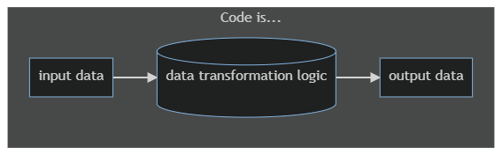
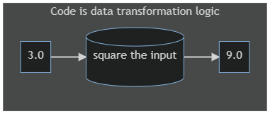

# Introduction

In this section, we talk about code and programming from the ground up.

## What is code?

Put simply, computer code is a set of instructions to a computer on how to transform data.

In other words, code is the transformation logic that the computer uses to transform its input into output.

Figure 1

!!! note
    In these flow diagrams, we're using rectangles to denote data and cylinders to denote data transformation logic.

For example, an instruction telling the computer to calculate the square of a number is code.

Figure 2

A programming language is a human-readable syntax for writing out such instructions. A set of such instructions is considered a program or a source code.

??? note "Tech Tip"
    This source code is further processed and coverted into a form that the computer understands (i.e. steps in building the source code like compiling, linking, etc.) but a discussion on that is beyond the scope of this text.

## What is Shards?

Shards is a programming language with a highly visual syntax, linear data transformation flow, and an easy learning curve.

Development in Shards feels very similar to [Visual programming](https://en.wikipedia.org/wiki/Visual_programming_language), but without giving up the power and expressiveness of textual syntax.

??? note "Tech Tip"
    Shards is based on Joel Martin's C implementation of the [mal language](https://github.com/kanaka/mal#c) (which in turn is inspired by [Clojure](https://clojure.org/), a lisp). However, the scripting language is just a description of the computational graph (i.e., your code's logic). The runtime itself is completely detached and highly optimized for performance making Shards code execution fast. In fact, many Fragcolor projects like [Claymore](https://github.com/fragcolor-xyz/claymore), [Clamor](https://github.com/fragcolor-xyz/clamor), etc. use Shards extensively as a scripting language.

--8<-- "includes/license.md"
