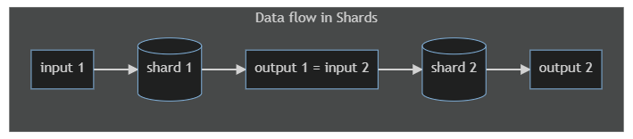
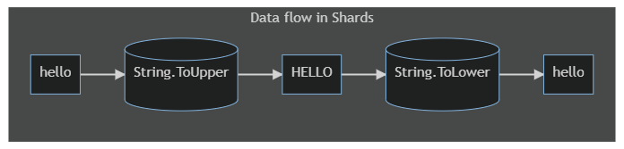
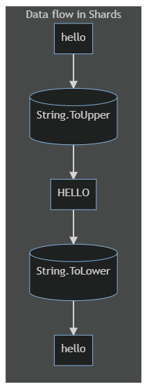

# The Shards Primer

*A step-by-step guide for the beginning Shards developer*

Shards has a visual code syntax so prior programming experience is (desired but) not required to start coding in Shards. Also, we shall cover any required programming concepts as we go along.

However, this is just a primer. It will introduce you to basic programming concepts and get you started writing Shards code, but it will not teach you everything there is to know about Shards (or programming).

Once you're done with this primer, check out our [tutorials](https://learn.fragcolor.xyz/) and [code examples](https://learn.fragcolor.xyz/code-examples) (coming soon).

For Shards language reference head over to the [shards](https://docs.fragcolor.xyz/shards/) and [functions](https://docs.fragcolor.xyz/functions/) documentation.

## Introduction

In this section, we talk about code and programming from the ground up.

### What is code?

Put simply, computer code is a set of instructions to a computer on how to transform data.

In other words, code is the transformation logic that the computer uses to transform its input into output.

Figure 1


!!! note
    In these flow diagrams, we're using rectangles to denote data and cylinders to denote data transformation logic.

For example, an instruction telling the computer to calculate the square of a number is code.

Figure 2


A programming language is a human-readable syntax for writing out such instructions. A set of such instructions is considered a program or a source code.

??? note "Tech Tip"
    This source code is further processed and coverted into a form that the computer understands (i.e. steps in building the source code like compiling, linking, etc.) but a discussion on that is beyond the scope of this text.

### What is Shards?

Shards is a programming language with a highly visual syntax, linear data transformation flow, and an easy learning curve.

Development in Shards feels very similar to [Visual programming](https://en.wikipedia.org/wiki/Visual_programming_language), but without giving up the power and expressiveness of textual syntax.

??? note "Tech Tip"
   Shards is a [mal](https://github.com/kanaka/mal) implementation (which in turn is inspired by [Clojure](https://clojure.org/), a lisp) but the scripting language is just a description of the computational graph (i.e., your code's logic). The runtime itself is completely detached and highly optimized for performance making Shards code execution fast. In fact, many Fragcolor projects like [Claymore](https://github.com/fragcolor-xyz/claymore), [Clamor](https://github.com/fragcolor-xyz/clamor), etc. use Shards extensively as a scripting language.

## Elements of Shards

, we look at the basic building blocks of the Shards programming language.

### Functions and shards

In Shards, the chunks of transformation logic (that the computer needs to transform data) come in two flavors:

* [functions](https://docs.fragcolor.xyz/functions/)
* [shards](https://docs.fragcolor.xyz/shards/) (written with a lowercase 's')

Functions are units that are native to the mal language implementation (i.e., the core language on which Shards is based), while shards are a feature of Shards language, designed from the ground up to allow you to compose your logic more intuitively and flexibly. 

!!! note
    1. Shards includes over 500 shards and around 100 functions allowing you to manipulate data and compose logic the way that you want.
    2. In the majority of the cases function names start with lower case letters and shard names start with upper case letters.
    3. You can also write your own shards using macros like `defshards` and `defloops` which we'll cover later in the [Built-in macros](#-Built-in-macros) section.

Now let's run some Shards code!

??? note "Executing Shards code"
    1. If you're new to programming you should [install VS Code and set it up](#-code-editor). 
    2. The Shards [web sandbox](https://learn.fragcolor.xyz/sandbox) is coming soon but for now please [build Shards](https://docs.fragcolor.xyz/contribute/code/building-shards/) on your machine to work through the examples in this guide.
    3. Once the `shards.exe` is built, copy paste the code sample you want to run from this guide into a new file with an extension `edn` (that's the Shards script file extension for now). This is your Shards script file. 
    4. Place your Shards script (say`abc.edn`) into the`/build` folder and from there run the script `./shards <abc.edn>` to execute your Shards script.
    5. You just need to build the `shards.exe` once. After that you can change the code in your Shards script (or create a new Shards script) and run that script with the `./shards...` command
    6. If you're using [VS Code](https://code.visualstudio.com/) as your editor you can install the [code-runner plugin](https://marketplace.visualstudio.com/items?itemName=formulahendry.code-runner) and set up your VS Code to execute your Shards script on the click of the `Run` button (see [this](https://docs.fragcolor.xyz/contribute/code/building-shards/#verify-build-and-run) for details).

Since functions are native entities, they can be run as they are.

[`(println)`](https://docs.fragcolor.xyz/functions/standard-output/#println) is a function that prints to the terminal whatever you pass to it.

In the following example, let's pass the text "Hello World" to it and run the code (copy-paste and run this code in your editor).

*Code example 1*

=== "EDN"

    ```{.clojure .annotate linenums="1"}
    (println "Hello World")
    ```
    
=== "Result"

    ```
    Hello World 
    ```

Now let's try the same with the shard [`(Msg)`](https://docs.fragcolor.xyz/shards/General/Msg/), which is similar in functionality to the function `(println)`.

*Code example 2*

=== "EDN"

    ```{.clojure .annotate linenums="1"}
    (Msg "Hello World")
    ```
    
=== "Result"

    ```
    ```

But this didn't work! There is no output.

This is because, unlike a function, a shard needs additional software context to run. These software constructs are called *wires* and *meshes*.

Now, let's execute `(Msg)` with the required wire and mesh context, and you should see the output appear.

*Code example 3*

=== "EDN"

    ```{.clojure .annotate linenums="1"}
    (defmesh root)
    (defwire mywire
        (Msg "Hello World")
        )
    (schedule root mywire)
    (run root)
    ```
    
=== "Result"

    ```
    [info] [2022-07-21 16:16:15.648] [T-29488] [logging.cpp::98] [mywire] Hello World
    ```

### Shards, wires, and meshes

To understand why the last code example worked, let's see what's needed to execute a shard:

* You need to first queue it on a *wire* (a software construct that can hold a sequence of shards) - In the code above function [`(defwire)`](https://docs.fragcolor.xyz/functions/macros/#defwire) creates a wire by the name 'mywire' at line no. 2. This wire is enclosed in a set of parentheses (line no. 2 and 4) and houses the shard `(Msg)` at line no. 3.
* Next, you need to schedule the wire on a *mesh* (a software construct that can hold many wires for execution) - A mesh named 'root' is created by function [`(defmesh)`](https://docs.fragcolor.xyz/functions/macros/#defmesh) at line no. 1. And then the function [`(schedule)`](https://docs.fragcolor.xyz/functions/misc/#schedule) schedules wire 'mywire' on mesh 'root' for execution.
* Once all wires are scheduled on a mesh, you need to *run* the mesh - The function [`(run)`](https://docs.fragcolor.xyz/functions/misc/#run) invokes the mesh 'root' for execution at line no. 6. This invocation leads to the execution of the wires scheduled on that mesh, and hence the execution of the shards contained within each wire

Of course, in the above example, we have just one shard and one wire - but each wire can have multiple shards (sequence of shards that execute in order), and each mesh may have multiple wires scheduled on it for execution.

From a programming perspective - 

* Shards are logic blocks that compose the wire
* A wire is a coroutine or a stateful smart function that is made up of a sequence of shards and can persist its memory across wire execution/iterations
* A mesh is a thread scheduler that schedules and executes the wire coroutines

From a layman's perspective, this process of writing and executing shards via the wire/mesh context is similar to you stringing a necklace and then counting its beads (like how prayer beads on a rosary are counted).

Let's break down this analogy into steps:

* Step 1: Collect a few beads => Write out a sequence of shards
* Step 2: Find a thread and string the beads onto it => Define a wire and put the shards into it
* Step 3: Hold the necklace in your hand => Define a mesh and schedule the wire on it
* Step 4: Start counting the beads one by one (the necklace moving between your fingers with every count) => Run the mesh. This will start executing the shards in the scheduled wire one by one (as per the sequence of the shards in the wire)

The analogy doesn't end here!

What we just described was a looped wire (whole necklace). Such a wire will be executed continuously in a loop by its mesh (just like you can keep counting the beads on a necklace over and over) till its control parameters tell it to stop. Looped wires are defined by function `(defloop)`

Break this necklace (but don't spill the beads!) and lay it down end-to-end and you have a non-looped wire. Such a wire will be executed only once by its mesh (irrespective of the mesh's control parameters). Non-looped wires are defined by function `(defwire)`.

!!! note
    Pick up two necklaces in one hand and start counting the beads on both - and you have the case of a single mesh running multiple wires! Such wires can be independently executed and/or paused and can even share state (memory variables). More on this in section []

The following code is an example of a single non-looped wire ('mywire') scheduled and then executed on a mesh ('root').

*Code example 4*

=== "EDN"

    ```{.clojure .annotate linenums="1"}
    (defmesh root)
    (defwire mywire
        (Msg "Hello World")
        )
    (schedule root mywire)
    (run root)
    ```
    
=== "Result"

    ```
    [info] [2022-07-21 16:16:15.648] [T-29488] [logging.cpp::98] [mywire] Hello World
    ```

### Loops and non-loops

'mywire' in *Code example 4* is a non-looped wire and that's the reason `(run)` doesn't need any other parameters other than just the name of the mesh to run (which is 'root' in this case). Since this is a non-looped wire example, the wire executes only once and that's why you see just one run of the output.

Let's spice up things a bit - change the `defwire` function in *Code example 4* to `defloop` and run the code again.

*Code example 5*

=== "EDN"

    ```{.clojure .annotate linenums="1"}
    (defmesh root)
    (defloop mywire
        (Msg "Hello World")
        )
    (schedule root mywire)
    (run root)
    ```
    
=== "Result"

    ```
    [info] [2022-07-21 22:00:37.309] [T-15968] [logging.cpp::98] [mywire] Hello World
    [info] [2022-07-21 22:00:37.312] [T-15968] [logging.cpp::98] [mywire] Hello World
    [info] [2022-07-21 22:00:37.314] [T-15968] [logging.cpp::98] [mywire] Hello World
    [info] [2022-07-21 22:00:37.315] [T-15968] [logging.cpp::98] [mywire] Hello World
    [info] [2022-07-21 22:00:37.317] [T-15968] [logging.cpp::98] [mywire] Hello World
    [info] [2022-07-21 22:00:37.319] [T-15968] [logging.cpp::98] [mywire] Hello World
    [info] [2022-07-21 22:00:37.320] [T-15968] [logging.cpp::98] [mywire] Hello World
    [info] [2022-07-21 22:00:37.322] [T-15968] [logging.cpp::98] [mywire] Hello World
    .
    .
    .
    ```

You'll see the wire executing continuously in a loop (go to  your terminal and hit the `Ctrl+C` key on Windows to break the loop; `command + .` if you're on a Mac).
This is because we defined 'mywire' as a looped wire and hence it now needs to be controlled via some extra parameters in the `(run)` command.

To handle looped wires `(run)` takes two more parameters that are placed after the name of the mesh. The first parameter specifies the time (in seconds) between wire iterations and the second parameter sepcifies the maximum number of runs allowed for the wire.

So `(run root 1 3)` will execute the wire three times with an interval of 1 second between iterations, as illustrated in the following code example.

*Code example 6*

=== "EDN"

    ```{.clojure .annotate linenums="1"}
    (defmesh root)
    (defloop mywire
        (Msg "Hello World")
        )
    (schedule root mywire)
    (run root 1 3)
    ```
    
=== "Result"

    ```
    [info] [2022-07-21 22:11:55.167] [T-14432] [logging.cpp::98] [mywire] Hello World
    [info] [2022-07-21 22:11:56.174] [T-14432] [logging.cpp::98] [mywire] Hello World
    [info] [2022-07-21 22:11:57.181] [T-14432] [logging.cpp::98] [mywire] Hello World
    ```

The iteration control parameters for `(run)` don't affect the non-looped (`(defwire)`) wires.

??? note Game loops
    (`defloop`) can be used to easily implment game loops (i.e.) game code that needs to run periodically

Before we end this section let's take two examples of multiple wires:
* *Code example 7* has 2 non-looped wires
* *Code example 8* has one looped and one non-looped wire

!!! note
    Try to anticipate the output of these programs and then confirm your assumptions by running the program in your terminal. Change the code to play around with the order of the shards, the wire schedules, and `run` control parameters. Try this out with every example code in this primer. This exercise will help you build your intuition about how Shards works.

*Code example 7*

=== "EDN"

    ```{.clojure .annotate linenums="1"}
    (defmesh root)

    (defwire mywire1
        (Msg "Hello World")
        (Msg "Bye World")
        )

    (defwire mywire2
        (Msg "Hello Universe")
        (Msg "Bye Universe")
        )

    (schedule root mywire1)
    (schedule root mywire2)
    (run root)
    ```
    
=== "Result"

    ```
    [info] [2022-07-21 22:16:58.691] [T-11720] [logging.cpp::98] [mywire1] Hello World
    [info] [2022-07-21 22:16:58.703] [T-11720] [logging.cpp::98] [mywire1] Bye World
    [info] [2022-07-21 22:16:58.705] [T-11720] [logging.cpp::98] [mywire2] Hello Universe
    [info] [2022-07-21 22:16:58.706] [T-11720] [logging.cpp::98] [mywire2] Bye Universe
    ```

*Code example 7*

=== "EDN"

    ```{.clojure .annotate linenums="1"}
    (defmesh root)

    (defwire nonloopedwire
        (Msg "Hello World, just once!"))

    (defloop loopedwire
        (Msg "Hello World, on repeat!"))

    (schedule root nonloopedwire)
    (schedule root loopedwire)
    (run root)
    ```
    
=== "Result"

    ```
    [info] [2022-07-28 19:16:57.985] [T-40588] [logging.cpp::98] [nonloopedwire] Hello World, just once!
    [info] [2022-07-28 19:16:57.995] [T-40588] [logging.cpp::98] [loopedwire] Hello World, on repeat!
    [info] [2022-07-28 19:16:58.993] [T-40588] [logging.cpp::98] [loopedwire] Hello World, on repeat!
    [info] [2022-07-28 19:16:59.989] [T-40588] [logging.cpp::98] [loopedwire] Hello World, on repeat!
    ```

One last example, before we move on to the next section, to show how we can use both functions and shards together (of course, the shards still need to be inside a wire).

!!! note
    1. In *Code example 8* we're using the shard [`(Log)`](https://docs.fragcolor.xyz/shards/General/Log/) which takes an input (coming from the left of the shard) and prints that to the screen. This is in contrast with `(Msg)` which doesn't accept any input but instead prints the value of its parameter (parameters stay inside the parentheses with the shard). More on this in the [Anatomy of a shard](#-anatomy-of-a-shard) section.
    2. [`(def)`](https://docs.fragcolor.xyz/functions/macros/#def) is a function that defines an alias (or a name) for a value, and `(Log)` accesses that value ("Hello World) via its alias ('greeting') and prints it to the terminal.

*Code example 8*

=== "EDN"

    ```{.clojure .annotate linenums="1"}
    (println "Start script execution")
    (def greeting "Hello World")

    (defmesh root)
    
    (defwire mywire
        greeting (Log)
        )
    
    (schedule root mywire)
    (run root)
    
    (println "End script execution")
    ```
    
=== "Result"

    ```
    Start script execution
    [info] [2022-07-21 22:43:39.904] [T-1512] [logging.cpp::55] [mywire] Hello World
    End script execution
    ```

## Anatomy of a function

As we saw in the [What is code?](#-what-is-code?) section, functions are built-in chunks of transformation logic that can each process data in a particular manner.

### Input and output

Functions take an input, do a computation, and produce an output. The whole function and its input must be enclosed in a set of parentheses.

For example:

* `(def)` is a function that can assign names/aliases to a data value
* [`(prn)`](https://docs.fragcolor.xyz/functions/standard-output/#prn) is a function that takes an input and prints its value on the screen

The following code example illustrates the usage of these functions.

*Code example 9*

=== "EDN"

    ```{.clojure .annotate linenums="1"}
    ;; inputs to `def`: alias `myvar`, data `123`
    ;; output of `def`: myvar = "my data"
    (def myvar 123)

    ;; input to `prn` : "Hello World"
    ;; output of `prn`: print input data => "Hello World"
    (prn "Hello World")

    ;; input to `prn` : alias `myvar` that has data `123`
    ;; output of `prn`: print alias' data => 123
    (prn myvar)
    ```
    
=== "Result"

    ```
    "Hello World"
    123  
    ```

!!! note
    In programming, *comments* are used to provide information and context about the code to a programmer. These comments are ignored by the computer (which processes only code). In Shards, comments start with a semicolon, `;`, and all subsequent characters in that line are ignored for processing.

### Composition with functions

An important aspect of functions is composition - passing one function's output into the other function as its input

Let's consider the function `(cons)` - it takes two inputs and gives one output:

* input1: a sequence of values (a vector), which could also be `nil` (null value) - like `[10 20 30]` or `nil`
* input2: an item to add to this sequence (goes to the front of the list) and create a new list (a collection of objects) - like `40`
* output: a new list combining items from the input vector with the input item (in case of a `nil` vector, the output is a single-item list consisting of just the solo input item)

But, since a function doesn't print its output out to the screen (or standard output) by default, we will use `prn` to see the output of `cons`.

And for that, we place the whole `cons` function body *in place of* the input of `(prn)`. This is function composition - `(prn (cons...))`. The following code example illustrates this function composition.

*Code example 10*

=== "EDN"

    ```{.clojure .annotate linenums="1"}
    ;; constructing a list from: [10 20 30] + 40
    (cons 40 [10 20 30])    ;; => ...
    ;; printing the `cons` output to screen by composing with `prn`
    (prn (cons 40 [10 20 30])) ;; => (40 10 20 30)

    ;; constructing a list from: nil + 40
    (cons 40 nil)
    ;; printing the `cons` output to screen by composing with `prn`
    (prn (cons 40 nil)) ;; => (40)

    ;; constructing a list by composing `cons` recursively on itself
    (cons 1 (cons 2 (cons 3 nil)))
    ;; printing the `cons` output to screen by composing with `prn`
    (prn (cons 1 (cons 2 (cons 3 nil)))) ;; => (1 2 3)
    ```
    
=== "Result"

    ```
    (40 10 20 30)
    (40)
    (1 2 3)
    ```

### Data flow

The input is always a part of the function's body (within its parentheses). And the result (output) of the function is data that is either displayed in its place (like with `(cons)`) or an action that has taken place on the input (like with printing to screen with `(prn)`).

Hence, in the case of functions data doesn't seem to flow in any particular direction.

## Anatomy of a shard

Shards are also built-in chunks of data transformation logic. However, unlike functions, shards are composed by default and this gives the Shards language syntax its highly visual nature (more on this [later](#data-and-control-flow)).

### Input and output

A shard processes its input and produces an output.

However, unlike functions, shards process their input from outside of their parentheses (from the left side or from above ) and also place the generated output outside of the parentheses (to the right side or to below).

For example, the shard [`(Math.Sqrt)`](https://docs.fragcolor.xyz/shards/Math/Sqrt/) computes the square root of a number.

So the following code fragments are equally valid (with the output being shown as comments since we will need another shard to capture and print the output):
```{.clojure .annotate linenums="1"}
;; input coming in from left, output going out from the right
9.0 (Math.Sqrt)     ;; output => 3.0

;; input coming in from top, output being placed below
9.0             ;; input
(Math.Sqrt)     ;; shard
;; output => 3.0

;; mixed syntax
9.0 (Math.Sqrt) ;; input and shard
;; output => 3.0
```

Since the output of a shard is available to its right (or below it), and a shard processes input from its left (or from above it) - if we were to place one shard after the other, the 2nd shard would process the output created by the first shard (more details on this [later](#-data-and-control-flow)).

Let's use this fact to run some actual code (*Code example 11* below) and print the output of the `(Math.Sqrt)` shard to the standard output (i.e., the terminal screen). We'll use the shard `(Log)` for this, as this shard takes its input and prints it to the terminal screen.

*Code example 11*

=== "EDN"

    ```{.clojure .annotate linenums="1"}
    ;; input coming in from left, output going out from the right
    9.0 (Math.Sqrt) (Log)     ;; `Log` processes output of `(Math.Sqrt)` => 3.0

    ;; input coming in from top, output being placed below
    9.0             ;; input
    (Math.Sqrt)     ;; shard
    (Log)           ;; `Log` processes output of `(Math.Sqrt)` => 3.0

    ;; mixed syntax
    9.0 (Math.Sqrt) ;; input and shard
    (Log)           ;; `Log` processes output of `(Math.Sqrt)` => 3.0
    ```
    
=== "Result"

    ```
    [info] [2022-07-25 22:51:00.768] [T-2664] [logging.cpp::55] [mywire] 3
    [info] [2022-07-25 22:51:00.773] [T-2664] [logging.cpp::55] [mywire] 3
    [info] [2022-07-25 22:51:00.774] [T-2664] [logging.cpp::55] [mywire] 3
    ```

### Parameters

Besides the main input coming in from the left side, a shard may also take additional inputs or controls via *parameters*. Parameters are additional data that is needed by the shard to process its input.

Parameters may be mandatory or optional. Mandatory parameters are needed for the shard to work and hence a value has to be passed to them. Optional parameters do not necessarily need a value and empty optional parameters are ignored by the shard.

Unlike input and output, a shard's parameters need to be defined/placed inside the shard's parentheses (just like input to a function). For example, `(Log)` has an optional parameter (that's why `(Log)` worked without any parameter value in the last code example) - `:Prefix`: prefixes `(Log)`'s output.

The following code example illustrates this.

*Code example 12*

=== "EDN"

    ```{.clojure .annotate linenums="1"}
    9.0             ;; input
    (Math.Sqrt)     ;; shard
    ;; `Log` attaches prefix string to its output => My output is: 3.0
    (Log :Prefix "My output is" )

    ;; mixed syntax
    9.0 (Math.Sqrt) ;; input and shard
    ;; `Log` attaches prefix string to its output => My output is: 3.0
    (Log :Prefix "My output is" )  ;; `Log` prints => My output is: 3.0
    ```
    
=== "Result"

    ```
    [info] [2022-07-25 23:07:27.319] [T-2316] [logging.cpp::53] [mywire] My output is: 3
    [info] [2022-07-25 23:07:27.328] [T-2316] [logging.cpp::53] [mywire] My output is: 3
    ```

**Position and Keywords**

Parameters in Shards are positional if you're not using keywords, i.e., if you skip the keywords and directly put the value in the shard it will work as long as you maintain the position of the parameter w.r.t other parameters in the shard (though it's a good idea to keep keywords in for readability).

For example, the shard [`(Table)`](https://docs.fragcolor.xyz/shards/General/Table/), which creates a new/empty table with one key, has four parameters:
```{.clojure .annotate linenums="1"}
(Table
  :Name [(String) (ContextVar [(Any)])]
  :Key [(String) (ContextVar [(String)]) (None)]
  :Global [(Bool)]
  :Types [(Enum) (Seq [(Enum)]) (Seq [(Enum) (Seq [(Enum)]) (Self)])]
)
```

So, assuming we're using all the parameters and their keywords, you'd write it out like this:
```{.clojure .annotate linenums="1"}
(Table
    :Name "my-table"
    :Key "Key-1"
    :Global true 
    :Types Type.Float)

.my-table (Log) ;; => {Key-1: {}}
```

If you retain the keywords, the positions of the parameters don't matter. The following is valid too:
```{.clojure .annotate linenums="1"}
(Table
    :Global true
    :Name "my-table"
    :Types Type.Float
    :Key "Key-1")

.my-table (Log) ;; => {Key-1: {}}
```

If you drop the parameter keywords, then you have to maintain the original positions of the parameters (else how will Shards know which value is for which parameter?). The following two codes are valid:
```{.clojure .annotate linenums="1"}
(Table
    "my-table"
    "Key-1"
    true
    Type.Float)

.my-table (Log) ;; => {Key-1: {}}
```
OR

```{.clojure .annotate linenums="1"}
(Table "my-table" "Key-1" true Type.Float)

.my-table (Log) ;; => {Key-1: {}}
```

But this code isn't (this will give errors as there are no parameter keywords and the parameter positions are wrong):
```{.clojure .annotate linenums="1"}
(Table
    true
    "Key-1"
    Type.Float
    "my-table")

;; errors => 
;; [error] [2022-07-26 13:11:23.530] [T-12896] [SHCore.cpp::1113] Parameter validation failed: Parameter not accepting this kind of variable (Bool) shard: Table
;; [error] [2022-07-26 13:11:23.538] [T-12896] [SHCore.cpp::1156] Failed parameter index: 0 line: 32   
Error: Parameter validation failed
```

### Data flow

Shards are composed by default. When you place a shard next to another (to its right or just after it in the next line), this shard that you just placed takes the output of the existing shard (which is to its left or above it) as its input.

For example:
```
(sh1) (sh2) (sh3) (sh4)
```
or this:
```
(sh1)
(sh2)
(sh3)
(sh4)
```
is equivalent to the composition:
```
(sh4 (sh3 (sh2 (sh1))))
```

Typically, shards code is written in a mixed form of the first two syntax forms.

Here's an example snippet from our [Snake tutorial](https://learn.fragcolor.xyz/snake/).

```{.clojure .annotate linenums="1"}
(Count .snake) (Math.Subtract 1) >= .head-idx
                     .snake (Take .head-idx) >= .head
                     ; snake eats its own body?
                     (When (-> .snake (IndexOf .head) (IsNot .head-idx))
                           (-> true > .game-over))
                     ; snake hits a wall?
                     (When (-> .head (Take 0) (IsLess 0) (Or) (Take 0) (IsMoreEqual grid-cols)
                               (Or)
                               .head (Take 1) (IsLess 0) (Or) (Take 1) (IsMoreEqual grid-rows))
                           (-> true > .game-over))
```

As you can see, this syntax maps very nicely to the linear left-to-right data flow that we discussed in the [What is code?](#what-is-code) section (Figure 2). 

To see this similarity better, let's convert the code above into a flow diagram.

Figure 3



To explore this concept further, let's consider an example using two transformations: 

* convert lower case characters to upper case (the shard `String.ToUpper`)
* and then, convert upper case characters back to lower case (the shard `String.ToLower`)

Laying out these transformations from left to right, we get a sense of how the data flows along the transformation blocks.

Figure 4



The equivalent Shards code fragment:
```{.clojure .annotate linenums="1"}
"hello" (String.ToUpper) (String.ToLower)
```

would produce the output:
```{.clojure .annotate linenums="1"}
"hello"
```

Now, if you stack the shards vertically instead of laying them down horizontally, the code would still work.

Figure 5



The flow of the data would become top-to-bottom but the transformations and the output would remain the same. 

So this code fragment:
```{.clojure .annotate linenums="1"}
"hello" 
(String.ToUpper)
(String.ToLower)
```
would still produce:
```{.clojure .annotate linenums="1"}
"hello"
```

As would this code fragment:
```{.clojure .annotate linenums="1"}
"hello" (String.ToUpper)
(String.ToLower)
```

or this one:
```{.clojure .annotate linenums="1"}
"hello" 
(String.ToUpper) (String.ToLower)
```

Hence, the flow of data in shards can be thought of as left-to-right, top-to-bottom, or a mix of the two.

### Null input and passthrough

Sometimes you may want a shard to *not* process the input coming to it from the previous shard. This can be done by inserting a `nil` constant (basically a nil/ null/ nothing value) in between the two shards, effectively overwriting the output coming in from the previous shard with a null value. You can declare a nil constant by using the keyword [`(Const)`](https://docs.fragcolor.xyz/shards/General/Const/).

In the following code example `(Const nil)` overwrites the output of `(Math.Sqrt)` (value 3.0) preventing it from reaching the next shard, `(Log)`. Since `(Log)` now receives a 'nothing' value (courtesy `nil`), it prints nothing to the screen.

*Code example 13*

=== "EDN"

    ```{.clojure .annotate linenums="1"}
    9.0 (Math.Sqrt)     ;; output of `Math.Sqrt` => 3.0  
    (Const nil) (Log)   ;; `nil` blocks value 3.0 and passes null to `Log`, which then prints => None
    ```
    
=== "Result"

    ```
    [info] [2022-07-25 23:37:49.720] [T-16580] [logging.cpp::55] [mywire] None
    ```

On the other hand, sometimes you may want a shard's input to be available to the shard after the next.

Suppose have three shards such that *shard1* takes 'a' as input and after passing through *shard2* and *shard3* this 'a' becomes 'd':
```
(a) -> shard1 -> (b) -> shard2 -> (c) -> shard3 (d)
```

Now assume you need *shard3* to receive output from *shard1* ('b') instead of output from *shard2* ('c').

This can be done with the `:Passthrough` parameter. If a shard has this parameter and you set it to `true`, that shard will pass as its output whatever it received as its input (its own output will be computed but will not be passed to the next shard). As a result, the data 'passes through' one full shard and becomes the input for the next shard.

Going back to our example above, let's also assume that *shard2* has a passthrough parameter and we have set it to `true`. Now, *shard2* will still take in input 'b' and compute 'c' internally, but because of passthrough being in effect, it will instead pass 'b' as its output to *shard3*.
```
(a) shard1 -> (b) -> shard2 -> (c) |:| (b) -> shard3 (e)
```

You'll notice that *shard3*'s output has changed since it's now processing 'b' as input instead of processing 'c'.

Let's illustrate this with a real Shards example.

[`(Assert.IsNot)`](https://docs.fragcolor.xyz/shards/Assert/IsNot/) has passthrough permanently enabled (it cannot be turned off). So in the following code, `(Assert.IsNot)` still does its job (compares its input value 8 with its parameter value 7 and concludes assertion is `true`), but letting its input (value 8) passthrough itself as its output and become the input for the next shard, `(Log)`.

*Code example 14*

=== "EDN"

    ```{.clojure .annotate linenums="1"}
    8                   ;; input for `Assert.IsNot`
    (Assert.IsNot 7)    ;; assertion `true` (8 is not equal to 7) so no error; input passed as own output
    (Log)               ;; passthrough true so `Log` receives value 8 as input form `Assert.IsNot`, so prints => 8
    ```
    
=== "Result"

    ```
    [info] [2022-07-25 23:53:43.609] [T-25300] [logging.cpp::55] [mywire] 8
    ```

For `(Asset.IsNot)` passthrough is default switched on and cannot be changed, but for [`(Match)`](https://docs.fragcolor.xyz/shards/General/Match/) it's a controllable parameter.

In the code example below, passthrough has been turned on for `(Match)` and is already enabled for `(Assert,IsNot)`. As a result, the input to `Match` (value 1) passes through both these shards and ends up as input for `(Log)`, which prints it to the terminal screen.

*Code example 15*

=== "EDN"

    ```{.clojure .annotate linenums="1"}
    1
    (Match [
            nil (-> (Msg "Matched nil"))     ;; case processed, match found
            1 (-> (Msg "Matched 1"))         ;; case ignored
            (+ 0 1) (-> (Msg "Matched 1a"))  ;; case ignored
            2 (-> (Msg "Matched 2"))]        ;; case ignored
        :Passthrough true)                   ;; passthrough turned on --
    (Assert.IsNot 10 true)                   ;; -- so input to `Match` is also input to `Assert.IsNot`
    (Log)                                    ;; passthrough for `Assert.IsNot` too, so `Log` receives value 1 as input, prints it => 1
    ```
    
=== "Result"

    ```
    [info] [2022-07-25 23:59:01.693] [T-9688] [logging.cpp::98] [mywire] Matched nil
    [info] [2022-07-25 23:59:01.701] [T-9688] [logging.cpp::55] [mywire] 1
    ```

!!! note
    1. The shard [`(Sub)`](https://docs.fragcolor.xyz/shards/General/Sub/) can simulate passthrough for other shards. See the section [KISS and `Sub`](#kiss-and-sub) for more.
    2. The mathematics expression shown in this example, `(+ 0 1)`, uses the prefix notation (AKA [Polish notation](https://en.wikipedia.org/wiki/Polish_notation)). More on this in the section [Do your sums](#do-your-sums).

## Manipulating data

Data manipulation is the sole reason for a computer program to exist. In this section, we take a look at how Shards code understands and manipulates data.

### Data types and values

Data comes in many forms. These are called *data types*. For example - *4* is a number and *"Hello there"* is a block of text, etc.

While a data type is a description of the kind of data under consideration, a *value* is an actual data value. These are also called *literals*. So, *4* is a literal and its data type is numeric.

Types are important because they tell a shard or function what kind of data to expect/process. So if a shard receives a wrong data type it can immediately discard it and raise an error to the user to pass the correct data type. This helps in reducing runtime errors caused due to a shard or function trying to transform an incorrect data type.

For example, imagine passing text to a shard that sums up numbers: it will not know what to do because mathematical summation does not work on text characters.

Let's look at some of these data types and literals.

!!! note
    In this section, we discuss only the common data types in Shards. For more see the complete list of supported data types for [shards](https://docs.fragcolor.xyz/shards/#valid-data-types-for-shards) and [functions](https://docs.fragcolor.xyz/functions/values/), including a few more called [collections](https://docs.fragcolor.xyz/functions/collections/). Some of the shard types are available only for internal use by shards (i.e., a programmer may not define and use them explicitly in their code).


```{.clojure .annotate linenums="1"}
;; named literal - denotes nill, nothing, none
nil                         ;; implicit declaration without keyword `Const`
(Const nil)                 ;; explicit declaration using keyword `Const`

;; named literals - boolean true, boolean false
true                        ;; denotes 'truth', evaluates to 1 in boolean logic (implicit declaration)
(Const true)                ;; explicit declaration using the Const keyword
false                       ;; denotes 'falsehood', evaluates to 0 in boolean logic (implicit declaration)
(Const nil)                 ;; explicit declaration using the Const keyword

;; string data - anything in double quotes
"Hello World"               ;; a string literal (implicit declaration without keyword `String`)
(String "a")                ;; single character (explicit declaration with keyword `String`)
(String "House No. #87")    ;; special characters, numbers, spaces
(String "Hello friends!")   ;; blocks of text

;; numeric data - integers (non-decimal numbers)
123                         ;; a single integer literal (implicit declaration without keyword `Int`)
(Int 1)                     ;; single integer (explicit declaration with keyword `Int`)                      
(Int2 10 20)                ;; group of 2 integers
(Int3 2 3 3 )               ;; group of 3 integers
(Int4 9 8 7 6)              ;; group of 4 integers

;; numeric data - floats (decimal numbers)
23.87                       ;; a single float literal (implicit declaration without keyword `Float`)
(Float 1.2)                 ;; single float (explicit declaration with keyword `Float`)
(Float2 2.2 45.1)           ;; group of 2 floats
(Float3 7.0 5.3 4.0)        ;; group of 3 floats
(Float4 7.8 7.5 9.9 10.0)   ;; group of 4 floats

;; a sequence literal (values can be other/nested data types)
[1 "world" 4 ["very" 5] 78]

;; a table literal (values can be other/nested data types)
{:k1 "value1" :key2 ["v" "a" "l" 3] "key3" 450}

;; a color literal (special data type with RGBA channel values)
(Color 100 120 255 0)
```

There are a few values (literals) that are used so frequently (by both the programmer as well as the computer) that they have their own names - like `nil`, `true`, `false`, etc. These are called named literals and their names cannot be used to identify any other value.

`nil` represents null/nothing/none in Shards. That means you can use this keyword to indicate a null input or a null result etc. Similarly, the boolean literals - `true`, `false` - represent the truth (`true`) or falsehood (`false`) of an assertion or a conditional check, or an expression evaluation. Since these literals are named as well as fixed in value - they are internally handled as constants (i.e., using the `Const` keyword). While declaring these named literals, you may choose to drop the `Const` keyword (implicit declaration) or use it (explicit declaration). Both methods are equivalent but explicit declaration is recommended. We'll dig more into these literals and how to use them in later sections.

Just like the literal names, data type names are (like `String`/`string`) reserved too. They cannot be used to identify anything other than the type of data. 

A [`string`] (https://docs.fragcolor.xyz/shards/#string) (or its pascal case alias `String`) data type is essentially anything wrapped in double quotes. This is useful for storing blocks of descriptive text or messages.

Numbers come in two types - integers and floating-point numbers. Use integers when you do not want decimals and floats when higher precision is required. [`int`](https://docs.fragcolor.xyz/shards/#int) and [`float`](https://docs.fragcolor.xyz/shards/#float) are single numbers, while `int2`/`int3`/`int4` and `float2`/`float3`/`float4` are groups of numbers that are processed together (also called vectors). For example, in a pole-vaulting competition, a competitor's medal tally could be expressed as an `int`, their weight as a `float`, and the highest point they jumped to as a 3-vector `float3` (in `(xyz)` coordinates). All numeric data types have pascal case aliases. So `Int`/`Int2`,`Int3`/`Int4` and `Float`/`Float2`/`Float3`/`Float4` are valid type names too. 

A [`Sequence`](https://docs.fragcolor.xyz/shards/#seq) is an ordered list of items that can be accessed by their position or index within the structure (very similar to data type 'array' in other programming languages). The values are enclosed in parentheses and are *not* separated by commas. The items inside a sequence may be of different/nested types. For example, `[[3 4] 24 "down" (Float2 4.0 5.0)]` is a valid sequence.

A [`Table`](https://docs.fragcolor.xyz/shards/#table) is an unordered collection of values that can be accessed by specific keys which are also part of the table (very similar to the data type 'object' in other programming languages). The values in the table can be of different/nested types but the keys must be either prefixed with a `:` (a valid key: `:key2`) enclosed in double quotes (another valid key: `"abc"`). Also, tables must always have key/value pairs. There cannot be just a key or just a value. So, `{key24 "val24"}` is an invalid table (because the key is not named properly) and so is this `{:k1 "abc" :k2 :k3 "def"}` (because here the key `:k2` has no corresponding value).

A [`color`](https://docs.fragcolor.xyz/shards/#color) is a vector of 4 integers representing the RGBA values (in sequence) for that color. Each value can range from 0 to 255 (any value above 255 is subtracted from 256 to bring it back into 0 - 255 range, as many times as needed). The R, G, and B values represent the amount of red, green, and blue color components and the A represents the *alpha* channel or how opaque the color shade is (0 is fully transparent, 255 is fully opaque). `color` has a pascal case alias `Color`.

Similar to named literal declarations, you may choose to use declare certain data types - like `String`, `Int`, and `Float` - with the type keyword (explicit declaration) or without the type keyword (implicit declaration). Both methods are equivalent but explicit declaration is recommended.

### Variables and constants

As we saw in the last section - a data type is a description of the data while a literal is an actual data value.

It's straightforward to use literals directly:
```{.clojure .annotate linenums="1"}
9 (Math.Sqrt)       ;; takes literal 9 as input
(Log)               ;; outputs literal => 3
```

However, it's easier to manipulate them if you store them in a memory location, give that location a name, then refer to the value via that name. Think of the memory location as a box and the data as an item that can be stored in the box.

Just like you can swap out items from a box; you can change the data inside a memory location. Such a memory location is then called a *variable* or a *mutable variable*.

!!! note
    The initial variable declaration sets the data type of the variable. Once the data type is set you can mutate the variable only for the same data type values. So, if you created a variable by assigning an integer type data value to it, then you can only assign it integers from here on. Any attempt to assign a different data type value (say string) will give an error. 

If you put a restriction on the box that prevents you from changing the item inside it (like say locking the box), then such a memory location is called a *constant* or an *immutable variable*. Once set (i.e., during initial declaration) you cannot change the value of a constant.

In Shards, we can create mutable variables outside a wire/shard by using via `(def)`, and within a wire/shard by using [`(Set)`](https://docs.fragcolor.xyz/shards/General/Set/) (alias `>=`). Constants can be created within a wire/shard with a [`(Ref)`]() (alias `=`). Mutable variables can be updated with a different value by using `def`, or [`(Update)`](https://docs.fragcolor.xyz/shards/General/Update/) (alias `>`) again on them. To print the value of a variable you may explicitly log it by its name (using `prn` or `Log`) or use [`(Get)`](https://docs.fragcolor.xyz/shards/General/Get/) to read it from the variable.

!!! note
    1. By convention use `kebab-case` for naming variables, constants, user-defined shards, etc.
    2. All variables and constants names (declared with a wire/shard) should start with a period `.`.
    3. Reserved keywords (words that are already taken up by the programming language) cannot be used to name variables, constants, user-defined shards (using `defshards`, `defwires`, `defloop`, `defmesh`), and user-defined functions (using `defn`). All data type names, named literals, built-in shards names, and built-in function names are reserved keywords in Shards.

### Creating and updating variables

Let's see some real code examples of all that we have discussed in this section.

*Code example 16*

=== "EDN"

    ```{.clojure .annotate linenums="1"}
    ;; define, update, and log mutable variables outside a wire/shard
    (def malvar1 9)                     ;; define a variable and assign it a numeric value
    (prn malvar1)                       ;; print malvar1 value => 9

    (def malvar2 "Toy")                 ;; define another variable and assign it a string value
    (prn malvar2)                       ;; print malvar2 value => "Toy"

    (def malvar2 "Story")               ;; update existing variable with another string value
    (prn malvar2)                       ;; print updated malvar2 value => "Story"

    (defmesh root)

    (defwire mywire
    ;; access variables from outside the wire/shard
    malvar1 (Log)                       ;; print value of malvar1 => 9
    malvar2 (Log)                       ;; print updated value of malvar2 => "Story"

    ;; define, update, and log mutable variables within a wire/shard    
        "Shards" >= .stringvar          ;; create a variable with a string value
        .stringvar (Log)                ;; print initial value of .stringvar => Shards
        "Claymore" > .stringvar         ;; update .stringvar with another string value
        .stringvar (Log)                ;; print updated value of .stringvar => Claymore
        
        123 >= .intvar                  ;; create a variable with a numeric value
        .intvar (Log)                   ;; print initial value of .intvar => 123
        999 > .intvar                   ;; update .intvar with another numeric value          
        (Get .intvar) (Log)             ;; `Get` the updated value of .intvar then log it => 999

        [1 2 3] >= .seqvar              ;; create a variable with a sequence value
        .seqvar (Log)                   ;; print initial value of .seqvar => [1, 2, 3]
        [10 20 30] > .seqvar            ;; update .seqvar with another sequence value          
        .seqvar (Log)                   ;; print updated value of .seqvar => [10, 20, 30]
    
        {:k1 "v1"} >= .tblvar           ;; create a variable with a table (one key/value pair)
        .tblvar (Log)                   ;; print initial value of .tblvar => {:k1 "v1"}
        "v11" (Update .tblvar "k1")     ;; update value of key :k1 (using alias `Update` to pass the key) 
        (Get .tblvar) (Log)             ;; `Get` the updated value of .tblvar then log it => {:k1 "v11"}
    
    ;; define and update `Const` type variables
        (Const true) >= .boolflag       ;; create a boolean variable with value `true`
        .boolflag (Log)                 ;; print current value of .boolflag => true
        (Const false) > .boolflag       ;; update the .boolflag with another boolean value 'false'
        .boolflag (Log)                 ;; print updated value of .boolflag => false
        ;;uncomment the following code to see error when trying to update a boolean type variable with a nil type value
        ;; (Const nil) > .boolflag      ;; throws error as you cannot update one type of variable (boolean) with another type data ('nil')
        
        (Const nil) >= .nilconst        ;; create a nil value constant
        .nilconst (Log)                 ;; print the value of nil constant => None
        ;;uncomment the following code to see error when trying to update a boolean type variable with a nil type value
        ;; (Const "abc") > .nilconst    ;; attempt to update nil type const with string type data throws error

    ;; define, attempt to update, and log constants within a wire/shard
        100 = .intconst                 ;; create a numeric constant with an integer value
        .intconst (Log)                 ;; print the value of .intconst => 100
        ;; uncomment the following code and run it see "attempted to update constant" error
        ;; 900 > .intconst              ;; attempt to update the constant value =>   
        200 (Ref .intconstant)          ;; create another numeric constant using the alias `Ref`   
        (Get .intconstant) (Log)        ;; `Get` the unchanged value of .intvar then log it => 100
        )

    (schedule root mywire)
    (run root 1 1)
    ```
    
=== "Result"

    ```
    ...
    9
    "Toy"
    "Story"
    ...
    [info] [2022-08-02 14:54:03.201] [T-20448] [logging.cpp::55] [mywire] 9
    [info] [2022-08-02 14:54:03.203] [T-20448] [logging.cpp::55] [mywire] Story
    [info] [2022-08-02 14:54:03.204] [T-20448] [logging.cpp::55] [mywire] Shards
    [info] [2022-08-02 14:54:03.206] [T-20448] [logging.cpp::55] [mywire] Claymore
    [info] [2022-08-02 14:54:03.207] [T-20448] [logging.cpp::55] [mywire] 123
    [info] [2022-08-02 14:54:03.208] [T-20448] [logging.cpp::55] [mywire] 999
    [info] [2022-08-02 14:54:03.210] [T-20448] [logging.cpp::55] [mywire] [1, 2, 3]
    [info] [2022-08-02 14:54:03.211] [T-20448] [logging.cpp::55] [mywire] [10, 20, 30]
    [info] [2022-08-02 14:54:03.212] [T-20448] [logging.cpp::55] [mywire] {k1: v1}
    [info] [2022-08-02 14:54:03.214] [T-20448] [logging.cpp::55] [mywire] {k1: v11}
    [info] [2022-08-02 14:54:03.215] [T-20448] [logging.cpp::55] [mywire] true
    [info] [2022-08-02 14:54:03.216] [T-20448] [logging.cpp::55] [mywire] false
    [info] [2022-08-02 14:54:03.217] [T-20448] [logging.cpp::55] [mywire] None
    [info] [2022-08-02 14:54:03.218] [T-20448] [logging.cpp::55] [mywire] 100
    [info] [2022-08-02 14:54:03.220] [T-20448] [logging.cpp::55] [mywire] 200
    ...
    ;; error on attempting to update a boolean var with nil type const (.boolflag)
    [error] [2022-08-02 14:53:14.769] [T-14356] [runtime.cpp::1090] Error composing shard: Set/Ref/Update, variable already set as another type: boolflag, wire: mywire
    Error: Set/Ref/Update, variable already set as another type: boolflag
    ...
    ;; error on attempting to update a nil type var with string type const (.nilconst)
    [error] [2022-08-02 14:53:35.119] [T-6708] [runtime.cpp::1090] Error composing shard: Set/Ref/Update, variable already set as another type: nilconst, wire: mywire
    Error: Set/Ref/Update, variable already set as another type: nilconst
    ...
    ;; error on attempting to update a constant (.intconst)
    [error] [2022-08-02 12:18:55.922] [T-10616] [runtime.cpp::1090] Error composing shard: Set/Ref/Update, attempted to write an immutable variable., wire: mywire
    Error: Set/Ref/Update, attempted to write an immutable variable.
    ```

### Variable scope

Variables exist within 'scopes'. A scope can be thought of as a field of view within which a variable exists, can be seen by other program elements, and can interact with them.

For example, variables created with `(def)` outside the wires are available to all wires/shards.

But variables created inside a wire (called *Context variables* or 'ContextVariable') are by default, accessible only to the wire they've been created in.

They can be made accessible to other wires by setting a parameter called `:Global` to `true` in `Set` (this parameter is `false` by default). 

However, irrespective of `:Global`, variables created within wires are not accessible outside the wires (i.e. `(prn)` cannot read context variables).

The variables that are accessible across wires or outside wires are called *global variables* and can be said to have a *global scope*. 

Variables that are accessible only within the wire they were created are called *local variables* and are said to have *local scope*.

!!! note "The `:Global` parameter"
    1. `:Global` is available as a parameter across many shards that create, manipulate, or read variables. Its default value is always `false`.
    2. When its used with shards that create variables (like `(Set)` or [`(Push)`](https://docs.fragcolor.xyz/shards/General/Push/)) it defines the scope of the newly created variable.
    3. When its used with shards that read, update or modify an existing variable (`(Get)`, `(Update)`, etc.) its value is used in conjunction with the variable's name to identify the right variable (since you can have two variables with the same name but different scope). 

*Code example 17*

=== "EDN"

    ```{.clojure .annotate linenums="1"}
    (def malvar 9)                                  ;; variable declared oustide wires/shards (external to wires)

    (defmesh root)
    (defwire varwire

    ;; access variables from outside the wires/shards
        malvar (Log)                                ;; variables external to wires can be accessed by all wires => 9

    ;; define locally scoped or local variables (i.e., Global is false by default)    
        "Shards" (Set .var-local)                   ;; .var-local is accessible only within this wire
        "Local Var" (Set .justvar)                  ;; this .justvar (Global is false) is accessible only within this wire

    ;; define globally scoped or global variables (i.e., Global is set to true)    
        "Claymore" (Set .var-global :Global true)   ;; .var-local is accessible only within this wire
        "Global Var" (Set .justvar :Global true)    ;; this .justvar (Global is true) is not the same as the .justvar defined above

        )

    (defwire mywire
    (Once (Dispatch varwire))                       ;; run 'mywire1' once to create wire variables
    ;; access variables from outside wires/shards
        malvar (Log)                                ;; variables external to wires can be accessed by all wires => 9

    ;; access global variables declared in the other wire
        (Get .var-global :Global true) (Log)        ;; can read global var => Claymore
        (Get .justvar :Global true) (Log)           ;; can read global version of .justvar => Global var

    ;; attempt to access local variables declared in the other wire
        ;; uncomment the line below to see error on trying to access local variable of anotheir wire
        ;; (Get .var-local) (Log)                   ;; will give an error

    ;; despite setting :Global flag false, this wire cannot access the local var, falls back to reading global version 
        (Get .justvar :Global false) (Log)          ;; defaults to reading the global version of var .justvar => Global var 
        )

    (schedule root mywire)
    (run root 1 1)

    ;; `prn` can't read context variables
    (prn .var-local)                                ;; prints var name => ContextVariable: var-local
    (prn .var-global)                               ;; prints var name => ContextVariable: var-global
    (prn .justvar)                                  ;; prints var name => ContextVariable: justvar
    ```
    
=== "Result"

    ```
    ...
    [info] [2022-08-02 13:18:33.396] [T-22892] [logging.cpp::55] [varwire] 9      
    [info] [2022-08-02 13:18:33.398] [T-22892] [logging.cpp::55] [mywire] 9       
    [info] [2022-08-02 13:18:33.399] [T-22892] [logging.cpp::55] [mywire] Claymore
    [info] [2022-08-02 13:18:33.400] [T-22892] [logging.cpp::55] [mywire] Global Var
    [info] [2022-08-02 13:18:33.402] [T-22892] [logging.cpp::55] [mywire] Global Var
    ...
    [trace] [2022-08-02 13:18:33.416] [T-22892] [runtime.hpp::294] stopping wire: mywire
    ContextVariable: var-local
    ContextVariable: var-global
    ContextVariable: justvar
    ...
    ;; error on attempting to read a local variable of another wire
    [error] [2022-08-02 13:20:30.112] [T-30168] [runtime.cpp::1090] Error composing shard: Get (var-local): Could not infer an output type and no Default value provided., wire: mywire
    Error: Get (var-local): Could not infer an output type and no Default value provided.   
    ...
    ```

### Manipulating variables

We have seen how to create and modify certain variables. But this is just the tip of the iceberg. Shards contains a large collection of shards to help you modify all the different types of variables that you might use in your program. 

In this section, we will summarize the most important ones. 
    
**Read**

- To read immutable or mutable variable values, including a specific key/value pair from a table: use `Get` (especially if accessing global variables across wires)
- To read specific index element from a sequence or a key/value pair from a table: use [`(Take)`](https://docs.fragcolor.xyz/shards/General/Take/) (for both sequences and tables), [`(RTake)`](https://docs.fragcolor.xyz/shards/General/RTake/) (only for sequences)

**Create**

- To declare un-named constants: use `(Const)`
- To declare named immutable-variables or constants: use `(Ref)`
- To create a new/mutable table: use [`(Table)`](https://docs.fragcolor.xyz/shards/General/Table/)
- To create a new/mutable sequence: use [`(Sequence)`](https://docs.fragcolor.xyz/shards/General/Sequence/)
- To create mutable variables, sequences, tables: use `(Set)`
- To create a sequence with a starting value (including empty []): use `(Push)`
- To create a table with a starting key/value pair (including empty {}): use `(Push)`

**Update**

- To add a new key/value pair to an existing table: use `(Set)`(will generate warnings, but is the cleanest way possible)
- To add a new key/value pair with value as sequence to an existing table: use `(Set)` (avoid `(Push)`)
- To add new elements to existing key/value sequence of an existing table: use `(Set)` (avoid `(Push)`)
- To update an existing key/value in an existing table: use `(Update)`
- To overwrite an existing sequence with a new sequence: use `(Update)`
- To update the value of existing string/numeric variables: use `(Update)`
- To add new elements to an existing sequence: use [`(AppendTo)`](https://docs.fragcolor.xyz/shards/General/AppendTo/)/[`(PrependTo)`](https://docs.fragcolor.xyz/shards/General/AppendTo/) if the sequence was created with `(Set)`, use `(Push)` if the sequence was created with `(Push)`

**Delete**

- To remove the leading or trailing element from a sequence: use [`(DropFront)`](https://docs.fragcolor.xyz/shards/General/DropFront/) and [`(Drop)`](https://docs.fragcolor.xyz/shards/General/Drop/) respectively
- To remove (and use) the leading or trailing element from a sequence: use [`(PopFront)`](https://docs.fragcolor.xyz/shards/General/PopFront/) and [`(Pop)`](https://docs.fragcolor.xyz/shards/General/Pop/) respectively
- To clear out a full sequence: use [`(Clear)`](https://docs.fragcolor.xyz/shards/General/Clear/)
- To remove sequence elements (based on indices) or table key/value pairs (based on keys): use [`(Erase)`](https://docs.fragcolor.xyz/shards/General/Erase/)
- To remove sequence elements that satisfy a certain condition: use [`(Remove)`](https://docs.fragcolor.xyz/shards/General/Remove/)

**Manipulate**

- To swap two variables values (across datatypes): use [`(Swap)`](https://docs.fragcolor.xyz/shards/General/Swap/)
- To join two strings: use [`(String.Join)`](https://docs.fragcolor.xyz/shards/String/Join/)
- To remove the leading and trailing spaces from string data: use [`(String.Trim)`](https://docs.fragcolor.xyz/shards/String/Trim/)
- To convert all string characters into the upper case: use [`(String.ToUpper)`](https://docs.fragcolor.xyz/shards/String/ToUpper/)
- To convert all string characters into the lower case: use [`(String.ToLower)`](https://docs.fragcolor.xyz/shards/String/ToUpper/)
- To copy out characters (or elements) from a string (or a sequence) by specifying start/end and step values: use [`(Slice)`](https://docs.fragcolor.xyz/shards/General/Slice/)
- To sort elements of a sequence in ascending or descending order: use [`(Sort)`](https://docs.fragcolor.xyz/shards/General/Sort/)

**Typecast**

Convert one data type to another

- To convert between equal-element integers and floats vectors use: the appropriate `(To*)` shard (for example, to `(Int4)` => `(Float4)`, use `(ToFloat4)`](https://docs.fragcolor.xyz/shards/General/ToFloat2/))
- To convert an integer/float vector (like `Int2`, `Int3`, ..., `Float3`, `Float4`, etc.) into a sequence: use [`(Flatten)`](https://docs.fragcolor.xyz/shards/General/Flatten/)
- To convert between two unequal integer/float vectors: first `(Flatten)` one of them, then add/remove the required integer and floating-point numbers to match source and destination vector size, then use the appropriate `(To*)` shard (for example, to `(Int2 2 3)` => `(Float3 2.0 3.0 4.0)`, flatten the `(Int2)`, append `(Float 4.0)` to flattened sequence, convert the 3-element sequence to `(Float3)` by using `(ToFloat3)`).
- To convert the string representation of an integer/float to the actual number data: use [`(ParseInt)`](https://docs.fragcolor.xyz/shards/General/ParseInt/) or [`(ParseFloat)`](https://docs.fragcolor.xyz/shards/General/ParseFloat/).

**Miscellaneous**

- To count characters in a string, elements in a sequence, or key/value pairs in a table: use [`(Count)`](https://docs.fragcolor.xyz/shards/General/Count/)
- To print a string to the standard output (from within a wire/shard): use [`(Msg)`](https://docs.fragcolor.xyz/shards/General/Msg/)
- To print an input string to the standard output along with an optional prefix string (from within a wire/shard): use [`(Log)`](https://docs.fragcolor.xyz/shards/General/Log/)
- To print multiple strings **without** their double quotes to the standard output (from outside wires/shards): use [`(println)`](https://docs.fragcolor.xyz/functions/standard-output/#println)
- To print multiple strings **including** their double quotes to the standard output (from outside wires/shards): use [`(prn)`](https://docs.fragcolor.xyz/functions/standard-output/#prn)

### Do your sums

Before we end this section let's look at how Shards does maths and what mathematical transformations are available for us to use within Shards.

**Mathematical expressions**
Shards uses the [prefix notation](https://en.wikipedia.org/wiki/Polish_notation) (`(+ 3 4)`) for mathematical expressions, rather than more widely used infix notation (`(3 + 4)`).

In the prefix notation, the operators precede the operands while in the infix notation they are placed in between the operands. Here's a mathematical expression in both notations:
```{.clojure .annotate linenums="1"}
;; expression in prefix notation
(/ (- (* (+ 3 2) 4) 6) 2)               ;; evaluates to => 7

;; same expression in infix notation
((((3 + 2) * 4) - 6) / 2)               ;; evaluates to => 7
```

As you can see, in each bracketed expression that is evaluated, the prefix notation puts the operator first, followed by the two operands.
```{.clojure .annotate linenums="1"}
;; step-by-step evaluation in prefix notation
(/ (- (* (+ 3 2) 4) 6) 2)               ;; (+ 3 2) => like (3 + 2) => 5
(/ (- (* 5 4) 6) 2)                     ;; (* 5 4) => like (5 * 4) => 20
(/ (- 20 6) 2)                          ;; (- 20 6) => like (20 - 6) => 14
(/ 14 2)                                ;; (/ 14 2) => like (14 / 2) => 7
7
```

**Comparison operators**

Shards implements common mathematical [comparison operators](https://docs.fragcolor.xyz/functions/operators/) using the same prefix notation.

A few examples:
```{.clojure .annotate linenums="1"}
(> 4 2) (Log)                 ;; => true
(< 4 2) (Log)                 ;; => false
(= 5 (+ 3 2)) (Log)           ;; => true
(>= 9 (+ (- 10 2) 4)) (Log)   ;; => false
(<= (* 2 4) (/ 25 5)) (Log)   ;; => false
```

!!! note
    Some of these comparison operators look exactly like alias symbols for certain shards (`>=`, `>`, `=`), but should not be confused with them. Whether `>` denotes a *greater than* comparison or an update to a variable (alias symbol for `(Update)`) depends on the context of the usage and the rest of the code. The wrong context will throw an error. 

**Maths shards**

The basic mathematical and comparison operators described above are built in as part of the mal language (core language on which Shards is based).

However, Shards also provides a more extensive library of mathematical functions and comparison operators in form of various shards.

For example, [`(Math.Add)`](https://docs.fragcolor.xyz/shards/Math/Add/) will add two numbers, [`(Math.Subtract)`](https://docs.fragcolor.xyz/shards/Math/Subtract/) will subtract one number from the other, and so on for [`(Math.Multiply)`](https://docs.fragcolor.xyz/shards/Math/Multiply/) and [`(Math.Divide)`](https://docs.fragcolor.xyz/shards/Math/Divide/), and others.

It doesn't stop at basic mathematical operations - there are shards that support trigonometric computations, matrix algebra, 3D geometric transformations, etc. 

!!! note
    You can check out all the `(Math.*)` shards by typing 'Math.' in the search box on the [Fragcolor Shards documentation page](https://docs.fragcolor.xyz/)

As for comparison, the following shards can compare numeric quantities too:

- equality (`=`) with [`(Is)`](https://docs.fragcolor.xyz/shards/General/Is/)
- inequality (`<`, `>`) with [`(IsLess)`](https://docs.fragcolor.xyz/shards/General/IsLess/) and  [`(IsMore)`](https://docs.fragcolor.xyz/shards/General/IsMore/)
- mixed equality/inequality (`=<`, `>=`) with [`(IsLessEqual)`](https://docs.fragcolor.xyz/shards/General/IsLessEqual/) and  [`(IsMoreEqual)`](https://docs.fragcolor.xyz/shards/General/IsMoreEqual/)

Now, let's redo our earlier examples with shards instead:

*Code example 18*

=== "EDN"

    ```{.clojure .annotate linenums="1"}
    (defmesh root)

    (defwire mywire
        ;; (> 4 2)                  
        4 (IsMore 2) (Log)                      ;; => true

        ;; (< 4 2)                  
        4 (IsLess 2) (Log)                      ;; => false

        ;; (= 5 (+ 3 2))
        3 (Math.Add 2) (Is 5) (Log)             ;; => true

        ;; (>= 9 (+ (- 10 2) 4))            
        10 (Math.Subtract 2) (Math.Add 4) >= .rhsvar1
        9 (IsMoreEqual .rhsvar1) (Log)          ;; => false       

        ;; (<= (* 2 4) (/ 25 5))             
        25 (Math.Divide 5) >= .rhsvar2
        4 (Math.Multiply 2) >= .lhsvar2
        .lhsvar2 (IsLessEqual .rhsvar2) (Log)   ;; => false
        )

    (schedule root mywire)
    (run root 1 1)
    ```
    
=== "Result"

    ```
    [info] [2022-08-02 20:24:41.389] [T-30948] [logging.cpp::55] [mywire] true
    [info] [2022-08-02 20:24:41.390] [T-30948] [logging.cpp::55] [mywire] false
    [info] [2022-08-02 20:24:41.392] [T-30948] [logging.cpp::55] [mywire] true
    [info] [2022-08-02 20:24:41.393] [T-30948] [logging.cpp::55] [mywire] false
    [info] [2022-08-02 20:24:41.394] [T-30948] [logging.cpp::55] [mywire] false
    ```

## Controlling the flow

Now that we have an understanding of the building blocks of a Shards program, let's see how we can manipulate its control flow.

### Stay DRY with `defshards`

We've already seen [macros](https://docs.fragcolor.xyz/functions/macros/) like `defmesh`, `defwire`, `defloop`, `schedule`, and `run` in action - now, let's look at `defshards`.

Imagine we need to program a bot to welcome people to our Shards Bootcamp. The following code is one way to do it.

*Code example 19*

=== "EDN"

    ```{.clojure .annotate linenums="1"}
    (defmesh root)

    (defwire jekyll
        (Msg "Mr. Jekyll")
        (Msg "Welcome to the Shards Bootcamp!")                     ;; common-logic starts
        (Msg "We are delighted to have you with us.")               ;; ...cont'd
        (Msg "Which module would you like to practice today?")      ;; common-logic ends
        )

    (defwire hyde
        (Msg "Mr. Hyde")
        (Msg "Welcome to the Shards Bootcamp!")                     ;; common-logic starts
        (Msg "We are delighted to have you with us.")               ;; ...cont'd
        (Msg "Which module would you like to practice today?")      ;; common-logic ends
        )

    (schedule root jekyll)
    (schedule root hyde)
    (run root 1 1)
    ```
    
=== "Result"

    ```
    [trace] [2022-07-28 22:44:42.008] [T-12432] [runtime.cpp::2026] wire jekyll starting
    [info] [2022-07-28 22:44:42.011] [T-12432] [logging.cpp::98] [my-wire-1] Mr. Jekyll
    [info] [2022-07-28 22:44:42.012] [T-12432] [logging.cpp::98] [my-wire-1] Welcome to the Shards Bootcamp!
    [info] [2022-07-28 22:44:42.015] [T-12432] [logging.cpp::98] [my-wire-1] We are delighted to have you with us.
    [info] [2022-07-28 22:44:42.017] [T-12432] [logging.cpp::98] [my-wire-1] Which module would you like to practice today?
    ...
    [trace] [2022-07-28 22:44:42.025] [T-12432] [runtime.cpp::2026] wire hyde starting
    [info] [2022-07-28 22:44:42.026] [T-12432] [logging.cpp::98] [my-wire-2] Mr. Hyde
    [info] [2022-07-28 22:44:42.027] [T-12432] [logging.cpp::98] [my-wire-2] Welcome to the Shards Bootcamp!
    [info] [2022-07-28 22:44:42.029] [T-12432] [logging.cpp::98] [my-wire-2] We are delighted to have you with us.
    [info] [2022-07-28 22:44:42.030] [T-12432] [logging.cpp::98] [my-wire-2] Which module would you like to practice today?
    ```

This is quite verbose.

So, let's take the common logic (all the `(Msg)` statements except for the first one, in both wires) and group it together using `(defshards)` (that's what `defshards` stands for - define a group of shards, give it a name, invoke it from anywhere).

*Code example 20*

=== "EDN"

    ```{.clojure .annotate linenums="1"}
    (defmesh root)

    (defshards welcome []
        (Msg "Welcome to the Shards Bootcamp!")                     ;; common-logic starts
        (Msg "We are delighted to have you with us.")               ;; ...cont'd
        (Msg "Which module would you like to practice today?")      ;; common-logic ends
        )

    (defwire jekyll
        (Msg "Mr. Jekyll")
        (welcome)                                                   ;; invoking common-logic group of shards
        )

    (defwire hyde
        (Msg "Mr. Hyde")
        (welcome)                                                   ;; invoking common-logic group of shards
        )

    (schedule root jekyll)
    (schedule root hyde)
    (run root 1 1)
    ```
    
=== "Result"

    ```
    [trace] [2022-07-28 23:12:59.817] [T-8028] [runtime.cpp::2026] wire jekyll starting
    [info] [2022-07-28 23:12:59.818] [T-8028] [logging.cpp::98] [jekyll] Mr. Jekyll
    [info] [2022-07-28 23:12:59.819] [T-8028] [logging.cpp::98] [jekyll] Welcome to the Shards Bootcamp!
    [info] [2022-07-28 23:12:59.820] [T-8028] [logging.cpp::98] [jekyll] We are delighted to have you with us.
    [info] [2022-07-28 23:12:59.821] [T-8028] [logging.cpp::98] [jekyll] Which module would you like to practice today?
    ...
    [trace] [2022-07-28 23:12:59.826] [T-8028] [runtime.cpp::2026] wire hyde starting
    [info] [2022-07-28 23:12:59.827] [T-8028] [logging.cpp::98] [hyde] Mr. Hyde
    [info] [2022-07-28 23:12:59.828] [T-8028] [logging.cpp::98] [hyde] Welcome to the Shards Bootcamp!
    [info] [2022-07-28 23:12:59.829] [T-8028] [logging.cpp::98] [hyde] We are delighted to have you with us.
    [info] [2022-07-28 23:12:59.830] [T-8028] [logging.cpp::98] [hyde] Which module would you like to practice today?
    ```


The output remains the same but the code looks more compact! The common logic is in a group of shards (or `defshards`) called 'welcome' and you can invoke a `defshards` by calling its name in parentheses i.e., `(welcome)`.

There is still room for improvement, though. See the `[]` next to the `(defshards)` name? That's like an input value for the `defshards` construct. Anything passed into it is available for the `defshards` shards to use. The idea is to move the remaining `(Msg)` shard too to 'welcome', but along with that pass the name as input to the `defshards`.

For this two things need to be done - add a variable to hold the input that will come to 'welcome' - `(defshards welcome [name]...)`. And, pass the appropriate name when invoking 'welcome' from the wires - `(welcome "Mr. Jekyll")`, and `(welcome "Mr. Hyde")`.

Let's see how this pans out in our *Code example 21*.

*Code example 21*

=== "EDN"

    ```{.clojure .annotate linenums="1"}
    (defmesh root)

    (defshards welcome [name]                                       ;; all shards inside 'welcome' have access to the 'name' value
        (Msg name)                                                  ;; yes, `Msg` can print variable values too!
        (Msg "Welcome to the Shards Bootcamp!")
        (Msg "We are delighted to have you with us.")
        (Msg "Which module would you like to practice today?")
        )

    (defwire jekyll
        (welcome "Mr. Jekyll")                                      ;; invoking 'welcome' with name value
        )

    (defwire hyde
        (welcome "Mr. Hyde")                                        ;; invoking 'welcome' with name value
        )

    (schedule root jekyll)
    (schedule root hyde)
    (run root 1 1)
    ```
    
=== "Result"

    ```
    [info] [2022-07-28 23:38:14.121] [T-38388] [logging.cpp::98] [jekyll] Mr. Jekyll
    [info] [2022-07-28 23:38:14.122] [T-38388] [logging.cpp::98] [jekyll] Welcome to the Shards Bootcamp!
    [info] [2022-07-28 23:38:14.123] [T-38388] [logging.cpp::98] [jekyll] We are delighted to have you with us.
    [info] [2022-07-28 23:38:14.125] [T-38388] [logging.cpp::98] [jekyll] Which module would you like to practice today?
    ...
    [trace] [2022-07-28 23:38:14.132] [T-38388] [runtime.cpp::2026] wire hyde starting
    [info] [2022-07-28 23:38:14.136] [T-38388] [logging.cpp::98] [hyde] Mr. Hyde
    [info] [2022-07-28 23:38:14.138] [T-38388] [logging.cpp::98] [hyde] Welcome to the Shards Bootcamp!
    [info] [2022-07-28 23:38:14.139] [T-38388] [logging.cpp::98] [hyde] We are delighted to have you with us.
    [info] [2022-07-28 23:38:14.140] [T-38388] [logging.cpp::98] [hyde] Which module would you like to practice today?
    ```

What if you wanted to include a greeting too? Well, pass two parameters to `defshard` 'welcome!
So we make a provision for accepting two parameters in 'welcome'(`defshards welcome [greeting, name]`) and invoke 'welcome' with two values (`(welcome "Good morning!" "Mr. Jekyll")`).

*Code example 22*

=== "EDN"

    ```{.clojure .annotate linenums="1"}
    (defmesh root)

    (defshards welcome [greeting, name]                     ;; all shards inside 'welcome' have access to 'greeting' and 'name' values
        (Msg greeting)                                      ;; yes, `Msg` can print variable values too!
        (Msg name)                                          ;; yes, `Msg` can print variable values too!
        (Msg "Welcome to the Shards Bootcamp!")
        (Msg "We are delighted to have you with us.")
        (Msg "Which module would you like to practice today?")
        )

    (defwire jekyll
        (welcome "Good morning!" "Mr. Jekyll")              ;; invoking 'welcome' with name value
        )

    (defwire hyde
        (welcome "Good evening!" "Mr. Hyde")                ;; invoking 'welcome' with name value
        )

    (schedule root jekyll)
    (schedule root hyde)
    (run root 1 1)
    ```
    
=== "Result"

    ```
    [trace] [2022-07-29 11:22:57.578] [T-19808] [runtime.cpp::2026] wire jekyll starting
    [info] [2022-07-29 11:22:57.579] [T-19808] [logging.cpp::98] [jekyll] Good morning!
    [info] [2022-07-29 11:22:57.580] [T-19808] [logging.cpp::98] [jekyll] Mr. Jekyll
    [info] [2022-07-29 11:22:57.583] [T-19808] [logging.cpp::98] [jekyll] Welcome to the Shards Bootcamp!
    [info] [2022-07-29 11:22:57.584] [T-19808] [logging.cpp::98] [jekyll] We are delighted to have you with us.
    [info] [2022-07-29 11:22:57.585] [T-19808] [logging.cpp::98] [jekyll] Which module would you like to practice today?  
    ...
    [trace] [2022-07-29 11:22:57.592] [T-19808] [runtime.cpp::2026] wire hyde starting
    [info] [2022-07-29 11:22:57.594] [T-19808] [logging.cpp::98] [hyde] Good evening!
    [info] [2022-07-29 11:22:57.595] [T-19808] [logging.cpp::98] [hyde] Mr. Hyde
    [info] [2022-07-29 11:22:57.596] [T-19808] [logging.cpp::98] [hyde] Welcome to the Shards Bootcamp!
    [info] [2022-07-29 11:22:57.598] [T-19808] [logging.cpp::98] [hyde] We are delighted to have you with us.
    [info] [2022-07-29 11:22:57.599] [T-19808] [logging.cpp::98] [hyde] Which module would you like to practice today? 
    ```

As you can see, `defshards` is a powerful way to group reusable logic in one place and invoke it wherever needed.

!!! note
    In software engineering, this principle is called "Don't repeat yourself" or DRY.

### KISS and `(Sub)` 

`(Sub)` is a very useful shard. It does many things that make life easy for a Shards programmer. Let's look at each of these in detail.

**Parallel shards**

`(Sub)` groups together multiple shards and can pass the same input to all of them. This simulates a form of parallel processing where each shard executes independently and their outputs are not consumed at all.

Also, the `(Sub)` has a passthrough set to `true` internally, hence the output of the whole `(Sub)` block is the input that was passed to it in the first place.

So if your logic requires you to execute multiple shards in parallel, consuming the same input, and executing independently, then you should reach out for `(Sub)`.

Syntactically, `(Sub)` also requires the use of the symbol `->`.

Let's see an example of `(Sub)` in action.

*Code example 23*

=== "EDN"

    ```{.clojure .annotate linenums="1"}
    (defmesh root)

    (defwire mywire
        ;; Using `Sub` with `->` to group together 3 shards
        (int 5) (Log)                       ;; input to the `Sub` and its 3 shards => 5
        (Sub (-> (Math.Multiply 2) (Log)))  ;; output of 1st `Sub` shard => 10
        (Sub (-> (Math.Multiply 3) (Log)))  ;; output of 2nd `Sub` shard => 15  
        (Sub (-> (Math.Multiply 4) (Log)))  ;; output of 3rd `Sub` shard => 20  
        (Log)                               ;; output of all the `Sub`s is passthrough => 5 
        )

    (schedule root mywire)
    (run root 1 1)
    ```
    
=== "Result"

    ```
    [info] [2022-08-02 21:14:43.078] [T-24444] [logging.cpp::55] [mywire] 5
    [info] [2022-08-02 21:14:43.079] [T-24444] [logging.cpp::55] [mywire] 10
    [info] [2022-08-02 21:14:43.080] [T-24444] [logging.cpp::55] [mywire] 15
    [info] [2022-08-02 21:14:43.081] [T-24444] [logging.cpp::55] [mywire] 20
    [info] [2022-08-02 21:14:43.082] [T-24444] [logging.cpp::55] [mywire] 5
    ```

**Keeping it simple**

As you might notice, the combination of `(Sub)` and `->` tends to get verbose. Fortunately, we have an alternative in the form of `|`. This keyword symbol can replace both `(Sub)` and `->` leading to more succinct and easy-to-read code.

Let's rewrite *Code example 23* using `|` instead (note that `|` replaces the construct `Sub (->`).

*Code example 24*

=== "EDN"

    ```{.clojure .annotate linenums="1"}
    (defmesh root)

    (defwire mywire
        ;; `|` replaces `Sub (->`
        (int 5) (Log)                       ;; input to the `|` and its 3 shards => 5
        (| (Math.Multiply 2) (Log))         ;; output of 1st `|` shard => 10
        (| (Math.Multiply 3) (Log))         ;; output of 2nd `|` shard => 15  
        (| (Math.Multiply 4) (Log))         ;; output of 3rd `|` shard => 20  
        (Log)                               ;; output of all the `|`s is passthrough => 5 
        )

    (schedule root mywire)
    (run root 1 1)
    ```
    
=== "Result"

    ```
    [info] [2022-08-02 21:14:43.078] [T-24444] [logging.cpp::55] [mywire] 5
    [info] [2022-08-02 21:14:43.079] [T-24444] [logging.cpp::55] [mywire] 10
    [info] [2022-08-02 21:14:43.080] [T-24444] [logging.cpp::55] [mywire] 15
    [info] [2022-08-02 21:14:43.081] [T-24444] [logging.cpp::55] [mywire] 20
    [info] [2022-08-02 21:14:43.082] [T-24444] [logging.cpp::55] [mywire] 5
    ```

**Simulating passthrough**

In section [Null input and passthrough](#null-input-and-passthrough) we talked about passthrough and touched upon the fact that `(Sub)` can simulate passthrough for those shards which do not have this parameter natively.

If you look at *Code example 23* or *Code example 24*, you'll notice how `(Sub)` (and hence by extension, `|`) is able to achieve this feat. For each shard that is wrapped in a `(Sub)` or `(|)`, the input is automatically passing through because the wrapper `(Sub)` or `(|)` has passthrough enabled for itself.

Hence, if you want to simulate passthrough for any shard that doesn't have this parameter natively, simply wrap it in a `(Sub)` + `(->)` shard, or in a `(|)` shard.

!!! note
    KISS is a popular acronym for "Keep it simple, silly!". For this section, however, a more appropriate expansion would be "Killing it with Shards' Sub!".

### Decisions, decisions!

When you're writing code you'll often find the need to check a certain condition and then execute some logic based on the result.

Depending on the condition/check, you might have just two paths (if the result is a yes/no) or multiple paths (if you're matching the input against a finite set of values).

In programming language terminology, these are called control statements. Shards has mnany such constructs that can check for conditions and route the program's control accordingly.

Let's take a look at the most commonly used ones.

**`(If)`**

```{.clojure .annotate linenums="1"}
(If
  :Predicate [(Shard) (Seq [(Shard)]) (None)]
  :Then [(Shard) (Seq [(Shard)]) (None)]
  :Else [(Shard) (Seq [(Shard)]) (None)]
  :Passthrough [(Bool)]
)
```

The [`(If)`](https://docs.fragcolor.xyz/shards/General/If/) shard evaluates the expression in its `:Predicate` parameter and depending on the output (`true`/`false`), it executes the shards in the `:Then` parameter (if the `:Predicate` expression evaluates to `true`) or the shards in the `:Else` parameter (if the `:Predicate` expression evaluates to `false`). 

This control construct is knows as if-then-else statement in other programming languages.

This shard is useful when you have at least two logic paths and depending on the condition you're checking you need to mandatorily execute *one* of those paths.

*Code example 25*

=== "EDN"

    ```{.clojure .annotate linenums="1"}
    (defmesh root)

    (defshards greetme []               
        (Msg "Hi")                      
    )

    (defshards greetmetoo []
        (Msg "Hello")
    )

    (defshards saybye []                ;; `saybye` invoked from mywire
        (Msg "Bye")                     ;; prints message => Bye
    )

    (defwire mywire
        10 (If (IsLess 2)               ;; 10 > 2 hence condition evaluates to `false`
                :Then (greetme)         
                :Else (saybye)          ;; hence `:Else` shard executed
                )
        )

    (schedule root mywire)
    (run root 1 1)
    ```
    
=== "Result"

    ```
    [info] [2022-08-03 00:07:46.153] [T-18520] [logging.cpp::98] [mywire] Bye
    ```

**`(When)` and `(WhenNot)`**

```{.clojure .annotate linenums="1"}
(When
  :Predicate [(Shard) (Seq [(Shard)]) (None)]
  :Action [(Shard) (Seq [(Shard)]) (None)]
  :Passthrough [(Bool)]
)
```

```{.clojure .annotate linenums="1"}
(WhenNot
  :Predicate [(Shard) (Seq [(Shard)]) (None)]
  :Action [(Shard) (Seq [(Shard)]) (None)]
  :Passthrough [(Bool)]
)
```

The [`(When)`](https://docs.fragcolor.xyz/shards/General/When/) and [`(WhenNot)`](https://docs.fragcolor.xyz/shards/General/WhenNot/) shards work like *If-Then* and *If-Else* components of the `(If)` shard. 

`(When)` executes its `:Action` shards if its `:Predicate` evaluates to `true`; while `(WhenNot)` executes its `:Action` shards if its `:Predicate` evaluates to `false`. Taken together they do what the `(If)` shard does alone.

These shards are useful when you have only one logic path and you need to figure out whether or not to execute it.

*Code example 26*

=== "EDN"

    ```{.clojure .annotate linenums="1"}
    (defmesh root)

    (defshards greetme []                   ;; `greetme` invoked from mywire
        (Msg "Hi")                          ;; prints message => Hi
    )

    (defshards greetmetoo []
        (Msg "Hello")
    )

    (defshards saybye []
        (Msg "Bye")
    )

    (defwire mywire
        10 (When :Predicate (IsMore 2)      ;; 10 > 2 so predicate evaluates to `true`
                 :Action (greetme)          ;; hence `:Action` shard executed
                )
  
        10 (WhenNot :Predicate (IsMore 2)   ;; 10 > 2 so predicate evaluates to `false`
                    :Action (greetme)       ;; hence `:Action` shard not executed
                )                           ;; 'greetme` invoked only once => "Hi" printed only once
        )

    (schedule root mywire)
    (run root 1 1)
    ```
    
=== "Result"

    ```
    [info] [2022-08-03 00:16:11.860] [T-24532] [logging.cpp::98] [mywire] Hi
    ```

**`(Match)`**

```{.clojure .annotate linenums="1"}
(Match
  :Cases [(Seq [(Any)])]
  :Passthrough [(Bool)]
)
```

The [`(Match)`](https://docs.fragcolor.xyz/shards/General/Match/) shard matches the incoming input against the evaluation of its `:Cases` shards. Every case contains a value (or an expression that evaluates to a value) and a sequence of shards. If the input matches a case's value, the shards for that case are activated. Once a match is found, the rest of the cases are ignored and the control moves on to the next shard. If no match is found, the shard processing ends with it matching with a mandatorily declared `nil` case.

The `(Match)` shard is your best bet when you have multiple logic paths to consider but no complicated conditions to evaluate as`(Match)` can only check for *equality* between the input and the case values.

*Code example 27*

=== "EDN"

    ```{.clojure .annotate linenums="1"}
    (defmesh root)

    (defshards greetme []                   
        (Msg "Hi")                          
    )

    (defshards greetmetoo []                    ;; `greetmetoo` invoked from mywire
        (Msg "Hello")                           ;; prints message => Hello
    )

    (defshards saybye []
        (Msg "Bye")
    )

    (defwire mywire
        10
        (Match [
                2 (-> (greetme))                ;; case processed, match not found
                5 (-> (saybye))                 ;; case processed, match found
                10 (-> (greetmetoo))            ;; case matched hence 'greetmetoo' invoked 
                nil (-> (Msg "Matched nil"))]   ;; case ignored 
            )             
        )

    (schedule root mywire)
    (run root 1 1)
    ```
    
=== "Result"

    ```
    [info] [2022-08-03 00:33:05.072] [T-2652] [logging.cpp::98] [mywire] Hello
    ```

**`(Cond)`**

```{.clojure .annotate linenums="1"}
(Cond
  :Wires [(Seq [(Shard) (Seq [(Shard)]) (None)])]
  :Passthrough [(Bool)]
  :Threading [(Bool)]
)
```

The [`(Cond)`](https://docs.fragcolor.xyz/shards/General/Cond/) contains multiple cases (`:Wires`), each with a condition to evaluate and a sequence of shards to execute. This shard takes the input and evaluates the condition of each case till it reaches a condition that evaluates to true (with the shard's input). Once a case's condition has been evaluated to be true its shards are triggered for execution and further cases are not considered. If even the last case's condition does not evaluate to `true` the control is passed on to the next shard. 

The `(Cond)` shard is like a combination of `(If)` and `(Match)`. It has the custom logic to flexibly check conditions like `(If)` and a straightforward multi-path switch like `(Match)`. Whether you have a single logic path to consider or multiple logic paths, this shard is a \ fit for most scenarios. 

*Code example 28*

=== "EDN"

    ```{.clojure .annotate linenums="1"}
    (defmesh root)

    (defshards greetme []                   
        (Msg "Hi")                          
    )

    (defshards greetmetoo []                
        (Msg "Hello")                       
    )

    (defshards saybye []                            ;; `saybye` invoked from mywire                                  
        (Msg "Bye")                                 ;; prints message => Bye
    )

    (defwire mywire
        [10 20 30]
        (Cond
            [(-> (AnyLess 10)) (-> (greetme))       ;; condition `false`
             (-> (AllMore 20)) (-> (greetmetoo))    ;; condition `false`
             (-> (AnyNot 20)) (-> (saybye))         ;; condition `true` hence `saybye` invoked
             (-> true) (-> (Msg "No cond true"))]
            )            
        )

    (schedule root mywire)
    (run root 1 1)
    ```
    
=== "Result"

    ```
    [info] [2022-08-03 00:41:50.215] [T-9552] [logging.cpp::98] [mywire] Bye
    ```

### Loops for everyone

At times you will want to run some logic in a loop until a condition becomes true or a match is found. 

Shards already gives you the ability to run a `(defloop)` wire (and its logic) in a loop with `(run)` control parameters (time interval between two iterations, maximum number of iterations)

*Code example 29*

=== "EDN"

    ```{.clojure .annotate linenums="1"}
    (defmesh root)
    (defwire mywire
        (Msg "Life in a loop!")     ;; Msg prints 3 times, with 2 sec intervals      
        )

    (schedule root mywire)
    (run root 2 3)                  ;; `mywire` will run 3 times with 2 secs intervals
    ```
    
=== "Result"

    ```
    [info] [2022-08-03 00:52:16.166] [T-15868] [logging.cpp::98] [mywire] Life in a loop!
    [info] [2022-08-03 00:52:18.174] [T-15868] [logging.cpp::98] [mywire] Life in a loop!
    [info] [2022-08-03 00:52:20.178] [T-15868] [logging.cpp::98] [mywire] Life in a loop!
    ```

However, sometimes this is not enough and you need to control your loop based on parameters other than just the number or frequency of wire iterations.

For this, Shards has a couple of iterator or loop constructs.

**`(Repeat)`**

```{.clojure .annotate linenums="1"}
(Repeat
  :Action [(Shard) (Seq [(Shard)])]
  :Times [(Int) (Seq [(Int)]) (ContextVar [(Int)]) (ContextVar [(Seq [(Int)])])]
  :Forever [(Bool)]
  :Until [(Shard) (Seq [(Shard)]) (None)]
)
```

[`(Repeat)`](https://docs.fragcolor.xyz/shards/General/Repeat/) runs the shards passed in its `:Action` parameter `:Times` no. of times, or forever if `:Forever` set to true, or till the `:Until` condition is met.

The presence of 3 control parameters (no. of times, forever, condition) makes this a very flexible iterator/loop shard. Since `:Until` is an optional parameter, either `:Times` or `:Forever` needs to be used alongside `:Until`. This is because `:Times` or `:Forever` are needed to provide the upper limit of iteratins within which the condition in `:Until` would be checked (in a loop).

*Code example 30*

=== "EDN"

    ```{.clojure .annotate linenums="1"}
    (defmesh root)

    (defloop mywire

        (Repeat
            (-> (Msg "I'm forever"))
                ;; :Forever true            ;; if uncommented, will print 'Msg' forever
                )
        
        (Repeat
            (-> (Msg "Times twice"))
                :Times 2)                   ;; print `Msg` twice
        
        0 >= .n1
        (Repeat
            (-> .n1 (Log "Counting n1")
                (Math.Inc .n1))
            :Forever true                   ;; upper limit of iterations is infinity   
            :Until (-> .n1 (IsMore 3)))     ;; so, this will `Log` to its condition max: 4 times 

        0 >= .n2
        (Repeat
            (-> .n2 (Log "Counting n2")
                (Math.Inc .n2))
            :Times 2                        ;; upper limit of iterations is 2 
            :Until (-> .n2 (IsMore 5)))     ;; so, even though condition max is 6, this will log only 2 times

        )

    (schedule root mywire)
    (run root 1 1)        
    ```
    
=== "Result"

    ```
    [info] [2022-08-03 03:29:27.840] [T-20080] [logging.cpp::98] [mywire] Times twice
    [info] [2022-08-03 03:29:27.841] [T-20080] [logging.cpp::98] [mywire] Times twice
    [info] [2022-08-03 03:29:27.843] [T-20080] [logging.cpp::53] [mywire] Counting n1: 0
    [info] [2022-08-03 03:29:27.844] [T-20080] [logging.cpp::53] [mywire] Counting n1: 1
    [info] [2022-08-03 03:29:27.846] [T-20080] [logging.cpp::53] [mywire] Counting n1: 2
    [info] [2022-08-03 03:29:27.847] [T-20080] [logging.cpp::53] [mywire] Counting n1: 3
    [info] [2022-08-03 03:29:27.848] [T-20080] [logging.cpp::53] [mywire] Counting n2: 0
    [info] [2022-08-03 03:29:27.849] [T-20080] [logging.cpp::53] [mywire] Counting n2: 1
    ```


**`(ForRange)`**

```{.clojure .annotate linenums="1"}
(ForRange
  :From [(Int) (ContextVar [(Int)])]
  :To [(Int) (ContextVar [(Int)])]
  :Action [(Shard) (Seq [(Shard)]) (None)]
)
```

[`(ForRange)`](https://docs.fragcolor.xyz/shards/General/ForRange/) executes the sequence of shards in `:Action` parameter while an iteration value is between `:From` and `:To` (both inclusive).

*Code example 31*

=== "EDN"

    ```{.clojure .annotate linenums="1"}
    (defmesh root)
    (defloop mywire
        (ForRange
            1 4
            (-> (ToFloat) (Math.Sqrt) (Log)))  ;; prints square root of 1.0, 2.0, 3.0, and 4.0
        )
    (schedule root mywire)
    (run root 1 1)  
    ```
    
=== "Result"

    ```
    [info] [2022-08-03 03:47:07.625] [T-8900] [logging.cpp::55] [mywire] 1
    [info] [2022-08-03 03:47:07.627] [T-8900] [logging.cpp::55] [mywire] 1.41421
    [info] [2022-08-03 03:47:07.628] [T-8900] [logging.cpp::55] [mywire] 1.73205
    [info] [2022-08-03 03:47:07.629] [T-8900] [logging.cpp::55] [mywire] 2
    ```

**`(ForEach)` and `(Map)`**

```{.clojure .annotate linenums="1"}
(ForEach
  :Apply [(Shard) (Seq [(Shard)])]
)
```

```{.clojure .annotate linenums="1"}
(Map
  :Apply [(Shard) (Seq [(Shard)])]
)
```

[`(ForEach)`](https://docs.fragcolor.xyz/shards/General/ForEach/) executes the shards in `:Apply` on (every element of) an input sequence or on (every key/value pair of) an input table.

[`(Map)`](https://docs.fragcolor.xyz/shards/General/Map/) does the same but it only works on sequences. 

*Code example 32*

=== "EDN"

    ```{.clojure .annotate linenums="1"}
    (defmesh root)
    (defloop mywire
    
        ;; ForEach on a sequence
        [1 2 3]
        (ForEach
            (->
                (| (Math.Multiply 10) (Log))  ;; => 10, 20, 30
                (| (Math.Multiply 100) (Log))  ;; => 100, 200, 300
            ))

        ;; Map on a sequence
        [1 2 3]
        (Map
            (->
                (| (Math.Multiply 2) (Log))  ;; => 2, 4, 6
                (| (Math.Multiply 4) (Log))  ;; => 4, 8, 12
            ))

        ;; ForEach on a table
        {:k1 "3" :k2 "6"}
        ;; ForEach receives each key/value pair as a sequence in alphabetic order of key
        (ForEach    
            (->
                (| (Take 0) (Log "Key"))    ;; => k1, k2
                (| (Take 1) (Log "Value"))  ;; => 3, 6
            ))

        )
    (schedule root mywire)
    (run root 1 1)       
    ```
    
=== "Result"

    ```
    [info] [2022-08-03 04:09:29.815] [T-30780] [logging.cpp::55] [mywire] 10
    [info] [2022-08-03 04:09:29.816] [T-30780] [logging.cpp::55] [mywire] 100
    [info] [2022-08-03 04:09:29.818] [T-30780] [logging.cpp::55] [mywire] 20
    [info] [2022-08-03 04:09:29.820] [T-30780] [logging.cpp::55] [mywire] 200
    [info] [2022-08-03 04:09:29.822] [T-30780] [logging.cpp::55] [mywire] 30
    [info] [2022-08-03 04:09:29.823] [T-30780] [logging.cpp::55] [mywire] 300
    [info] [2022-08-03 04:09:29.825] [T-30780] [logging.cpp::55] [mywire] 2
    [info] [2022-08-03 04:09:29.826] [T-30780] [logging.cpp::55] [mywire] 4
    [info] [2022-08-03 04:09:29.828] [T-30780] [logging.cpp::55] [mywire] 4
    [info] [2022-08-03 04:09:29.830] [T-30780] [logging.cpp::55] [mywire] 8
    [info] [2022-08-03 04:09:29.831] [T-30780] [logging.cpp::55] [mywire] 6
    [info] [2022-08-03 04:09:29.833] [T-30780] [logging.cpp::55] [mywire] 12
    [info] [2022-08-03 04:09:29.834] [T-30780] [logging.cpp::53] [mywire] Key: k1
    [info] [2022-08-03 04:09:29.838] [T-30780] [logging.cpp::53] [mywire] Value: 3
    [info] [2022-08-03 04:09:29.840] [T-30780] [logging.cpp::53] [mywire] Key: k2
    [info] [2022-08-03 04:09:29.841] [T-30780] [logging.cpp::53] [mywire] Value: 6
    ```


**`(Once)` and `(Setup)`**

```{.clojure .annotate linenums="1"}
(Once
  :Action [(Shard) (Seq [(Shard)])]
  :Every [(Float)]
)
```

[`(Once)`](https://docs.fragcolor.xyz/shards/General/Once/) executes a sequence of shards (passed in its `:Action` parameter) in a loop with a frequency given by its `:Every` parameter, per wire flow execution.

Or in other words, `(Once)` executes the shards in `:Action` as many times as it can within the allotted wire flow execution time (wire execution frequency * no. of max wire iterations), while maintaining its `:Every` frequency.

*Code example 33*

=== "EDN"

    ```{.clojure .annotate linenums="1"}
    (defmesh root)
    (defloop mywire
        (Once
            :Action (Msg "Once is never enough")
            ;; `Msg` should execute once every 0.2 seconds
            ;; total available time for it to run = 1 sec (total wire execution time)
            ;; total no. of runs of `Msg` => 1/(0.2) => 5 times
            :Every 0.2)        
        )
    (schedule root mywire)
    ;; wire executes max of 10 times, once in every 10 seconds
    ;; total wire execution time = 0.1 * 10 => 1 sec
    (run root 0.1 10)    
    ```
    
=== "Result"

    ```
    [info] [2022-08-03 02:06:52.121] [T-20648] [logging.cpp::98] [mywire] Once is never enough      
    [info] [2022-08-03 02:06:52.327] [T-20648] [logging.cpp::98] [mywire] Once is never enough      
    [info] [2022-08-03 02:06:52.530] [T-20648] [logging.cpp::98] [mywire] Once is never enough      
    [info] [2022-08-03 02:06:52.733] [T-20648] [logging.cpp::98] [mywire] Once is never enough      
    [info] [2022-08-03 02:06:52.933] [T-20648] [logging.cpp::98] [mywire] Once is never enough 
    ```

When `:Every` is set to 0, `(Once)` runs its `:Action` shards only once per wire flow execution (because an infinite frequency has no meaning and the maximum wire loop execution frequency is the upper limit of `(Once)` execution frequency).

So dropping the `:Every` parameter (i.e., effectively setting it to 0) and using a combination of `(Sub)` and `->` to run multiple shards in `:Action` parameter, we get the following code:

 *Code example 34*

=== "EDN"

    ```{.clojure .annotate linenums="1"}
    (defmesh root)

    (defloop mywire
        (Once
            :Action
            (Sub (->
                (Msg "Just this once!")
                (Msg "No second chances!")
                )))        
        )

    (schedule root mywire)
    (run root 0.1 10)         
    ```
    
=== "Result"

    ```
    [info] [2022-08-03 02:28:14.244] [T-25096] [logging.cpp::98] [mywire] Just this once!
    [info] [2022-08-03 02:28:14.245] [T-25096] [logging.cpp::98] [mywire] No second chances! 
    `
```

As you can see, now the `:Action` shards execute only once for the whole wire flow execution.

This is a useful configuration as we would want our variable and counter initialization code to run only once, and not every time the wire loops (since that would reset our counters and variable initial values). 

Hence, this configuration of `(Once)` is first tuned to replace `Sub` + `->` with `|`, and then aliased as `(Setup)`.

So now we can just use `(Setup)` whenever we want some code to run only for the first time (or once) in wire flow execution.

 *Code example 35*

=== "EDN"

    ```{.clojure .annotate linenums="1"}
    (defmesh root)

    (defloop mywire
        (Setup
            (Msg "Just this once!")
            (Msg "No second chances!")
            )
        )

    (schedule root mywire)
    (run root 0.1 10)          
    ```
    
=== "Result"

    ```
    [info] [2022-08-03 02:40:05.658] [T-1832] [logging.cpp::98] [mywire] Just this once!
    [info] [2022-08-03 02:40:05.661] [T-1832] [logging.cpp::98] [mywire] No second chances!

    ```

--8<-- "includes/license.md"

Built on {{ (git.date or now()).strftime("%b %d, %Y at %H:%M:%S") }} from commit [{{ git.short_commit }}](https://github.com/fragcolor-xyz/shards-examples/commit/{{ git.commit }}).

