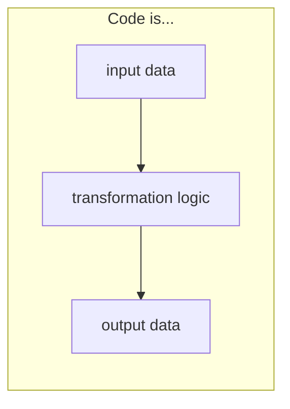
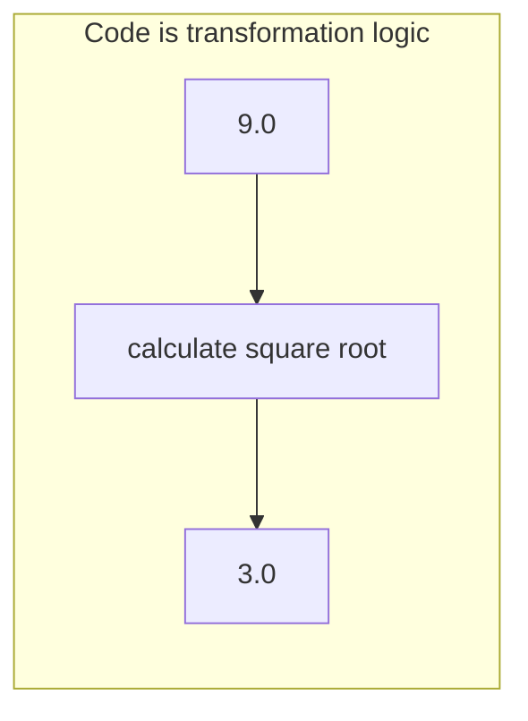

# The Shards Primer

*An step-by-step guide for the beginning Shards developer*

Shards has a visual code syntax so prior programming experience is (desired but) not required to start coding in Shards. We shall cover any required programming concepts as we go along.

## Introduction

### What is code?

Put simply, computer code is a set of instructions to a computer on how to transform data.


```mermaid
graph LR
    subgraph Code is...
        id[input data]
        tr[transformation logic]
        od[output data]
        id --> tr
        tr --> od
    end
```
Fig 1

For example, an instruction telling the computer to calculate the square root of a number, is code.



```mermaid
graph LR
    subgraph Code is transformation logic
        id[9.0]
        tr[calculate square root]
        od[3.0]
        id --> tr
        tr --> od
    end
```
Fig 2

A programming language is a human-readable syntax for writing out such instructions. A set of such instructions is considered a program or a source code.

!!! note
    This source code is further processed and coverted into a form that the computer understands (i.e. steps in building the source code like compiling, linking, etc.) but a discussion on that is beyond the scope of this text.

### What is Shards?

Shards is a programming language with a highly visual syntax, linear data transformetion flow, and an easy learning curve.

Development in Shards feels very similar to [Visual programming](https://en.wikipedia.org/wiki/Visual_programming_language), but without giving up the power and expressiveness of textual syntax.

!!! note
   Shards is a [mal](https://github.com/kanaka/mal) implementation but the scripting language is just a description of the computational graph (i.e., your code's logic). The runtime itself is completely detached and highly optimized for performance making Shards code execution fast. Shards also powers Fragcolor's upcoming visual game-creation engine, [Claymore](https://github.com/fragcolor-xyz/claymore)

## Elements of Shards

### Functions and shards

In Shards, the chunks of transformation logic (that the computer needs to transform data) come in two flavors:

* [functions](https://docs.fragcolor.xyz/functions/)
* [shards](https://docs.fragcolor.xyz/shards/) (written with a lowercase 's')

Functions are units that are native to the mal implementation (i.e., the core language on which Shards is based), while shards are a Shards language feature that allow you to compose your logic more conveniently and with more control. 

!!! note
    1. Shards includes over 500 shards and close to a 100 functions allowing you to manipulate data and compose logic the way that you want.
    2. You can also write your own shards using macros like `defshards` and `defloops` which we cover later in the [Built-in macros](#-Built-in-macros) section.

Now let's run some Shards code!

??? note "Executing Shards code"
    1. The Shards [web sandbox](https://learn.fragcolor.xyz/sandbox) is coming soon but for now please [build Shards](https://docs.fragcolor.xyz/contribute/code/building-shards/) on your machine to work through the examples in this guide. 
    2. Once the `shards.exe` is built, copy paste the code sample you want to run from this guide into a new file with an extension `edn` (that's the Shards script file extension for now). This is your Shards script file. 
    3. Place your Shards script (say`abc.edn`) into the`/build` folder and from there run the script `./shards <abc.edn>` to execute your Shards script.
    4. You just need to build the `shards.exe` once. After that you can change the code in your Shards script (or create a new Shards script) and run that script with the `./shards...` command
    5. If you're using [VS Code](https://code.visualstudio.com/) as your editor you can install the [code-runner plugin](https://marketplace.visualstudio.com/items?itemName=formulahendry.code-runner) and set up your VS Code to execute your Shards script on the click of the `Run` button (see [this](https://docs.fragcolor.xyz/contribute/code/building-shards/#verify-build-and-run) for details).

Since functions are native entities, they can be run as they are.

[`(println)`](https://docs.fragcolor.xyz/functions/standard-output/#println) is a function that prints to the terminal whatever you pass to it. Let's pass the text "Hello World" to it and run the code (copy-paste and run this code in your editor).

=== "EDN"

    ```{.clojure .annotate linenums="1"}
    (println "Hello World")
    ```
    
=== "Result"

    ```
    Hello World 
    ```

Now let's try the same with the shard [`(Msg)`](https://docs.fragcolor.xyz/shards/General/Msg/), which is similar in functionality to the function `(println)`.

=== "EDN"

    ```{.clojure .annotate linenums="1"}
    (Msg "Hello World")
    ```
    
=== "Result"

    ```
    ```

But this didn't work! There is no output.

This is because unlike a function, a shard needs additional software context to run. These sofware constructs are called *wires* and *meshes*.

Now, let's execute `(Msg)` with the required wire and mesh context, and you should see the output appear.

=== "EDN"

    ```{.clojure .annotate linenums="1"}
    (defmesh root)
    (defwire mywire
        (Msg "Hello World")
        )
    (schedule root mywire)
    (run root)
    ```
    
=== "Result"

    ```
    [info] [2022-07-21 16:16:15.648] [T-29488] [logging.cpp::98] [mywire] Hello World
    ```

### Shards, wires, and meshes

To understand why the last code example worked, let see what's needed in order to execute a shard:

* You need to first queue it on a *wire* (a software construct that can hold a sequence of shards) - In the code above function [`(defwire)`](https://docs.fragcolor.xyz/functions/macros/#defwire) creates a wire by the name 'mywire' at line no. 2. This wire starts with a parenthesis at line no. 2, closes with another parenthesis at line no. 4, and houses the shard `(Msg)` at line no. 3.
* Next, you need to schedule the wire on a *mesh* (a software construct that can hold many wires for execution) - A mesh named 'root' is created by function [`(defmesh)`](https://docs.fragcolor.xyz/functions/macros/#defmesh) at line no. 1. And then the function [`(schedule)`](https://docs.fragcolor.xyz/functions/misc/#schedule) schedules wire 'mywire' on mesh 'root' for execution.
* Once all wires are scheduled on a mesh, you need to *run* the mesh - The function [`(run)`](https://docs.fragcolor.xyz/functions/misc/#run) invokes the mesh 'root' for execution at line no. 6. This invocation leads to the execution of the wires scheduled on that mesh, and hence the execution of the shards contained within each wire

Of course, in the above example, we have just one shard and one wire - but each wire can have multiple shards (sequence of shards that execute in order), and each mesh may have multiple wires scheduled on it for execution.


From a programming perspective - 

* Shards are logic blocks that compose the wire
* A wire is a coroutine or a stateful smart function that is made up of a sequence of shards, and can persist its memory across wire execution/iterations
* A mesh is a thread scheduler that schedules and executes the wire coroutines

From a layman's perspective this process of writing and executing shards via the wire/mesh context is similar to you stringing a necklace and then counting its beads.

Let's break down this analogy into steps:

* Step 1: Collect a few beads => Write out a sequence of shards
* Step 2: Find a thread and string the beads onto it => Define a wire and put the shards into it
* Step 3: Hold the necklace in your hand => Define a mesh and schedule the wire on it
* Step 4: Start counting the beads one-by-one (the necklace moving between your fingers with every count) => Run the mesh. This will start executing the shards in the scheduled wire one-by-one (as per the sequence of the shards in the wire)

The analogy doesn't end here!

What we just described was a looped wire (whole necklace). Such a wire will be executed continously in a loop by it mesh (just like you can keep counting the beads on a necklace over and over) till its control parameters tell it to stop. Looped wires are defined by function `(defloop)`

Break this necklace (but don't spill the beads!) and lay it down end-to-end and you have a non-looped wire. Such a wire will be executed only once by its mesh (irrespective of the mesh's control parameters).Non-looped wires are defined by function `(defwire)`.

Pick up two necklaces in one hand and start counting the beads on both - and you have the case of a single mesh running multiple wires! Such wires can be independently executed and/or paused and can even share state (memory variables).

We'll pick up the case of multiple wires and other advanced wire handling techniques in the section [Wire hopping](#-wire-hopping) but for now let's get back to our original example of the `(Msg)` shard.

=== "EDN"

    ```{.clojure .annotate linenums="1"}
    (defmesh root)
    (defwire mywire
        (Msg "Hello World")
        )
    (schedule root mywire)
    (run root)
    ```
    
=== "Result"

    ```
    [info] [2022-07-21 16:16:15.648] [T-29488] [logging.cpp::98] [mywire] Hello World
    ```

### Looped and non-looped

Now `mywire` over here is a non-looped wire and that's the reason `(run)` doesn't need any other parameters other than just the name of the mesh to run (which is 'root' in this case). Since this is a non-looped wire example, the wire executes only once and that's why you see just one run of the output.

Let's spice up things a bit - change the `defwire` function in the example above to `defloop` and run the code again.

=== "EDN"

    ```{.clojure .annotate linenums="1"}
    (defmesh root)
    (defloop mywire
        (Msg "Hello World")
        )
    (schedule root mywire)
    (run root)
    ```
    
=== "Result"

    ```
    [info] [2022-07-21 22:00:37.309] [T-15968] [logging.cpp::98] [mywire] Hello World
    [info] [2022-07-21 22:00:37.312] [T-15968] [logging.cpp::98] [mywire] Hello World
    [info] [2022-07-21 22:00:37.314] [T-15968] [logging.cpp::98] [mywire] Hello World
    [info] [2022-07-21 22:00:37.315] [T-15968] [logging.cpp::98] [mywire] Hello World
    [info] [2022-07-21 22:00:37.317] [T-15968] [logging.cpp::98] [mywire] Hello World
    [info] [2022-07-21 22:00:37.319] [T-15968] [logging.cpp::98] [mywire] Hello World
    [info] [2022-07-21 22:00:37.320] [T-15968] [logging.cpp::98] [mywire] Hello World
    [info] [2022-07-21 22:00:37.322] [T-15968] [logging.cpp::98] [mywire] Hello World
    .
    .
    .
    ```

You'll see the wire executing continuously in a loop (focus on your terminal and hit the `Ctrl+C` key on Windows to break the loop; `command + .` if you're on a Mac).
This is because we defined 'mywire' as a looped wire and hence it now needs to be controlled via some extra parameters in the `(run)` command.

To handle looped wires `(run)` takes two more parameters that are placed after the name of mesh. The first parameter specifies time (seconds) between wire iterations and the second parameter sepcifies maximum number of runs allowed for the wire.

So `(run root 1 3)` will execute the wire three times with an interval of 1 second between iterations.

=== "EDN"

    ```{.clojure .annotate linenums="1"}
    (defmesh root)
    (defloop mywire
        (Msg "Hello World")
        )
    (schedule root mywire)
    (run root 1 3)
    ```
    
=== "Result"

    ```
    [info] [2022-07-21 22:11:55.167] [T-14432] [logging.cpp::98] [mywire] Hello World
    [info] [2022-07-21 22:11:56.174] [T-14432] [logging.cpp::98] [mywire] Hello World
    [info] [2022-07-21 22:11:57.181] [T-14432] [logging.cpp::98] [mywire] Hello World
    ```

The iteration control parameters for `(run)` have no effect on non-looped (`(defwire)`) wires.

??? note Game loops
    (`defloop`) can be used to easily implment game loops (i.e.) game code that needs to run periodically

Before we end this section let's look at an example that involves multiple wires and has multiple shards (we'll use non-looped wires for simplicity).

Run this code in your terminal and play around with the order of the shards and the order of the wire schedulers.

=== "EDN"

    ```{.clojure .annotate linenums="1"}
    (defmesh root)

    (defwire mywire1
        (Msg "Hello World")
        (Msg "Bye World")
        )

    (defwire mywire2
        (Msg "Hello Universe")
        (Msg "Bye Universe")
        )

    (schedule root mywire1)
    (schedule root mywire2)
    (run root)
    ```
    
=== "Result"

    ```
    [info] [2022-07-21 22:16:58.691] [T-11720] [logging.cpp::98] [mywire1] Hello World
    [info] [2022-07-21 22:16:58.703] [T-11720] [logging.cpp::98] [mywire1] Bye World
    [info] [2022-07-21 22:16:58.705] [T-11720] [logging.cpp::98] [mywire2] Hello Universe
    [info] [2022-07-21 22:16:58.706] [T-11720] [logging.cpp::98] [mywire2] Bye Universe
    ```

And an example to show that we can use both functions and shards together (of course, the shards still need to be inside a wire).

!!! note
    For this example we're using the shard [`(Log)`](https://docs.fragcolor.xyz/shards/General/Log/) which takes an input (coming from the left of the shard) and prints that to the screen. This is in contrast with `(Msg)` which doesn't accept any input but instead prints the value of its parameter (parameters stay inside the parenthesis with the shard). More on this in the [Anatomy of a shard](#-anatomy-of-a-shard) section.

=== "EDN"

    ```{.clojure .annotate linenums="1"}
    (println "Start script execution")
    (def greeting "Hello World")

    (defmesh root)
    
    (defwire mywire
        greeting (Log)
        )
    
    (schedule root mywire)
    (run root)
    
    (println "End script execution")
    ```
    
=== "Result"

    ```
    Start script execution
    [info] [2022-07-21 22:43:39.904] [T-1512] [logging.cpp::55] [mywire] Hello World
    End script execution
    ```

Not only can functions and shards co-exist, they can share memory too.

[`(def)`](https://docs.fragcolor.xyz/functions/macros/#def) is a function that defines an alias (or a name) for a value, and `(Log)` accesses that value ("Hello World) via its alias ('greeting') and prints it to the terminal.

--8<-- "includes/license.md"

Built on {{ (git.date or now()).strftime("%b %d, %Y at %H:%M:%S") }} from commit [{{ git.short_commit }}](https://github.com/fragcolor-xyz/shards-examples/commit/{{ git.commit }}).

