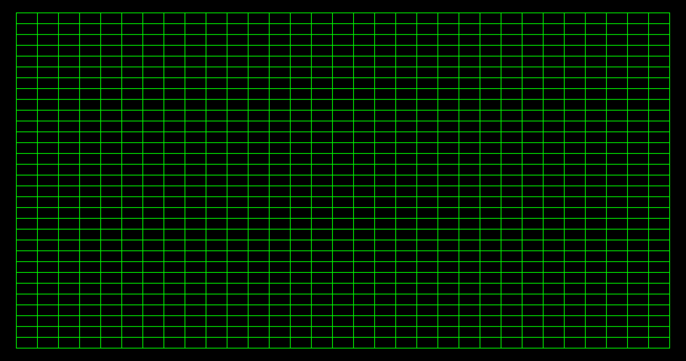

# Step 1

In this step we will lay the foundations of our games by first

1. Drawing our GFX window and

2. Setting up our grid system

## 1.1 Drawing the Window

For the **Snake Game**, unlike our other games, instead of using UI to render our game, we shall use GFX instead. In this step, we will learn how to set up our gfx window.

First, to set up our gfx window, we will need to add all the features that we would use into our features sequence.

=== "Code Added"

    ```shards
    Once({
      ; Create render steps
      GFX.BuiltinFeature(BuiltinFeatureId::Transform) >> features
      GFX.BuiltinFeature(BuiltinFeatureId::BaseColor) >> features
      GFX.BuiltinFeature(BuiltinFeatureId::AlphaBlend) >> features
      
    })
    ```

!!! note "What is a GFX feature ?"
    A GFX feature is a building block that tells the renderer how to draw. Think of them like “filters” you stack one after the other to get the final look.

    - Add shader logic (e.g., positioning objects or choosing their colors).

    - Change render state (e.g., turn on transparency/alpha blending, toggle depth writing, culling, etc.).

    - Expose parameters that your game can set per-view or per-object (advanced—handy later).

    Order matters! Features are applied in sequence; later features can override state set by earlier ones. For this example, we add

    1. `BuiltinFeatureId::Transform` - which applies world/view/projection so things appear in the right place.

    2. `BuiltinFeatureId::BaseColor` - which gives our objects a base color (from vertex color and/or a texture).

    3. `BuiltinFeatureId::AlphaBlend` - which enables simple transparency so see-through pixels blend nicely.

Next we initialize our draw queue and run our render steps

=== "Code Added"

    ```shards
    Once({
      ; Create render steps
      GFX.BuiltinFeature(BuiltinFeatureId::Transform) >> features
      GFX.BuiltinFeature(BuiltinFeatureId::BaseColor) >> features
      GFX.BuiltinFeature(BuiltinFeatureId::AlphaBlend) >> features
      
      GFX.DrawQueue = queue
    })

    GFX.DrawablePass(Features: features Queue: queue) >> render-steps
    ```

!!! note "What is a Draw Queue and a Drawable Pass"
    A Draw Queue is like a shopping list that holds all the items that we want our window to draw. A Drawable Pass is like the final list of items to draw + instructions (the features that we added) on how to draw them.

    After each frame, the queue is cleared so you don’t redraw old items, thus we have to ensure that the code that populates our draw queue is in a loop that runs every frame.


Next, we want to create our actual window. To draw a window first we would need the width and height of our screen.

First we use `GFX.Viewport` which returns an int4 describing the current viewport rectangle as:
(left, top, right, bottom) — all in pixels. From this we can get the width and height of our screen.

=== "Code Added"

    ```shards
    GFX.Viewport = vp ;; gets the screen's left, top, right, btm coordinates
    vp:2 | Sub((vp:0)) | ToFloat = width ;; screen width
    vp:3 | Sub((vp:1)) | ToFloat = height ;; screen height
    ```

We can then use this width and height to create a translation matrix and create a view.

=== "Code Added"

    ```shards
    @f2(width height) >= view-offset
        
    view-offset | ToFloat3 | Math.Translation = view-transform ;; final view transform
    GFX.View(View: view-transform OrthographicSize: @f2(1.0 -1.0) OrthographicSizeType: OrthographicSizeType::PixelScale) = view
    ;; We use an orthographic projection with PixelScale so 1 unit ≈ 1 pixel and @f2(1, -1) flips Y to make top-left the origin.
    ```

And lastly, we wrap our code up in `GFX.MainWindow` to tell our program that this is the main window and then render our queue of items with its instructions in our view.

=== "Code Added" 

    ```shards
    GFX.Render(render-steps view)
    ```

=== "Full Code so far"

    ```shards
    @wire(main-wire {
      GFX.MainWindow(
        Contents: {
          Once({
            ; Create render steps
            GFX.BuiltinFeature(BuiltinFeatureId::Transform) >> features
            GFX.BuiltinFeature(BuiltinFeatureId::BaseColor) >> features
            GFX.BuiltinFeature(BuiltinFeatureId::AlphaBlend) >> features
            GFX.DrawQueue = queue

          })
          
          
          GFX.DrawablePass(Features: features Queue: queue) >> render-steps

          GFX.Viewport = vp ;; gets the screen's left, top, right, btm coordinates
          vp:2 | Sub((vp:0)) | ToFloat = width ;; screen width
          vp:3 | Sub((vp:1)) | ToFloat = height ;; screen height
          
          @f2(width height) >= view-offset ;; makes the grid start from the top left of the screen
            
          view-offset | ToFloat3 | Math.Translation = view-transform ;; final view transform
          GFX.View(View: view-transform OrthographicSize: @f2(1.0 -1.0) OrthographicSizeType: OrthographicSizeType::PixelScale) = view

          GFX.Render(render-steps view)
      })
    } Looped: true)

    @mesh(main)
    @schedule(main main-wire)
    @run(main FPS: 60)
    ```

!!! note "What is a View ?"

    A View is in essence your camera which tells the renderer where you’re looking from and how the world maps to the screen. View "camera" requires the position of the camera and instructions on how to project the view:

    a view matrix – the camera’s position/orientation (or a simple 2D offset).

    Orthographic (flat, no perspective; perfect for 2D/pixel-perfect UIs).

    Perspective (3D depth with FOV).

    Near/Far range – which depths are visible (the “slice” of space you render).

## 1.2 Setting up our Grid

Well done! Now if we think about the essence of our snake game, there are three key rules.

1. When snake head's location is the same as a fruit's location, gain a point.

2. When snake head's location is the same as snake's body, lose the game.

3. When snake head's location is out of bounds, lose the game.

From this, we can clearly see that location is going to be a key part of our program. To kill two birds with one stone, render our game elements at precise locations and keep track of our locations for our game logic, we will be setting up a grid system.

First things first, by default, if we pass in our `@f2(width height)` as is to create our view, the centre of the screen will be `(0 0)`. To make things easier for us in the future so that we won't have to handle with negative numbers, let's shift the screen so that `(0 0)` will be the top left of the screen instead. To do this, we simply multiply our width and height by -0.5.

=== "Code Added"

    ```shards
    @f2(width height) | Math.Multiply(@f2(-0.5 -0.5)) >= view-offset
    view-offset | ToFloat3 | Math.Translation = view-transform
    ```

Next, we will be using basic type fonts to draw our whole game, where "█" will act as our snake body and "○" will be the fruits our snake will collect. Thus, it is reasonable that we make each cell in our grid be the standard width of a character for the font that we are using. To do this, first we import the [font](https://drive.google.com/file/d/1DSdOK5RJFsWI6FNp8UgvihnaaRFHsVEa/view?usp=drive_link) that we are using. 

=== "Code Added"

    ```shards
    @read("Px437_IBM_EGA_8x8.ttf" Bytes: true) | GFX.FontMap = font
    ```

!!! note "@read"
    `@read` is a built in that will read your file at compose time.

Next, we set a font size for the characters that we are using and use `GFX.FontSpaceSize` to get the size of a character aka - the size of each cell in our grid.

=== "Code Added"

    ```shards
    40 >= font-size
    @read("Px437_IBM_EGA_8x8.ttf" Bytes: true) | GFX.FontMap = font
    font | GFX.FontSpaceSize(font-size) | ToFloat2 = font-cell-size

    font-cell-size | Take(0) = font-size-width
    font-cell-size | Take(1) = font-size-height
    ```

Its not guaranteed that our screen would exactly divisible by the font size. To ensure we don't have a case where there is half a cell, lets ensure that there will always be a whole number number of cells by adding a padding to fill the remainder width of height. To do this we can use `Math.Mod`

=== "Code Added"

    ```shards
    width | Math.Mod(font-size-width) = offset-x
    height | Math.Mod(font-size-height) = offset-y
    ```

`Math.Mod` divides the input by the operand provided and returns the remainder. This remainder will be the left, right, top and bottom paddings for our grid. We then divide this remainder by 0.5 (because we want the padding to be evenly distributed, half on the left/bottom and half on the right/top) and add it to our view-offset to act as padding.

=== "Code Added"

    ```shards
    ;; Center the grid be evenly distributing the leftover space not covered by the grid.
    width | Math.Mod((font-size-width | ToFloat)) | Math.Multiply(0.5) = offset-x ;; padding for left and right
    height | Math.Mod((font-size-height | ToFloat)) | Math.Multiply(0.5) = offset-y ;; padding for up and down
    @f2(offset-x offset-y) | Add(view-offset) > view-offset ;; new 0,0 after taking into accound the padding
    ```

Lastly, to be safe, we wrap the code that calculates our padding and offset in a `Memoize` so that it recalculates our padding and view if our viewport or if our font-size changes.

=== "Code Added"

    ```shards
    [vp font-size] | Memoize({
      vp:2 | Sub((vp:0)) | ToFloat = width
      vp:3 | Sub((vp:1)) | ToFloat = height
      @f2(width height) | Math.Multiply(@f2(-0.5 -0.5)) >= view-offset

      font | GFX.FontSpaceSize(font-size) | ToFloat2 = font-cell-size
      font-cell-size | Take(0) = font-size-width
      font-cell-size | Take(1) = font-size-height
      width | Math.Mod(font-size-width) | Math.Multiply(0.5) = offset-x
      height | Math.Mod(font-size-height) | Math.Multiply(0.5) = offset-y 

      @f2(offset-x offset-y) | Add(view-offset) > view-offset
        
      view-offset | ToFloat3 | Math.Translation = view-transform ;; final view transform
    })
    ```

=== "Full Code so far"

    ```shards
    @wire(main-wire {
      GFX.MainWindow(
        Contents: {
          Once({
            ; Create render steps
            GFX.BuiltinFeature(BuiltinFeatureId::Transform) >> features
            GFX.BuiltinFeature(BuiltinFeatureId::BaseColor) >> features
            GFX.BuiltinFeature(BuiltinFeatureId::AlphaBlend) >> features
            GFX.DrawQueue = queue

            40 >= font-size
            @read("./snake/Px437_IBM_EGA_8x8.ttf" Bytes: true) | GFX.FontMap = font ;; change the file path to where your font ttf file is stored

          })
          
          
          GFX.DrawablePass(Features: features Queue: queue) >> render-steps

          GFX.Viewport = vp ;; gets the screen's left, top, right, btm coordinates
          [vp font-size] | Memoize({
            vp:2 | Sub((vp:0)) | ToFloat = width ;; screen width
            vp:3 | Sub((vp:1)) | ToFloat = height ;; screen height
            @f2(width height) | Math.Multiply(@f2(-0.5 -0.5)) >= view-offset ;; makes the grid start from the top left of the screen

            font | GFX.FontSpaceSize(font-size) | ToFloat2 = font-cell-size
            font-cell-size | Take(0) = font-size-width
            font-cell-size | Take(1) = font-size-height
            width | Math.Mod(font-size-width) | Math.Multiply(0.5) = offset-x
            height | Math.Mod(font-size-height) | Math.Multiply(0.5) = offset-y 

            @f2(offset-x offset-y) | Add(view-offset) > view-offset
              
            view-offset | ToFloat3 | Math.Translation = view-transform ;; final view transform
          })
          GFX.View(View: view-transform OrthographicSize: @f2(1.0 -1.0) OrthographicSizeType: OrthographicSizeType::PixelScale) = view

          GFX.Render(render-steps view)
      })
    } Looped: true)

    @mesh(main)
    @schedule(main main-wire)
    @run(main FPS: 60)
    ```

Well done! We have successfully rendered our window and set up a grid system that our snake game will eventually use. The image below is a representation of what we have achieved in this step (though in our program, our grid is invisible).  In the next step, we will start drawing out our snake! See you in our next step!

{ width=300 }

--8<-- "includes/license.md"
