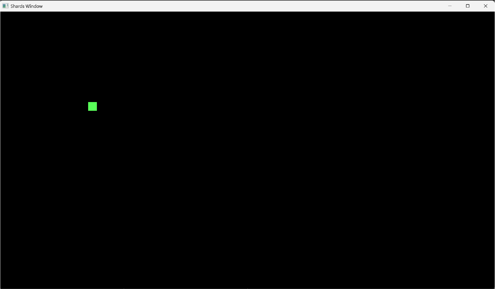
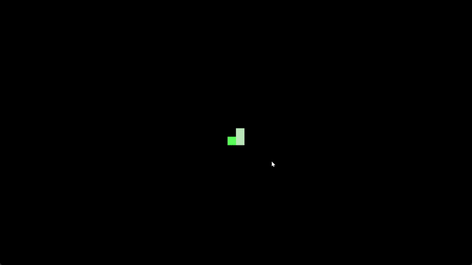

# Step 2

In this step we will

1. draw our snake on the screen and

2. Set up a table system to hold the coordinates of our snake body.

3. Have it move based on input.

## 2.1 Drawing our snake head on the screen

As mentioned in step 1, we will be using the characters "█" for the snake body and "○" for our fruits. To draw these characters in 3d space, we will have to use the `GFX.DynMesh` shards and `GFX.DynToMesh` to render our sequence of characters in 3D space.

!!! note "What are GFX.DynMesh and GFX.DynToMesh"
    - `GFX.DynMesh`
    It creates an empty, dynamic text mesh you can draw strings into (with GFX.DynDrawText, etc.). Each activation it clears itself, so you add whatever text you want this frame, then render it. Great for changing text like scores, timers, or your snake glyphs.

    - `GFX.DynToMesh`
    After you’ve filled the dynamic mesh with glyphs, GFX.DynToMesh converts it into the actual renderable pieces: a sequence of {mesh, texture} pairs you can feed into your usual render steps. You can also pick the winding order (CW for typical UI where Y points down, CCW for world space where Y points up).

First we set up our `GFX.DynMesh` which we can draw our characters on.

=== "Code Added"

    ```shards
    GFX.DynMesh = dmesh
    ```
Next we add the character to draw to our `dmesh` using `GFX.DynDrawText`. For now, let's draw our `"█"` in the arbitrary location (10.0 10.0). To convert our (10.0 10.0) grid position to world screen position, we multiply these coordinates by `font-cell-size`. Because GFX.DynDrawText takes the offset as a `@f3`, since it is drawing the character in 3D space, we have to convert both the location we are drawing it to and `font-cell-size` to a `@f3`. For the color of our character, let's use `@f4(0.1 1.0 0.1 1.0)` which is green.

=== "Code Added"

    ```shards
    "█" | GFX.DynDrawText(
				Font: font
				FontSize: font-size
				Output: dmesh
				Offset: (@f3(10.0 10.0 0.0) | Math.Multiply((font-cell-size | ToFloat3)))
				Scale: 1.0
				Color: @f4(0.1 1.0 0.1 1.0)
				VAlign: 1.0
		)
    ```

!!! note "What is the VAlign parameter"
		VAlign controls the vertical anchor for where your text is placed—i.e., which part of the cell our character sits.

		VAlign = 0 → bottom of the line cell at Offset

		VAlign = 1 → top of the line cell at Offset

		VAlign = -0.5 → centred on the baseline (this is the default)

		For grid-snapped glyphs with a top-left origin, VAlign: 1.0 (top) works naturally.

Lastly, we add the `dmesh` to our queue using `GFX.DynToMesh`.

=== "Code Added"

    ```shards
    dmesh | GFX.DynToMesh | DoMany({
        {Take("mesh") = mesh}
        {Take("texture") = texture}
        Math.MatIdentity | GFX.Drawable(mesh Params: {baseColorTexture: texture}) | GFX.Draw(queue)
    } ComposeSync: true)

    GFX.Render(render-steps view)
    ```

=== "Full Code so far"

    ```shards
    @wire(main-wire {
			GFX.MainWindow(
					Contents: {
					Once({
							; Create render steps
							GFX.BuiltinFeature(BuiltinFeatureId::Transform) >> features
							GFX.BuiltinFeature(BuiltinFeatureId::BaseColor) >> features
							GFX.BuiltinFeature(BuiltinFeatureId::AlphaBlend) >> features
							GFX.DrawQueue = queue

							40 >= font-size
							@read("./snake/Px437_IBM_EGA_8x8.ttf" Bytes: true) | GFX.FontMap = font ;; change the file path to where your font ttf file is stored

					})
					
					
					GFX.DrawablePass(Features: features Queue: queue) >> render-steps

					GFX.Viewport = vp ;; gets the screen's left, top, right, btm coordinates
					[vp font-size] | Memoize({
							vp:2 | Sub((vp:0)) | ToFloat = width ;; screen width
							vp:3 | Sub((vp:1)) | ToFloat = height ;; screen height
							@f2(width height) | Math.Multiply(@f2(-0.5 -0.5)) >= view-offset ;; makes the grid start from the top left of the screen

							font | GFX.FontSpaceSize(font-size) | ToFloat2 = font-cell-size
							font-cell-size | Take(0) = font-size-width
							font-cell-size | Take(1) = font-size-height
							width | Math.Mod((font-size-width)) | Math.Multiply(0.5) = offset-x
							height | Math.Mod((font-size-height)) | Math.Multiply(0.5) = offset-y 

							@f2(offset-x offset-y) | Add(view-offset) > view-offset
							
							view-offset | ToFloat3 | Math.Translation = view-transform ;; final view transform
					})
					GFX.View(View: view-transform OrthographicSize: @f2(1.0 -1.0) OrthographicSizeType: OrthographicSizeType::PixelScale) = view

					GFX.DynMesh = dmesh

					"█" | GFX.DynDrawText(
							Font: font
							FontSize: font-size
							Output: dmesh
							Offset: (@f3(10.0 10.0 0.0) | Math.Multiply((font-cell-size | ToFloat3)))
							Scale: 1.0
							Color: @f4(0.1 1.0 0.1 1.0)
							VAlign: 1.0
					)

					dmesh | GFX.DynToMesh | DoMany({
							{Take("mesh") = mesh}
							{Take("texture") = texture}
							Math.MatIdentity | GFX.Drawable(mesh Params: {baseColorTexture: texture}) | GFX.Draw(queue)
					} ComposeSync: true)

					GFX.Render(render-steps view)
			})
    } Looped: true)

    @mesh(main)
    @schedule(main main-wire)
    @run(main FPS: 60)
    ```

Try running the program and see if a green "█" is drawn on the screen. Try changing the location to see if it moves. If it does! Congratulations! You have successfully drawn our snake head.

{ width=500 }

## 2.2 Drawing our Snake body

Drawing our snake head is simple enough. The next step is to draw our snake body. To do this, we need a system to store our snake body and we need to ensure that it is dynamic, because this body and head will eventually move. We can do this by storing our snake segments information in a sequence. Let's create a sequence that will contain the grid location of each segment.

=== "Code Added"

    ```shards
    [@i2(10 10) @i2(11 10) @i2(12 10)] >= snake-segments
    ```

Next, from these snake segments, we need to input the grid location information for each entry into a GFX.DynDrawText.

=== "Code Added"

    ```shards
    0 >= repeat-idx
		snake-segments ;; snake body segments
		Repeat(
			Action: {
				snake-segments | Take(repeat-idx)
				= coord
					"█" | GFX.DynDrawText(
					Font: font
					FontSize: font-size
					Output: dmesh
					Offset: (coord | ToFloat3 | Math.Multiply((font-cell-size | ToFloat3)))
					Scale: 1.0
					Color: @f4(0.5 0.8 0.5 1.0)
					VAlign: 1.0
				)

				repeat-idx | Math.Add(1) > repeat-idx
				Log("repeat ???")
			}

			Until: {
				repeat-idx | Is((Count(snake-segments) | Math.Subtract(1))) ;; repeat only until the second last segment
			}
		)

		snake-segments | RTake(0) ;; snake head
		= head-coord
		"█" | GFX.DynDrawText(
			Font: font
			FontSize: font-size
			Output: dmesh
			Offset: (head-coord | ToFloat3 | Math.Multiply((font-cell-size | ToFloat3)))
			Scale: 1.0
			Color: @f4(0.1 1.0 0.1 1.0)
			VAlign: 1.0
		)
    ```

=== "Full Code so far"

    ```shards
		@wire(main-wire {
			GFX.MainWindow(
				Contents: {
					Once({
						; Create render steps
						GFX.BuiltinFeature(BuiltinFeatureId::Transform) >> features
						GFX.BuiltinFeature(BuiltinFeatureId::BaseColor) >> features
						GFX.BuiltinFeature(BuiltinFeatureId::AlphaBlend) >> features
						GFX.DrawQueue = queue

						40 >= font-size
						@read("./snake/Px437_IBM_EGA_8x8.ttf" Bytes: true) | GFX.FontMap = font ;; change the file path to where your font ttf file is stored

						[@i2(10 10) @i2(11 10) @i2(12 10)] >= snake-segments

					})
					
					
					GFX.DrawablePass(Features: features Queue: queue) >> render-steps

					GFX.Viewport = vp ;; gets the screen's left, top, right, btm coordinates
					[vp font-size] | Memoize({
						vp:2 | Sub((vp:0)) | ToFloat = width ;; screen width
						vp:3 | Sub((vp:1)) | ToFloat = height ;; screen height
						@f2(width height) | Math.Multiply(@f2(-0.5 -0.5)) >= view-offset ;; makes the grid start from the top left of the screen

						font | GFX.FontSpaceSize(font-size) | ToFloat2 = font-cell-size
						font-cell-size | Take(0) = font-size-width
						font-cell-size | Take(1) = font-size-height
						width | Math.Mod((font-size-width)) | Math.Multiply(0.5) = offset-x
						height | Math.Mod((font-size-height)) | Math.Multiply(0.5) = offset-y 

						@f2(offset-x offset-y) | Add(view-offset) > view-offset
							
						view-offset | ToFloat3 | Math.Translation = view-transform ;; final view transform
					})
					GFX.View(View: view-transform OrthographicSize: @f2(1.0 -1.0) OrthographicSizeType: OrthographicSizeType::PixelScale) = view

					GFX.DynMesh = dmesh

					0 >= repeat-idx
					snake-segments ;; snake body segments
					Repeat(
						Action: {
							snake-segments | Take(repeat-idx)
							= coord
								"█" | GFX.DynDrawText(
								Font: font
								FontSize: font-size
								Output: dmesh
								Offset: (coord | ToFloat3 | Math.Multiply((font-cell-size | ToFloat3)))
								Scale: 1.0
								Color: @f4(0.5 0.8 0.5 1.0)
								VAlign: 1.0
							)

							repeat-idx | Math.Add(1) > repeat-idx
						}

						Until: {
							repeat-idx | Is((Count(snake-segments) | Math.Subtract(1))) ;; repeat only until the second last segment
						}
					)

					snake-segments | RTake(0) ;; snake head
					= head-coord
					"█" | GFX.DynDrawText(
						Font: font
						FontSize: font-size
						Output: dmesh
						Offset: (head-coord | ToFloat3 | Math.Multiply((font-cell-size | ToFloat3)))
						Scale: 1.0
						Color: @f4(0.1 1.0 0.1 1.0)
						VAlign: 1.0
					)

					dmesh | GFX.DynToMesh | DoMany({
						{Take("mesh") = mesh}
						{Take("texture") = texture}
						Math.MatIdentity | GFX.Drawable(mesh Params: {baseColorTexture: texture}) | GFX.Draw(queue)
					} ComposeSync: true)

					GFX.Render(render-steps view)
			})
		} Looped: true)

		@mesh(main)
		@schedule(main main-wire)
		@run(main FPS: 60)
    ```

!!! note "Repeat Instead of ForEach"

		We are using a `Repeat` instead of a `ForEach` because a `ForEach` will automatically go through all of the sequence. `Repeat` however, allows us to set a condition so that it runs the code specified in the `Action` parameter until the second last snake segment. Which we want because the snake head will be the last entry in the sequence.

!!! note "RTake"

		`RTake` takes from the end of the sequence instead of the front. So `RTake(0)` takes the last entry in the sequence which is our snake head.

Try running the code now and you'll be able to see our snake head and its two body segments!

{ width=500 }

## 2.3 Making our Snake move

Now we are going to breathe life into our snake and make it move. To do this we have to add @i2(1 0) (for now we are just moving it right) to the coordinates of our snake head at a fixed rate. Then we have to shift the body along to follow suit.

First let's make a new `@wire` to keep our code organised and house our game logic. Then, let's take our current snake head, shift it right, and make it the new snake head. We also wrap this in an `Animation.Timer` so that we can control the rate of movement and shift it right once every fixed amount of seconds.

=== "Code Added"

    ```shards
		@wire(snake-game {
			;; move snake

			0.15 >= move-duration ;; initialize this in a once

			Animation.Timer(
				Duration: move-duration ;; you can change this to make the movement faster or slower
				Looped: true
				Action: {
					snake-segments | RTake(0) ;; take the last element in the sequence which is the snake head
					Math.Add(@i2(1 0)) = new-snake-head
					new-snake-head >> snake-segments
					DropFront(snake-segments)
				}
			)
		} Looped: true)

		Step(snake-game) ;; scheduled in our main-wire
    ```

=== "Full Code so far"

    ```shards
		@wire(snake-game-logic {
			;; move snake

			Animation.Timer(
				Duration: move-duration
				Looped: true
				Action: {
					snake-segments | RTake(0) ;; take the last element in the sequence which is the snake head
					Math.Add(@i2(1 0)) = new-snake-head
					new-snake-head >> snake-segments
					DropFront(snake-segments)
				}
			)
		} Looped: true)

		@wire(main-wire {
			GFX.MainWindow(
				Contents: {
					Once({
						; Create render steps
						GFX.BuiltinFeature(BuiltinFeatureId::Transform) >> features
						GFX.BuiltinFeature(BuiltinFeatureId::BaseColor) >> features
						GFX.BuiltinFeature(BuiltinFeatureId::AlphaBlend) >> features
						GFX.DrawQueue = queue

						40 >= font-size
						@read("./snake/Px437_IBM_EGA_8x8.ttf" Bytes: true) | GFX.FontMap = font ;; change the file path to where your font ttf file is stored

						[@i2(10 10) @i2(11 10) @i2(12 10)] >= snake-segments

						0.15 >= move-duration

					})
					
					
					GFX.DrawablePass(Features: features Queue: queue) >> render-steps

					GFX.Viewport = vp ;; gets the screen's left, top, right, btm coordinates
					[vp font-size] | Memoize({
						vp:2 | Sub((vp:0)) | ToFloat = width ;; screen width
						vp:3 | Sub((vp:1)) | ToFloat = height ;; screen height
						@f2(width height) | Math.Multiply(@f2(-0.5 -0.5)) >= view-offset ;; makes the grid start from the top left of the screen

						font | GFX.FontSpaceSize(font-size) | ToFloat2 = font-cell-size
						font-cell-size | Take(0) = font-size-width
						font-cell-size | Take(1) = font-size-height
						width | Math.Mod((font-size-width)) | Math.Multiply(0.5) = offset-x
						height | Math.Mod((font-size-height)) | Math.Multiply(0.5) = offset-y 

						@f2(offset-x offset-y) | Add(view-offset) > view-offset
							
						view-offset | ToFloat3 | Math.Translation = view-transform ;; final view transform
					})
					GFX.View(View: view-transform OrthographicSize: @f2(1.0 -1.0) OrthographicSizeType: OrthographicSizeType::PixelScale) = view

					;; game logic
					Step(snake-game-logic)

					;; draw game
					GFX.DynMesh = dmesh

					0 >= repeat-idx
					snake-segments ;; snake body segments
					Repeat(
						Action: {
							snake-segments | Take(repeat-idx)
							= coord
								"█" | GFX.DynDrawText(
								Font: font
								FontSize: font-size
								Output: dmesh
								Offset: (coord | ToFloat3 | Math.Multiply((font-cell-size | ToFloat3)))
								Scale: 1.0
								Color: @f4(0.5 0.8 0.5 1.0)
								VAlign: 1.0
							)

							repeat-idx | Math.Add(1) > repeat-idx
						}

						Until: {
							repeat-idx | Is((Count(snake-segments) | Math.Subtract(1))) ;; repeat only until the second last segment
						}
					)

					snake-segments | RTake(0) ;; snake head
					= head-coord
					"█" | GFX.DynDrawText(
						Font: font
						FontSize: font-size
						Output: dmesh
						Offset: (head-coord | ToFloat3 | Math.Multiply((font-cell-size | ToFloat3)))
						Scale: 1.0
						Color: @f4(0.1 1.0 0.1 1.0)
						VAlign: 1.0
					)

					dmesh | GFX.DynToMesh | DoMany({
						{Take("mesh") = mesh}
						{Take("texture") = texture}
						Math.MatIdentity | GFX.Drawable(mesh Params: {baseColorTexture: texture}) | GFX.Draw(queue)
					} ComposeSync: true)

					GFX.Render(render-steps view)
			})
		} Looped: true)

		@mesh(main)
		@schedule(main main-wire)
		@run(main FPS: 60)
    ```

If you run the code now, congratulations! Our snake is moving. Next we want our snake to move in different directions based on our input.

First things first, let's setup our input system. We will be using `Inputs.KeyDown`. For now we can just print a message whenever the key's are pressed.

!!! note "Inputs.KeyDown"
		Activates the code specified in the `Action` parameter only on the frame the key is pressed

=== "Code Added"

    ```shards
		;; Input Logic
		Inputs.KeyDown("right" {
			Msg("right pressed")
		})
		Inputs.KeyDown("down" {
			Msg("down pressed")
		})
		Inputs.KeyDown("left" {
			Msg("left pressed")
		})
		Inputs.KeyDown("up" {
			Msg("up pressed")
		})
    ```

Next, let's create a variable to hold our input state. We are going to use a table to hold this state. A table here is useful because if there's input state that we want to keep track of, we can simply add a new key.

=== "Code Added"

    ```shards
		;; Input Logic
		Once({
			{direction: 0} >= input-state ;; can be initialized in a once in main
		})

		Inputs.KeyDown("right" {
			0 | Update(input-state "direction")
		})
		Inputs.KeyDown("down" {
			1 | Update(input-state "direction")
		})
		Inputs.KeyDown("left" {
			2 | Update(input-state "direction")
		})
		Inputs.KeyDown("up" {
			3 | Update(input-state "direction")
		})
    ```

Next we change the `@i2` being added to our snake head based on the direction of our `input-state`. However, we also have to take in consideration, for the game Snake, traditionally, if the snake is already moving in that direction, we cannot have it reverse direction. For example, if our snake is moving right, and we press on the left button, it should continue to move right. Thus we have to also take note of the direction that our snake is already moving in.

=== "Code added"

    ```shards
		@i2(1 0) >= snake-direction ;; can be initialized in a once in main

		snake-direction >= prev-dir
		input-state | Take("direction")
		Match([ ;; takes what was given from input
			0 {; right
				prev-dir:0 | When(Is(0) { ;; prev-dir:0 is taking the x
					@i2(1 0) > snake-direction ;; if player pressed right and snake was previously not moving left or right, then change direction to move right
				})
			}
			1 {; down
				prev-dir:1 | When(Is(0) { ;; 
					@i2(0 1) > snake-direction ;; if player pressed down and snake was previously not moving up or down, then change direction to move down
				})
			}
			2 {; left
				prev-dir:0 | When(Is(0) {
					@i2(-1 0) > snake-direction ;; if player pressed left and snake was previously not moving left or right, then change direction to move left
				})
			}
			3 {; up
				prev-dir:1 | When(Is(0) {
					@i2(0 -1) > snake-direction ;; if player pressed down and snake was previously not moving up or down, then change direction to move down
				})
			}
		])
    ```

=== "Full Code so far"

    ```shards
		@wire(snake-game-logic {
			;; move snake

			Inputs.KeyDown("right" {
				0 | Update(input-state "direction")
			})
			Inputs.KeyDown("down" {
				1 | Update(input-state "direction")
			})
			Inputs.KeyDown("left" {
				2 | Update(input-state "direction")
			})
			Inputs.KeyDown("up" {
				3 | Update(input-state "direction")
			})

			snake-direction >= prev-dir
			input-state | Take("direction")
			Match([ ;; takes what was given from input
				0 {; right
					prev-dir:0 | When(Is(0) { ;; prev-dir:0 is taking the x
						@i2(1 0) > snake-direction ;; if player pressed right and snake was previously not moving left or right, then change direction to move right
					})
				}
				1 {; down
					prev-dir:1 | When(Is(0) { ;; 
						@i2(0 1) > snake-direction ;; if player pressed down and snake was previously not moving up or down, then change direction to move down
					})
				}
				2 {; left
					prev-dir:0 | When(Is(0) {
						@i2(-1 0) > snake-direction ;; if player pressed left and snake was previously not moving left or right, then change direction to move left
					})
				}
				3 {; up
					prev-dir:1 | When(Is(0) {
						@i2(0 -1) > snake-direction ;; if player pressed down and snake was previously not moving up or down, then change direction to move down
					})
				}
			])

			Animation.Timer(
				Duration: move-duration
				Looped: true
				Action: {
					
					
					snake-segments | RTake(0) ;; take the last element in the sequence which is the snake head
					Math.Add(snake-direction) = new-snake-head
					new-snake-head >> snake-segments
					DropFront(snake-segments)
				}
			)
		} Looped: true)

		@wire(main-wire {
			GFX.MainWindow(
				Contents: {
					Once({
						; Create render steps
						GFX.BuiltinFeature(BuiltinFeatureId::Transform) >> features
						GFX.BuiltinFeature(BuiltinFeatureId::BaseColor) >> features
						GFX.BuiltinFeature(BuiltinFeatureId::AlphaBlend) >> features
						GFX.DrawQueue = queue

						40 >= font-size
						@read("./snake/Px437_IBM_EGA_8x8.ttf" Bytes: true) | GFX.FontMap = font ;; change the file path to where your font ttf file is stored

						[@i2(10 10) @i2(11 10) @i2(12 10)] >= snake-segments
						{direction: 0} >= input-state
						@i2(1 0) >= snake-direction

						0.15 >= move-duration

					})
					
					
					GFX.DrawablePass(Features: features Queue: queue) >> render-steps

					GFX.Viewport = vp ;; gets the screen's left, top, right, btm coordinates
					[vp font-size] | Memoize({
						vp:2 | Sub((vp:0)) | ToFloat = width ;; screen width
						vp:3 | Sub((vp:1)) | ToFloat = height ;; screen height
						@f2(width height) | Math.Multiply(@f2(-0.5 -0.5)) >= view-offset ;; makes the grid start from the top left of the screen

						font | GFX.FontSpaceSize(font-size) | ToFloat2 = font-cell-size
						font-cell-size | Take(0) = font-size-width
						font-cell-size | Take(1) = font-size-height
						width | Math.Mod((font-size-width)) | Math.Multiply(0.5) = offset-x
						height | Math.Mod((font-size-height)) | Math.Multiply(0.5) = offset-y 

						@f2(offset-x offset-y) | Add(view-offset) > view-offset
							
						view-offset | ToFloat3 | Math.Translation = view-transform ;; final view transform
					})
					GFX.View(View: view-transform OrthographicSize: @f2(1.0 -1.0) OrthographicSizeType: OrthographicSizeType::PixelScale) = view

					;; game logic
					Step(snake-game-logic)

					;; draw game
					GFX.DynMesh = dmesh

					0 >= repeat-idx
					snake-segments ;; snake body segments
					Repeat(
						Action: {
							snake-segments | Take(repeat-idx)
							= coord
								"█" | GFX.DynDrawText(
								Font: font
								FontSize: font-size
								Output: dmesh
								Offset: (coord | ToFloat3 | Math.Multiply((font-cell-size | ToFloat3)))
								Scale: 1.0
								Color: @f4(0.5 0.8 0.5 1.0)
								VAlign: 1.0
							)

							repeat-idx | Math.Add(1) > repeat-idx
						}

						Until: {
							repeat-idx | Is((Count(snake-segments) | Math.Subtract(1))) ;; repeat only until the second last segment
						}
					)

					snake-segments | RTake(0) ;; snake head
					= head-coord
					"█" | GFX.DynDrawText(
						Font: font
						FontSize: font-size
						Output: dmesh
						Offset: (head-coord | ToFloat3 | Math.Multiply((font-cell-size | ToFloat3)))
						Scale: 1.0
						Color: @f4(0.1 1.0 0.1 1.0)
						VAlign: 1.0
					)

					dmesh | GFX.DynToMesh | DoMany({
						{Take("mesh") = mesh}
						{Take("texture") = texture}
						Math.MatIdentity | GFX.Drawable(mesh Params: {baseColorTexture: texture}) | GFX.Draw(queue)
					} ComposeSync: true)

					GFX.Render(render-steps view)
			})
		} Looped: true)

		@mesh(main)
		@schedule(main main-wire)
		@run(main FPS: 60)
    ```
Try running the code now and changing the direction! Well done, we have successfully moved our snake. In the next step we will add the fruits for our snake to collect and earn points and more game logic!

{ width=500 }
		
--8<-- "includes/license.md"
