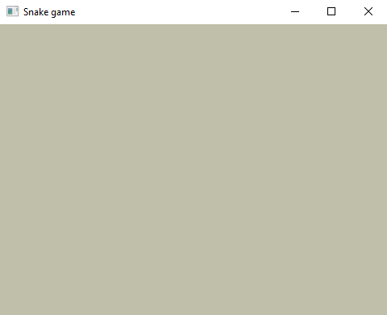

# Step 2

In this tutorial, we will implement a simplified version of the snake game. For now, we won't have high-end graphics but we'll instead focus on the game logic.

## Defining the play space

The snake evolves inside a grid. It moves one cell at a time either horizontally or vertically. The fruit that the snake must eat to grow can appear on any unoccupied cell.

Such a grid may be defined in many ways. We could use a 2D array (or in our case, a sequence of sequences since our grid exists in two-dimensional space). However, to keep our code simple, we will instead use a flat sequence to hold the states of all our grid elements.

The trick is to visualize the 1D sequence as a 2D matrix with defined grid row and grid column values (see code below).

=== "EDN"

    ```{.clojure .annotate linenums="1"}
    (def grid-cols 5) ;; (1)
    (def grid-rows 4)
    (def empty-grid
      [0 0 0 0 0
       0 0 0 0 0
       0 0 0 0 0
       0 0 0 0 0]) ;; (2)
    ```

    1. The [`def`](https://docs.fragcolor.xyz/functions/macros/#def) keyword associates a value with a name.
    2. `[]` is the syntax to define a sequence of values.

Now, to compute the index of a grid element in that sequence from its 2D coordinates, we can define the following function.

=== "EDN"

    ```{.clojure .annotate linenums="1"}
    (defn get-index [] ;; (1)
      (-> (| (Take 0) >= .x) ;; (2) (3)
          (| (Take 1) >= .y) ;; (4) (5)
          .y (Math.Multiply grid-cols) (Math.Add .x))) ;; (6) (7)
    ```

    1. The [`defn`](https://docs.fragcolor.xyz/functions/macros/#defn) keyword associates a function with a name. Note the `[]` after the `get-index` name. This indicates that this function has 0 parameters. We will later see functions that do have parameters.
    2. [`(->)`](https://docs.fragcolor.xyz/functions/misc/#shard-container) is a shard container that will group and execute its inner shard(s) in order.
    3. `(|)` is an alias for [`(Sub)`](https://docs.fragcolor.xyz/shards/General/Sub/). It allows reusing the same input across a sequence of shards.
    4. [`(Take)`](https://docs.fragcolor.xyz/shards/General/Take/) returns the value from a sequence at a given index (starting at `0`).
    5. `>=` is an alias for the shard [`(Set)`](https://docs.fragcolor.xyz/shards/General/Set/) which saves the output of ashard into a context variable.
    6. [`(Math.Multiply)`](https://docs.fragcolor.xyz/shards/Math/Multiply/) multiplies its input (written to the left of theshard) with a given value (written to the right of theshard and enclosed within it’s brackets) and outputs the result.
    7. [`(Math.Add)`](https://docs.fragcolor.xyz/shards/Math/Add/) adds a value to its input and outputs the result.
        
    ??? note
        Because defn expects a single "value" (called function return value) after the function name and the list of parameters, and our function’s logic (function body) contains multiple shards, a (->) shard is required  used required  to group these several shards together in a single (return) shard . Since this is a common situation with `(defn)` function shards, a convenient alternative is to use  [`(defshards)`](https://docs.fragcolor.xyz/functions/macros/#defshards) instead. A `(defshards)` behaves exactly like a function (including the ability to accept input parameters) but can contain multiple shards in its body. These multiple shards are executed in the order that they appear and `(defshards)` return value is the output of the last shard in its body. .

        ```clojure linenums="1"
        (defshards get-index []
          (| (Take 0) >= .x)
          (| (Take 1) >= .y)
          .y (Math.Multiply grid-cols) (Math.Add .x))
        ```

It can be a bit confusing considering that the function doesn't have any parameters. This is because there is an implicit parameter which is the input. 

Since the `(Take)`shard statements start with a `(|)`, they both process the same input (i.e. the implicit input parameter)  passed to the`get-index` function. The first statement stores the 0th element of the input (sequence) into a context variable `.x`, while the second statement stores the 1st element of the input into a context variable `.y`.

Similarly, there is an implicit output at the end of the function (the equivalent of the `return` statement in other programming languages) which is also the function's return value.

Let's break down the last line to understand what's happening here.

=== "EDN"

    ```clojure linenums="1"
    .y (Math.Multiply grid-cols) (Math.Add .x)
    ```

- Here `.y` is a context variable.
- Its value becomes the input of the nextshard: `(Math.Multiply)`.
- `(Math.Multiply)` takes that value, multiplies it by `grid-cols` and returns the result as output.
- The output becomes the input for the nextshard: `(Math.Add)`.
- `(Math.Add)` takes that input and adds it to the value of the context variable `.x`.
- Since this is the lastshard of the function, the output of thisshard becomes the output of the whole function.

Whenever this function is called, the same processing will happen.

=== "EDN"

    ```clojure linenums="1"
    (int2 1 2) (get-index)
    ```

This time our input is a 2D integer vector represented as a single `int2` value. Inside `(get-index)` each component of that vector will be extracted using `(Take)` (see above code listings).

## Creating a window

We will render our game as a windowed application. Therefore we first need to define a window.

=== "EDN"

    ```{.clojure .annotate linenums="1"}
    (defloop main-wire ;; (1)
      (GFX.MainWindow  ;; (2)
       :Title "Snake game" :Width 480 :Height 360
       :Contents
       (-> (GUI.Window ;; (3)
            :Title "canvas" :Width 1.0 :Height 1.0 :Pos (int2 0 0)
            :Flags [GuiWindowFlags.NoTitleBar GuiWindowFlags.MenuBar
                    GuiWindowFlags.NoResize GuiWindowFlags.NoMove GuiWindowFlags.NoCollapse]))))

    (defmesh root)
    (schedule root main-wire)
    (run root (/ 1.0 60))
    ```

    1. We have already seen `defloop`, `defmesh`, `schedule` and `run` in [step 1](./step-1.md).
    2. [`(GFX.MainWindow)`](https://docs.fragcolor.xyz/shards/GFX/MainWindow/) creates the application window.
    3. [`(GUI.Window)`](https://docs.fragcolor.xyz/shards/GUI/Window/) creates a UI window inside our application.

=== "Result"

    

Since we are going to use the UI system to display our game, we need to define a render area. This is why we have a UI window inside our application window.

However, we don't want that UI window to display a title bar and we want it to stay at position `(0 0)` i.e. anchored at the top left of our application. To that end, we set the width and height of the window to be 100% of the available space and we use a few flags to prevent the moving or resizing of this window.

You can play around by removing some of the flags or modifying other parameters and see how the game behavior changes.

## Let's try it out!

Let's give our function a try. First we will change a few values in the grid to be something other than `0`. And then we will try to retrieve and display those values in our brand-new window. Can you guess which values will be displayed?

=== "EDN"

    ```clojure linenums="1"
    (def grid-cols 5)
    (def grid-rows 4)
    (def grid
      [0 2 0 0 3
       1 0 7 0 0
       0 0 0 4 0
       6 0 5 0 8])

    (defn get-index []
      (-> (| (Take 0) >= .x)
          (| (Take 1) >= .y)
          .y (Math.Multiply grid-cols) (Math.Add .x)))

    (defloop main-wire
      (GFX.MainWindow
       :Title "Snake game" :Width 480 :Height 360
       :Contents
       (-> (GUI.Window
            :Title "canvas" :Width 1.0 :Height 1.0 :Pos (int2 0 0)
            :Flags [GuiWindowFlags.NoTitleBar GuiWindowFlags.NoResize
                    GuiWindowFlags.NoMove GuiWindowFlags.NoCollapse]
            :Contents
            (-> (int2 0 1) (get-index) >= .a
                (int2 3 2) (get-index) >= .b

                grid (Take .a) (GUI.Text)
                grid (Take .b) (GUI.Text))))))

    (defmesh root)
    (schedule root main-wire)
    (run root (/ 1.0 60))
    ```

=== "Result"

    

--8<-- "includes/license.md"
