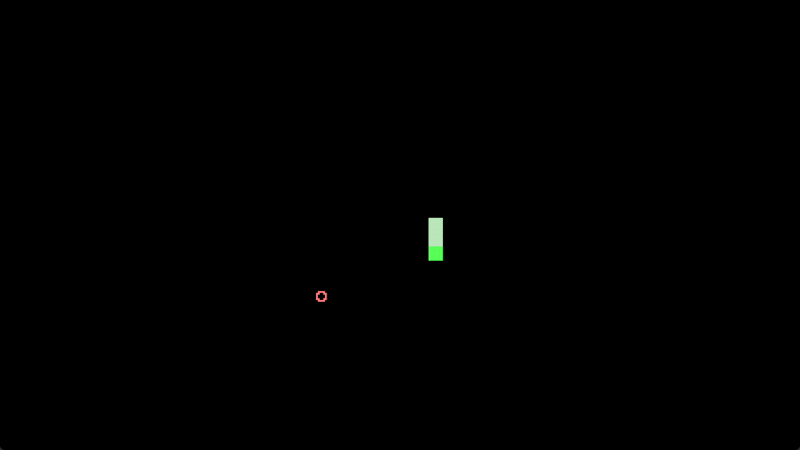
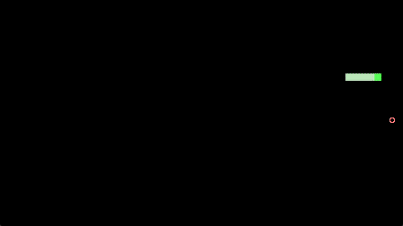
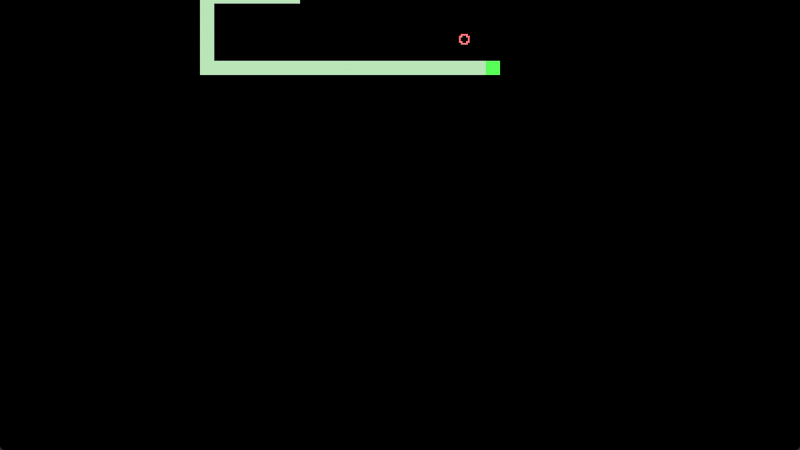
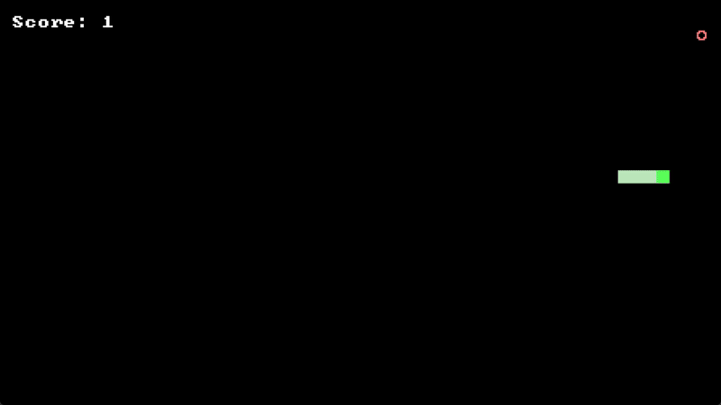

# Step 3

In this step we will:

1. Spawn fruits for our snake to collect

2. Display our points and increase it whenever our snake collect fruits

3. Make our player lose when our snake collides with itself or the walls

Let's get into it!

## 3.1 Spawning Fruits

The logic to spawn our fruits will be very similar to how we spawn our snake segments. First, we need to know what is the maximum range our fruit can spawn in (as we don't want our fruit to spawn off screen). To do this, we need our grid width and length.

=== "Code Added"

    ```shards
    width | Div((font-size-width | ToFloat)) | ToInt | Max(1) = grid-width ;; dividing the screen into a grid based on font.
    height | Div((font-size-height | ToFloat)) | ToInt | Max(1) = grid-length ;; Max ensures at least 1 cell in the grid
    ```

Next, we use `RandomInt` to create a randomized value for the x and y of our food position. We can arbitrarily wrap this in a once so that the position does not change with each tick.

=== "Code Added"

    ```shards
    @i2(0 0) >= food-pos ;; initialized in a once in our main wire
    Once({
      ; Spawn new food if needed
      RandomInt(grid-width) = food-x
      RandomInt(grid-length) = food-y
      @i2(food-x food-y) > food-pos
    })
    ```

Then, similar to how we are drawing out snake, we will use `GFX.DynDrawText` to draw our food.

=== "Code Added"

    ```shards
    ;; draw food
    "○" | GFX.DynDrawText(
      Font: font
      FontSize: font-size
      Output: dmesh
      Offset: (food-pos | ToFloat3 | Math.Multiply((font-cell-size | ToFloat3)))
      Scale: 1.0
      Color: @f4(1.0 0.2 0.2 1.0) ;; red color
      VAlign: 1.0
    )
    ```

=== "Full Code so far"

    ```shards
    @wire(snake-game-logic {
      ;; move snake

      Inputs.KeyDown("right" {
        0 | Update(input-state "direction")
      })
      Inputs.KeyDown("down" {
        1 | Update(input-state "direction")
      })
      Inputs.KeyDown("left" {
        2 | Update(input-state "direction")
      })
      Inputs.KeyDown("up" {
        3 | Update(input-state "direction")
      })

      snake-direction >= prev-dir
      input-state | Take("direction")
      Match([ ;; takes what was given from input
        0 {; right
          prev-dir:0 | When(Is(0) { ;; prev-dir:0 is taking the x
            @i2(1 0) > snake-direction ;; if player pressed right and snake was previously not moving left or right, then change direction to move right
          })
        }
        1 {; down
          prev-dir:1 | When(Is(0) { ;; 
            @i2(0 1) > snake-direction ;; if player pressed down and snake was previously not moving up or down, then change direction to move down
          })
        }
        2 {; left
          prev-dir:0 | When(Is(0) {
            @i2(-1 0) > snake-direction ;; if player pressed left and snake was previously not moving left or right, then change direction to move left
          })
        }
        3 {; up
          prev-dir:1 | When(Is(0) {
            @i2(0 -1) > snake-direction ;; if player pressed down and snake was previously not moving up or down, then change direction to move down
          })
        }
      ])

      Animation.Timer(
        Duration: move-duration
        Looped: true
        Action: {
          
          
          snake-segments | RTake(0) ;; take the last element in the sequence which is the snake head
          Math.Add(snake-direction) = new-snake-head
          new-snake-head >> snake-segments
          DropFront(snake-segments)
        }
      )

      Once({
        ; Spawn new food if needed
        RandomInt(grid-width) = food-x
        RandomInt(grid-length) = food-y
        @i2(food-x food-y) > food-pos
      })
    } Looped: true)

    @wire(main-wire {
      GFX.MainWindow(
        Contents: {
          Once({
            ; Create render steps
            GFX.BuiltinFeature(BuiltinFeatureId::Transform) >> features
            GFX.BuiltinFeature(BuiltinFeatureId::BaseColor) >> features
            GFX.BuiltinFeature(BuiltinFeatureId::AlphaBlend) >> features
            GFX.DrawQueue = queue

            40 >= font-size
            @read("./snake/Px437_IBM_EGA_8x8.ttf" Bytes: true) | GFX.FontMap = font ;; change the file path to where your font ttf file is stored

            [@i2(10 10) @i2(11 10) @i2(12 10)] >= snake-segments

            {direction: 0} >= input-state
            @i2(1 0) >= snake-direction

            0.15 >= move-duration

            @i2(0 0) >= food-pos

          })
          
          
          GFX.DrawablePass(Features: features Queue: queue) >> render-steps

          GFX.Viewport = vp ;; gets the screen's left, top, right, btm coordinates
          [vp font-size] | Memoize({
            vp:2 | Sub((vp:0)) | ToFloat = width ;; screen width
            vp:3 | Sub((vp:1)) | ToFloat = height ;; screen height
            @f2(width height) | Math.Multiply(@f2(-0.5 -0.5)) >= view-offset ;; makes the grid start from the top left of the screen

            font | GFX.FontSpaceSize(font-size) | ToFloat2 = font-cell-size
            font-cell-size | Take(0) = font-size-width
            font-cell-size | Take(1) = font-size-height
            width | Math.Mod((font-size-width)) | Math.Multiply(0.5) = offset-x
            height | Math.Mod((font-size-height)) | Math.Multiply(0.5) = offset-y 

            width | Div((font-size-width | ToFloat)) | ToInt | Max(1) = grid-width ;; dividing the screen into a grid based on font.
            height | Div((font-size-height | ToFloat)) | ToInt | Max(1) = grid-length ;; Max ensures at least 1 cell in the grid

            @f2(offset-x offset-y) | Add(view-offset) > view-offset
              
            view-offset | ToFloat3 | Math.Translation = view-transform ;; final view transform
          })
          GFX.View(View: view-transform OrthographicSize: @f2(1.0 -1.0) OrthographicSizeType: OrthographicSizeType::PixelScale) = view

          ;; game logic
          Step(snake-game-logic)

          ;; draw game
          GFX.DynMesh = dmesh

          0 >= repeat-idx
          snake-segments ;; snake body segments
          Repeat(
            Action: {
              snake-segments | Take(repeat-idx)
              = coord
                "█" | GFX.DynDrawText(
                Font: font
                FontSize: font-size
                Output: dmesh
                Offset: (coord | ToFloat3 | Math.Multiply((font-cell-size | ToFloat3)))
                Scale: 1.0
                Color: @f4(0.5 0.8 0.5 1.0)
                VAlign: 1.0
              )

              repeat-idx | Math.Add(1) > repeat-idx
            }

            Until: {
              repeat-idx | Is((Count(snake-segments) | Math.Subtract(1))) ;; repeat only until the second last segment
            }
          )

          snake-segments | RTake(0) ;; snake head
          = head-coord
          "█" | GFX.DynDrawText(
            Font: font
            FontSize: font-size
            Output: dmesh
            Offset: (head-coord | ToFloat3 | Math.Multiply((font-cell-size | ToFloat3)))
            Scale: 1.0
            Color: @f4(0.1 1.0 0.1 1.0)
            VAlign: 1.0
          )

          ;; draw food
          "○" | GFX.DynDrawText(
            Font: font
            FontSize: font-size
            Output: dmesh
            Offset: (food-pos | ToFloat3 | Math.Multiply((font-cell-size | ToFloat3)))
            Scale: 1.0
            Color: @f4(1.0 0.2 0.2 1.0) ;; red color
            VAlign: 1.0
          )

          dmesh | GFX.DynToMesh | DoMany({
            {Take("mesh") = mesh}
            {Take("texture") = texture}
            Math.MatIdentity | GFX.Drawable(mesh Params: {baseColorTexture: texture}) | GFX.Draw(queue)
          } ComposeSync: true)

          GFX.Render(render-steps view)
      })
    } Looped: true)

    @mesh(main)
    @schedule(main main-wire)
    @run(main FPS: 60)
    ```

Try running the code to see if our fruit is drawn on the screen. Next we shall give our snake the ability to collect the fruit and have this fruit respawn whenever this happens. First let's initialize our `food-pos` as a none first. This way whenever `food-pos` is a none, we randomize a new position for our fruit. And whenever our snake collides with our fruit, make `food-pos` none again so that a new position is randomized.

First, initialize our `food-pos` as a none of Type::Any (This way we can then store an @i2 into `food-pos` after).

=== "Code Added"

    ```shards
    none | ToAny >= food-pos
    ```

Next, we take off the once wrapping our logic that randomizes our `food-pos` and instead wrap it into a conditional that happens only when `food-pos` is none. If we don't convert `none | ToAny` first, we will not be able to set an `@i2` into `food-pos` as an error will be thrown complaining that `food-pos` was already set as a different type.

=== "Code Added"

    ```shards
    food-pos
    When(Predicate: Is(none) Action: {
      ; Spawn new food if needed
      RandomInt(grid-width) = food-x
      RandomInt(grid-length) = food-y
      @i2(food-x food-y) > food-pos
    })
    ```

And lastly, we add our collision logic and check, whenever our head position is the same as our food position, randomise a new food position. Also, since `food-pos` can potentially be a none, let's use a conditional so that our food renders only when `food-pos` is not none.

=== "Code Added"

    ```shards
    food-pos
    When(Predicate: {
      IsNotNone
      And
      new-snake-head | Is((food-pos | ToInt2))
    } Action: {
      none > food-pos
    })

    food-pos | When(Predicate: IsNotNone Action: {
      "○" | GFX.DynDrawText(
        Font: font
        FontSize: font-size
        Output: dmesh
        Offset: (food-pos | ToFloat3 | Math.Multiply((font-cell-size | ToFloat3)))
        Scale: 1.0
        Color: @f4(1.0 0.2 0.2 1.0) ;; red color
        VAlign: 1.0
      )
    })
    ```

=== "Full Code so far"

    ```shards
    @wire(snake-game-logic {
      ;; move snake

      Inputs.KeyDown("right" {
        0 | Update(input-state "direction")
      })
      Inputs.KeyDown("down" {
        1 | Update(input-state "direction")
      })
      Inputs.KeyDown("left" {
        2 | Update(input-state "direction")
      })
      Inputs.KeyDown("up" {
        3 | Update(input-state "direction")
      })

      snake-direction >= prev-dir
      input-state | Take("direction")
      Match([ ;; takes what was given from input
        0 {; right
          prev-dir:0 | When(Is(0) { ;; prev-dir:0 is taking the x
            @i2(1 0) > snake-direction ;; if player pressed right and snake was previously not moving left or right, then change direction to move right
          })
        }
        1 {; down
          prev-dir:1 | When(Is(0) { ;; 
            @i2(0 1) > snake-direction ;; if player pressed down and snake was previously not moving up or down, then change direction to move down
          })
        }
        2 {; left
          prev-dir:0 | When(Is(0) {
            @i2(-1 0) > snake-direction ;; if player pressed left and snake was previously not moving left or right, then change direction to move left
          })
        }
        3 {; up
          prev-dir:1 | When(Is(0) {
            @i2(0 -1) > snake-direction ;; if player pressed down and snake was previously not moving up or down, then change direction to move down
          })
        }
      ])

      Animation.Timer(
        Duration: move-duration
        Looped: true
        Action: {
          
          
          snake-segments | RTake(0) ;; take the last element in the sequence which is the snake head
          Math.Add(snake-direction) = new-snake-head

          ;; food collision logic
          food-pos
          When(Predicate: {
            IsNotNone
            And
            new-snake-head | Is((food-pos | ToInt2))
          } Action: {
            none > food-pos
          })

          new-snake-head >> snake-segments
          DropFront(snake-segments)
        }
      )

      food-pos
      When(Predicate: Is(none) Action: {
        ; Spawn new food if needed
        RandomInt(grid-width) = food-x
        RandomInt(grid-length) = food-y
        @i2(food-x food-y) > food-pos
      })
    } Looped: true)

    @wire(main-wire {
      GFX.MainWindow(
        Contents: {
          Once({
            ; Create render steps
            GFX.BuiltinFeature(BuiltinFeatureId::Transform) >> features
            GFX.BuiltinFeature(BuiltinFeatureId::BaseColor) >> features
            GFX.BuiltinFeature(BuiltinFeatureId::AlphaBlend) >> features
            GFX.DrawQueue = queue

            40 >= font-size
            @read("./snake/Px437_IBM_EGA_8x8.ttf" Bytes: true) | GFX.FontMap = font ;; change the file path to where your font ttf file is stored

            [@i2(10 10) @i2(11 10) @i2(12 10)] >= snake-segments

            {direction: 0} >= input-state
            @i2(1 0) >= snake-direction

            0.15 >= move-duration

            none | ToAny >= food-pos

          })
          
          
          GFX.DrawablePass(Features: features Queue: queue) >> render-steps

          GFX.Viewport = vp ;; gets the screen's left, top, right, btm coordinates
          [vp font-size] | Memoize({
            vp:2 | Sub((vp:0)) | ToFloat = width ;; screen width
            vp:3 | Sub((vp:1)) | ToFloat = height ;; screen height
            @f2(width height) | Math.Multiply(@f2(-0.5 -0.5)) >= view-offset ;; makes the grid start from the top left of the screen

            font | GFX.FontSpaceSize(font-size) | ToFloat2 = font-cell-size
            font-cell-size | Take(0) = font-size-width
            font-cell-size | Take(1) = font-size-height
            width | Math.Mod((font-size-width)) | Math.Multiply(0.5) = offset-x
            height | Math.Mod((font-size-height)) | Math.Multiply(0.5) = offset-y 

            width | Div((font-size-width | ToFloat)) | ToInt | Max(1) = grid-width ;; dividing the screen into a grid based on font.
            height | Div((font-size-height | ToFloat)) | ToInt | Max(1) = grid-length ;; Max ensures at least 1 cell in the grid

            @f2(offset-x offset-y) | Add(view-offset) > view-offset
              
            view-offset | ToFloat3 | Math.Translation = view-transform ;; final view transform
          })
          GFX.View(View: view-transform OrthographicSize: @f2(1.0 -1.0) OrthographicSizeType: OrthographicSizeType::PixelScale) = view

          ;; game logic
          Step(snake-game-logic)

          ;; draw game
          GFX.DynMesh = dmesh

          0 >= repeat-idx
          snake-segments ;; snake body segments
          Repeat(
            Action: {
              snake-segments | Take(repeat-idx)
              = coord
                "█" | GFX.DynDrawText(
                Font: font
                FontSize: font-size
                Output: dmesh
                Offset: (coord | ToFloat3 | Math.Multiply((font-cell-size | ToFloat3)))
                Scale: 1.0
                Color: @f4(0.5 0.8 0.5 1.0)
                VAlign: 1.0
              )

              repeat-idx | Math.Add(1) > repeat-idx
            }

            Until: {
              repeat-idx | Is((Count(snake-segments) | Math.Subtract(1))) ;; repeat only until the second last segment
            }
          )

          snake-segments | RTake(0) ;; snake head
          = head-coord
          "█" | GFX.DynDrawText(
            Font: font
            FontSize: font-size
            Output: dmesh
            Offset: (head-coord | ToFloat3 | Math.Multiply((font-cell-size | ToFloat3)))
            Scale: 1.0
            Color: @f4(0.1 1.0 0.1 1.0)
            VAlign: 1.0
          )

          ;; draw food
          food-pos | When(Predicate: IsNotNone Action: {
						"○" | GFX.DynDrawText(
							Font: font
							FontSize: font-size
							Output: dmesh
							Offset: (food-pos | ToFloat3 | Math.Multiply((font-cell-size | ToFloat3)))
							Scale: 1.0
							Color: @f4(1.0 0.2 0.2 1.0) ;; red color
							VAlign: 1.0
						)
					})

          dmesh | GFX.DynToMesh | DoMany({
            {Take("mesh") = mesh}
            {Take("texture") = texture}
            Math.MatIdentity | GFX.Drawable(mesh Params: {baseColorTexture: texture}) | GFX.Draw(queue)
          } ComposeSync: true)

          GFX.Render(render-steps view)
      })
    } Looped: true)

    @mesh(main)
    @schedule(main main-wire)
    @run(main FPS: 60)
    ```

Try running the program and "collecting" the fruit. Does the fruit randomize again every time it is collected ? Wonderful!

{ width=500 }

## 3.2 Collecting Fruits

Next we want to add in the reward and consequence of collecting fruits. Those being, when the snake collects fruits, the snake will grow longer, it will speed up and our score will increase. Let's do this one by one. First, let's make our snake grow. It is actually very simply to do this. We have a line `DropFront(snake-segments)` which makes it so that our snake does not endlessly grow when it moves since we are adding the `new-head` into our `snake-segments` sequence. So to make our snake grow whenever we collect fruit, it has to not `DropFront(snake-segments)`. We can change our food collision conditional to an If and only `DropFront(snake-segments)`, whenever we don't collide with a fruit.

=== "Code Added"

    ```shards
    food-pos
    If(Predicate: {
      IsNotNone
      And
      new-snake-head | Is((food-pos | ToInt2))
    } Then: {
      none > food-pos
    } Else: {
      DropFront(snake-segments)
    })
    ```

=== "Full Code so far"

    ```shards
    @wire(snake-game-logic {
      ;; move snake

      Inputs.KeyDown("right" {
        0 | Update(input-state "direction")
      })
      Inputs.KeyDown("down" {
        1 | Update(input-state "direction")
      })
      Inputs.KeyDown("left" {
        2 | Update(input-state "direction")
      })
      Inputs.KeyDown("up" {
        3 | Update(input-state "direction")
      })

      snake-direction >= prev-dir
      input-state | Take("direction")
      Match([ ;; takes what was given from input
        0 {; right
          prev-dir:0 | When(Is(0) { ;; prev-dir:0 is taking the x
            @i2(1 0) > snake-direction ;; if player pressed right and snake was previously not moving left or right, then change direction to move right
          })
        }
        1 {; down
          prev-dir:1 | When(Is(0) { ;; 
            @i2(0 1) > snake-direction ;; if player pressed down and snake was previously not moving up or down, then change direction to move down
          })
        }
        2 {; left
          prev-dir:0 | When(Is(0) {
            @i2(-1 0) > snake-direction ;; if player pressed left and snake was previously not moving left or right, then change direction to move left
          })
        }
        3 {; up
          prev-dir:1 | When(Is(0) {
            @i2(0 -1) > snake-direction ;; if player pressed down and snake was previously not moving up or down, then change direction to move down
          })
        }
      ])

      Animation.Timer(
        Duration: move-duration
        Looped: true
        Action: {
          
          
          snake-segments | RTake(0) ;; take the last element in the sequence which is the snake head
          Math.Add(snake-direction) = new-snake-head

          new-snake-head >> snake-segments

          ;; food collision logic
          food-pos
          If(Predicate: {
            IsNotNone
            And
            new-snake-head | Is((food-pos | ToInt2))
          } Then: {
            none > food-pos
          } Else: {
            DropFront(snake-segments)
          })

        }
      )

      food-pos
      When(Predicate: Is(none) Action: {
        ; Spawn new food if needed
        RandomInt(grid-width) = food-x
        RandomInt(grid-length) = food-y
        @i2(food-x food-y) > food-pos
      })
    } Looped: true)

    @wire(main-wire {
      GFX.MainWindow(
        Contents: {
          Once({
            ; Create render steps
            GFX.BuiltinFeature(BuiltinFeatureId::Transform) >> features
            GFX.BuiltinFeature(BuiltinFeatureId::BaseColor) >> features
            GFX.BuiltinFeature(BuiltinFeatureId::AlphaBlend) >> features
            GFX.DrawQueue = queue

            40 >= font-size
            @read("./snake/Px437_IBM_EGA_8x8.ttf" Bytes: true) | GFX.FontMap = font ;; change the file path to where your font ttf file is stored

            [@i2(10 10) @i2(11 10) @i2(12 10)] >= snake-segments

            {direction: 0} >= input-state
            @i2(1 0) >= snake-direction

            0.15 >= move-duration

            none | ToAny >= food-pos

          })
          
          
          GFX.DrawablePass(Features: features Queue: queue) >> render-steps

          GFX.Viewport = vp ;; gets the screen's left, top, right, btm coordinates
          [vp font-size] | Memoize({
            vp:2 | Sub((vp:0)) | ToFloat = width ;; screen width
            vp:3 | Sub((vp:1)) | ToFloat = height ;; screen height
            @f2(width height) | Math.Multiply(@f2(-0.5 -0.5)) >= view-offset ;; makes the grid start from the top left of the screen

            font | GFX.FontSpaceSize(font-size) | ToFloat2 = font-cell-size
            font-cell-size | Take(0) = font-size-width
            font-cell-size | Take(1) = font-size-height
            width | Math.Mod((font-size-width)) | Math.Multiply(0.5) = offset-x
            height | Math.Mod((font-size-height)) | Math.Multiply(0.5) = offset-y 

            width | Div((font-size-width | ToFloat)) | ToInt | Max(1) = grid-width ;; dividing the screen into a grid based on font.
            height | Div((font-size-height | ToFloat)) | ToInt | Max(1) = grid-length ;; Max ensures at least 1 cell in the grid

            @f2(offset-x offset-y) | Add(view-offset) > view-offset
              
            view-offset | ToFloat3 | Math.Translation = view-transform ;; final view transform
          })
          GFX.View(View: view-transform OrthographicSize: @f2(1.0 -1.0) OrthographicSizeType: OrthographicSizeType::PixelScale) = view

          ;; game logic
          Step(snake-game-logic)

          ;; draw game
          GFX.DynMesh = dmesh

          0 >= repeat-idx
          snake-segments ;; snake body segments
          Repeat(
            Action: {
              snake-segments | Take(repeat-idx)
              = coord
                "█" | GFX.DynDrawText(
                Font: font
                FontSize: font-size
                Output: dmesh
                Offset: (coord | ToFloat3 | Math.Multiply((font-cell-size | ToFloat3)))
                Scale: 1.0
                Color: @f4(0.5 0.8 0.5 1.0)
                VAlign: 1.0
              )

              repeat-idx | Math.Add(1) > repeat-idx
            }

            Until: {
              repeat-idx | Is((Count(snake-segments) | Math.Subtract(1))) ;; repeat only until the second last segment
            }
          )

          snake-segments | RTake(0) ;; snake head
          = head-coord
          "█" | GFX.DynDrawText(
            Font: font
            FontSize: font-size
            Output: dmesh
            Offset: (head-coord | ToFloat3 | Math.Multiply((font-cell-size | ToFloat3)))
            Scale: 1.0
            Color: @f4(0.1 1.0 0.1 1.0)
            VAlign: 1.0
          )

          ;; draw food
          food-pos | When(Predicate: IsNotNone Action: {
						"○" | GFX.DynDrawText(
							Font: font
							FontSize: font-size
							Output: dmesh
							Offset: (food-pos | ToFloat3 | Math.Multiply((font-cell-size | ToFloat3)))
							Scale: 1.0
							Color: @f4(1.0 0.2 0.2 1.0) ;; red color
							VAlign: 1.0
						)
					})

          dmesh | GFX.DynToMesh | DoMany({
            {Take("mesh") = mesh}
            {Take("texture") = texture}
            Math.MatIdentity | GFX.Drawable(mesh Params: {baseColorTexture: texture}) | GFX.Draw(queue)
          } ComposeSync: true)

          GFX.Render(render-steps view)
      })
    } Looped: true)

    @mesh(main)
    @schedule(main main-wire)
    @run(main FPS: 60)
    ```
{ width=500 }

Try running the program and collecting some fruits. The snake should be growing longer. Next, we want our snake to also move faster whenever it collects a fruit. To do this, we shorten `move-duration` whenever collision with food happens.

=== "Code Added"

    ```shards
    food-pos
    If(Predicate: {
      IsNotNone
      And
      new-snake-head | Is((food-pos | ToInt2))
    } Then: {
      none > food-pos
      move-duration | Mul(0.95) > move-duration ;; speed up slightly
    } Else: {
      DropFront(snake-segments)
    })
    ```

=== "Full Code so far"

    ```shards
    @wire(snake-game-logic {
      ;; move snake

      Inputs.KeyDown("right" {
        0 | Update(input-state "direction")
      })
      Inputs.KeyDown("down" {
        1 | Update(input-state "direction")
      })
      Inputs.KeyDown("left" {
        2 | Update(input-state "direction")
      })
      Inputs.KeyDown("up" {
        3 | Update(input-state "direction")
      })

      snake-direction >= prev-dir
      input-state | Take("direction")
      Match([ ;; takes what was given from input
        0 {; right
          prev-dir:0 | When(Is(0) { ;; prev-dir:0 is taking the x
            @i2(1 0) > snake-direction ;; if player pressed right and snake was previously not moving left or right, then change direction to move right
          })
        }
        1 {; down
          prev-dir:1 | When(Is(0) { ;; 
            @i2(0 1) > snake-direction ;; if player pressed down and snake was previously not moving up or down, then change direction to move down
          })
        }
        2 {; left
          prev-dir:0 | When(Is(0) {
            @i2(-1 0) > snake-direction ;; if player pressed left and snake was previously not moving left or right, then change direction to move left
          })
        }
        3 {; up
          prev-dir:1 | When(Is(0) {
            @i2(0 -1) > snake-direction ;; if player pressed down and snake was previously not moving up or down, then change direction to move down
          })
        }
      ])

      Animation.Timer(
        Duration: move-duration
        Looped: true
        Action: {
          
          
          snake-segments | RTake(0) ;; take the last element in the sequence which is the snake head
          Math.Add(snake-direction) = new-snake-head

          new-snake-head >> snake-segments

          ;; food collision logic
          food-pos
          If(Predicate: {
            IsNotNone
            And
            new-snake-head | Is((food-pos | ToInt2))
          } Then: {
            none > food-pos
            move-duration | Mul(0.95) > move-duration
          } Else: {
            DropFront(snake-segments)
          })

        }
      )

      food-pos
      When(Predicate: Is(none) Action: {
        ; Spawn new food if needed
        RandomInt(grid-width) = food-x
        RandomInt(grid-length) = food-y
        @i2(food-x food-y) > food-pos
      })
    } Looped: true)

    @wire(main-wire {
      GFX.MainWindow(
        Contents: {
          Once({
            ; Create render steps
            GFX.BuiltinFeature(BuiltinFeatureId::Transform) >> features
            GFX.BuiltinFeature(BuiltinFeatureId::BaseColor) >> features
            GFX.BuiltinFeature(BuiltinFeatureId::AlphaBlend) >> features
            GFX.DrawQueue = queue

            40 >= font-size
            @read("./snake/Px437_IBM_EGA_8x8.ttf" Bytes: true) | GFX.FontMap = font ;; change the file path to where your font ttf file is stored

            [@i2(10 10) @i2(11 10) @i2(12 10)] >= snake-segments

            {direction: 0} >= input-state
            @i2(1 0) >= snake-direction

            0.15 >= move-duration

            none | ToAny >= food-pos

          })
          
          
          GFX.DrawablePass(Features: features Queue: queue) >> render-steps

          GFX.Viewport = vp ;; gets the screen's left, top, right, btm coordinates
          [vp font-size] | Memoize({
            vp:2 | Sub((vp:0)) | ToFloat = width ;; screen width
            vp:3 | Sub((vp:1)) | ToFloat = height ;; screen height
            @f2(width height) | Math.Multiply(@f2(-0.5 -0.5)) >= view-offset ;; makes the grid start from the top left of the screen

            font | GFX.FontSpaceSize(font-size) | ToFloat2 = font-cell-size
            font-cell-size | Take(0) = font-size-width
            font-cell-size | Take(1) = font-size-height
            width | Math.Mod((font-size-width)) | Math.Multiply(0.5) = offset-x
            height | Math.Mod((font-size-height)) | Math.Multiply(0.5) = offset-y 

            width | Div((font-size-width | ToFloat)) | ToInt | Max(1) = grid-width ;; dividing the screen into a grid based on font.
            height | Div((font-size-height | ToFloat)) | ToInt | Max(1) = grid-length ;; Max ensures at least 1 cell in the grid

            @f2(offset-x offset-y) | Add(view-offset) > view-offset
              
            view-offset | ToFloat3 | Math.Translation = view-transform ;; final view transform
          })
          GFX.View(View: view-transform OrthographicSize: @f2(1.0 -1.0) OrthographicSizeType: OrthographicSizeType::PixelScale) = view

          ;; game logic
          Step(snake-game-logic)

          ;; draw game
          GFX.DynMesh = dmesh

          0 >= repeat-idx
          snake-segments ;; snake body segments
          Repeat(
            Action: {
              snake-segments | Take(repeat-idx)
              = coord
                "█" | GFX.DynDrawText(
                Font: font
                FontSize: font-size
                Output: dmesh
                Offset: (coord | ToFloat3 | Math.Multiply((font-cell-size | ToFloat3)))
                Scale: 1.0
                Color: @f4(0.5 0.8 0.5 1.0)
                VAlign: 1.0
              )

              repeat-idx | Math.Add(1) > repeat-idx
            }

            Until: {
              repeat-idx | Is((Count(snake-segments) | Math.Subtract(1))) ;; repeat only until the second last segment
            }
          )

          snake-segments | RTake(0) ;; snake head
          = head-coord
          "█" | GFX.DynDrawText(
            Font: font
            FontSize: font-size
            Output: dmesh
            Offset: (head-coord | ToFloat3 | Math.Multiply((font-cell-size | ToFloat3)))
            Scale: 1.0
            Color: @f4(0.1 1.0 0.1 1.0)
            VAlign: 1.0
          )

          ;; draw food
          food-pos | When(Predicate: IsNotNone Action: {
						"○" | GFX.DynDrawText(
							Font: font
							FontSize: font-size
							Output: dmesh
							Offset: (food-pos | ToFloat3 | Math.Multiply((font-cell-size | ToFloat3)))
							Scale: 1.0
							Color: @f4(1.0 0.2 0.2 1.0) ;; red color
							VAlign: 1.0
						)
					})

          dmesh | GFX.DynToMesh | DoMany({
            {Take("mesh") = mesh}
            {Take("texture") = texture}
            Math.MatIdentity | GFX.Drawable(mesh Params: {baseColorTexture: texture}) | GFX.Draw(queue)
          } ComposeSync: true)

          GFX.Render(render-steps view)
      })
    } Looped: true)

    @mesh(main)
    @schedule(main main-wire)
    @run(main FPS: 60)
    ```

{ width=500 }

Now, on top of growing, our snake should also speed up with each fruit collected! Next, a key component of the game is for our score to increase as we collect fruits. First, to start nice and easy, let's initialize our score variable.

=== "Code Added"

    ```shards
    0 >= score ;; initialize in once in our main wire
    ```

Next we add to this score whenever our snake collects food.

=== "Code Added"

    ```shards
    ;; food collision logic
    food-pos
    If(Predicate: {
      IsNotNone
      And
      new-snake-head | Is((food-pos | ToInt2))
    } Then: {
      none > food-pos
      score | Math.Add(1) > score
      move-duration | Mul(0.95) > move-duration
    } Else: {
      DropFront(snake-segments)
    })
    ```

Lastly, we need to display our score on the top left.

=== "Code Added"

    ```shards
    ["Score" score] | String.Format | GFX.DynDrawText(
      Font: font
      FontSize: font-size
      Output: dmesh
      Offset: (@f3(1.0 1.0 0.0) | Math.Multiply((font-cell-size | ToFloat3)))
      Scale: 1.0
      Color: @f4(1.0 1.0 1.0 1.0) ;; white
      VAlign: 1.0
    )
    ```

=== "Full Code so far"

    ```shards
    @wire(snake-game-logic {
      ;; move snake

      Inputs.KeyDown("right" {
        0 | Update(input-state "direction")
      })
      Inputs.KeyDown("down" {
        1 | Update(input-state "direction")
      })
      Inputs.KeyDown("left" {
        2 | Update(input-state "direction")
      })
      Inputs.KeyDown("up" {
        3 | Update(input-state "direction")
      })

      snake-direction >= prev-dir
      input-state | Take("direction")
      Match([ ;; takes what was given from input
        0 {; right
          prev-dir:0 | When(Is(0) { ;; prev-dir:0 is taking the x
            @i2(1 0) > snake-direction ;; if player pressed right and snake was previously not moving left or right, then change direction to move right
          })
        }
        1 {; down
          prev-dir:1 | When(Is(0) { ;; 
            @i2(0 1) > snake-direction ;; if player pressed down and snake was previously not moving up or down, then change direction to move down
          })
        }
        2 {; left
          prev-dir:0 | When(Is(0) {
            @i2(-1 0) > snake-direction ;; if player pressed left and snake was previously not moving left or right, then change direction to move left
          })
        }
        3 {; up
          prev-dir:1 | When(Is(0) {
            @i2(0 -1) > snake-direction ;; if player pressed down and snake was previously not moving up or down, then change direction to move down
          })
        }
      ])

      Animation.Timer(
        Duration: move-duration
        Looped: true
        Action: {
          
          
          snake-segments | RTake(0) ;; take the last element in the sequence which is the snake head
          Math.Add(snake-direction) = new-snake-head

          new-snake-head >> snake-segments

          ;; food collision logic
          food-pos
          If(Predicate: {
            IsNotNone
            And
            new-snake-head | Is((food-pos | ToInt2))
          } Then: {
            none > food-pos
            score | Math.Add(1) > score
            move-duration | Mul(0.95) > move-duration
          } Else: {
            DropFront(snake-segments)
          })

        }
      )

      food-pos
      When(Predicate: Is(none) Action: {
        ; Spawn new food if needed
        RandomInt(grid-width) = food-x
        RandomInt(grid-length) = food-y
        @i2(food-x food-y) > food-pos
      })
    } Looped: true)

    @wire(main-wire {
      GFX.MainWindow(
        Contents: {
          Once({
            ; Create render steps
            GFX.BuiltinFeature(BuiltinFeatureId::Transform) >> features
            GFX.BuiltinFeature(BuiltinFeatureId::BaseColor) >> features
            GFX.BuiltinFeature(BuiltinFeatureId::AlphaBlend) >> features
            GFX.DrawQueue = queue

            40 >= font-size
            @read("./snake/Px437_IBM_EGA_8x8.ttf" Bytes: true) | GFX.FontMap = font ;; change the file path to where your font ttf file is stored

            [@i2(10 10) @i2(11 10) @i2(12 10)] >= snake-segments

            {direction: 0} >= input-state
            @i2(1 0) >= snake-direction

            0.15 >= move-duration

            none | ToAny >= food-pos

            0 >= score

          })
          
          
          GFX.DrawablePass(Features: features Queue: queue) >> render-steps

          GFX.Viewport = vp ;; gets the screen's left, top, right, btm coordinates
          [vp font-size] | Memoize({
            vp:2 | Sub((vp:0)) | ToFloat = width ;; screen width
            vp:3 | Sub((vp:1)) | ToFloat = height ;; screen height
            @f2(width height) | Math.Multiply(@f2(-0.5 -0.5)) >= view-offset ;; makes the grid start from the top left of the screen

            font | GFX.FontSpaceSize(font-size) | ToFloat2 = font-cell-size
            font-cell-size | Take(0) = font-size-width
            font-cell-size | Take(1) = font-size-height
            width | Math.Mod((font-size-width)) | Math.Multiply(0.5) = offset-x
            height | Math.Mod((font-size-height)) | Math.Multiply(0.5) = offset-y 

            width | Div((font-size-width | ToFloat)) | ToInt | Max(1) = grid-width ;; dividing the screen into a grid based on font.
            height | Div((font-size-height | ToFloat)) | ToInt | Max(1) = grid-length ;; Max ensures at least 1 cell in the grid

            @f2(offset-x offset-y) | Add(view-offset) > view-offset
              
            view-offset | ToFloat3 | Math.Translation = view-transform ;; final view transform
          })
          GFX.View(View: view-transform OrthographicSize: @f2(1.0 -1.0) OrthographicSizeType: OrthographicSizeType::PixelScale) = view

          ;; game logic
          Step(snake-game-logic)

          ;; draw game
          GFX.DynMesh = dmesh

          0 >= repeat-idx
          snake-segments ;; snake body segments
          Repeat(
            Action: {
              snake-segments | Take(repeat-idx)
              = coord
                "█" | GFX.DynDrawText(
                Font: font
                FontSize: font-size
                Output: dmesh
                Offset: (coord | ToFloat3 | Math.Multiply((font-cell-size | ToFloat3)))
                Scale: 1.0
                Color: @f4(0.5 0.8 0.5 1.0)
                VAlign: 1.0
              )

              repeat-idx | Math.Add(1) > repeat-idx
            }

            Until: {
              repeat-idx | Is((Count(snake-segments) | Math.Subtract(1))) ;; repeat only until the second last segment
            }
          )

          snake-segments | RTake(0) ;; snake head
          = head-coord
          "█" | GFX.DynDrawText(
            Font: font
            FontSize: font-size
            Output: dmesh
            Offset: (head-coord | ToFloat3 | Math.Multiply((font-cell-size | ToFloat3)))
            Scale: 1.0
            Color: @f4(0.1 1.0 0.1 1.0)
            VAlign: 1.0
          )

          ;; draw food
          food-pos | When(Predicate: IsNotNone Action: {
						"○" | GFX.DynDrawText(
							Font: font
							FontSize: font-size
							Output: dmesh
							Offset: (food-pos | ToFloat3 | Math.Multiply((font-cell-size | ToFloat3)))
							Scale: 1.0
							Color: @f4(1.0 0.2 0.2 1.0) ;; red color
							VAlign: 1.0
						)
					})

          ["Score: " score] | String.Format | GFX.DynDrawText(
            Font: font
            FontSize: font-size
            Output: dmesh
            Offset: (@f3(1.0 1.0 0.0) | Math.Multiply((font-cell-size | ToFloat3)))
            Scale: 1.0
            Color: @f4(1.0 1.0 1.0 1.0) ;; white
            VAlign: 1.0
          )

          dmesh | GFX.DynToMesh | DoMany({
            {Take("mesh") = mesh}
            {Take("texture") = texture}
            Math.MatIdentity | GFX.Drawable(mesh Params: {baseColorTexture: texture}) | GFX.Draw(queue)
          } ComposeSync: true)

          GFX.Render(render-steps view)
      })
    } Looped: true)

    @mesh(main)
    @schedule(main main-wire)
    @run(main FPS: 60)
    ```

If you try running the code now, you will see the score on the top left and it should increase whenever our snake collects food! Well done!

{ width=500 }

## 3.3 Collisions

The next step is to have our snake collide with the walls and its own body and make the player lose when that happens. First, we initialize a `game-over` variable that will hold our game over state.

=== "Code Added"

    ```shards
    false >= game-over
    ```

Next we need to detect collisions. Let's start with wall collisions. Since we already have the grid width and length, we simply have to check when our snake head exceed these values and when they are lesser than 0.

=== "Code Added"

    ```shards
    ;; wall collision logic
    (new-snake-head | Take(0))
    When(Predicate: {
      IsMoreEqual(grid-width)
      Or
      (new-snake-head | Take(1)) | IsMoreEqual(grid-length)
      Or
      (new-snake-head | Take(0)) | IsLess(0)
      Or
      (new-snake-head | Take(1)) | IsLess(0)
    } Action: {
      true > game-over
    })
    ```

When the game reaches a game over state, we need our game logic to stop running. Thankfully, we already housed our game logic in the wire `snake-game-logic` which we run using `Step`. So, we simply have to add a conditional to `Step` our wire only if `game-over` is false.

=== "Code Added"
    
    ```shards
    game-over
    When(Predicate: Is(false) Action: {
      Step(snake-game-logic)
    })
    ```

We next need to apply the same logic to when our snake head hits any of its body segments. To do this we can use `IsAny` and compare the `new-snake-head` against `snake-segments` minus the head. We can get the necessary segment of the sequence from `snake-segments` using `Slice`.

=== "Code Added"

    ```shards
    ;; wall collision logic
    (new-snake-head | Take(0))
    When(Predicate: {
      IsMoreEqual(grid-width)
      Or
      (new-snake-head | Take(1)) | IsMoreEqual(grid-length)
      Or
      (new-snake-head | Take(0)) | IsLess(0)
      Or
      (new-snake-head | Take(1)) | IsLess(0)
      Or
      snake-segments | Slice(From: 0 To: (Count(snake-segments) | Math.Subtract(2))) | IsAny(new-snake-head).
    } Action: {
      true > game-over
    })
    ```

To make things clearer, we should display a menu when the game is over. To centre the text, we take the centre of the grid width subtract by the centre of the length of the string we want to display. To centre the text along the y axis, we simply get the centre of the grid length.

=== "Code Added"

    ```shards
    "Game Over" = game-over-string
    (grid-width | Math.Divide(2)) | ToFloat = grid-width-center
    (grid-length| Math.Divide(2)) | ToFloat = grid-length-center
    Count(game-over-string) | Math.Divide(2) | ToFloat = str-center

    ;; display game over
    game-over
    When(Predicate: Is(true) Action: {
      game-over-string | GFX.DynDrawText(
        Font: font
        FontSize: font-size
        Output: dmesh
        Offset: (@f3((grid-width-center | Math.Subtract(str-center)) grid-length-center 0.0) | Math.Multiply((font-cell-size | ToFloat3)))
        Scale: 1.0
        Color: @f4(1.0 1.0 1.0 1.0) ;; white
        VAlign: 1.0
      )
    })
    ```

=== "Full Code so far"

    ```shards
    @wire(snake-game-logic {
      ;; move snake

      Inputs.KeyDown("right" {
        0 | Update(input-state "direction")
      })
      Inputs.KeyDown("down" {
        1 | Update(input-state "direction")
      })
      Inputs.KeyDown("left" {
        2 | Update(input-state "direction")
      })
      Inputs.KeyDown("up" {
        3 | Update(input-state "direction")
      })

      snake-direction >= prev-dir
      input-state | Take("direction")
      Match([ ;; takes what was given from input
        0 {; right
          prev-dir:0 | When(Is(0) { ;; prev-dir:0 is taking the x
            @i2(1 0) > snake-direction ;; if player pressed right and snake was previously not moving left or right, then change direction to move right
          })
        }
        1 {; down
          prev-dir:1 | When(Is(0) { ;; 
            @i2(0 1) > snake-direction ;; if player pressed down and snake was previously not moving up or down, then change direction to move down
          })
        }
        2 {; left
          prev-dir:0 | When(Is(0) {
            @i2(-1 0) > snake-direction ;; if player pressed left and snake was previously not moving left or right, then change direction to move left
          })
        }
        3 {; up
          prev-dir:1 | When(Is(0) {
            @i2(0 -1) > snake-direction ;; if player pressed down and snake was previously not moving up or down, then change direction to move down
          })
        }
      ])

      Animation.Timer(
        Duration: move-duration
        Looped: true
        Action: {
          
          
          snake-segments | RTake(0) ;; take the last element in the sequence which is the snake head
          Math.Add(snake-direction) = new-snake-head

          new-snake-head >> snake-segments

          ;; food collision logic
          food-pos
          If(Predicate: {
            IsNotNone
            And
            new-snake-head | Is((food-pos | ToInt2))
          } Then: {
            none > food-pos
            score | Math.Add(1) > score
            move-duration | Mul(0.95) > move-duration
          } Else: {
            DropFront(snake-segments)
          })

          ;; wall collision logic
          (new-snake-head | Take(0))
          When(Predicate: {
            IsMoreEqual(grid-width)
            Or
            (new-snake-head | Take(1)) | IsMoreEqual(grid-length)
            Or
            (new-snake-head | Take(0)) | IsLess(0)
            Or
            (new-snake-head | Take(1)) | IsLess(0)
            Or
            snake-segments | Slice(From: 0 To: (Count(snake-segments) | Math.Subtract(2))) | IsAny(new-snake-head)
          } Action: {
            true > game-over
          })

        }
      )

      food-pos
      When(Predicate: Is(none) Action: {
        ; Spawn new food if needed
        RandomInt(grid-width) = food-x
        RandomInt(grid-length) = food-y
        @i2(food-x food-y) > food-pos
      })
    } Looped: true)

    @wire(main-wire {
      GFX.MainWindow(
        Contents: {
          Once({
            ; Create render steps
            GFX.BuiltinFeature(BuiltinFeatureId::Transform) >> features
            GFX.BuiltinFeature(BuiltinFeatureId::BaseColor) >> features
            GFX.BuiltinFeature(BuiltinFeatureId::AlphaBlend) >> features
            GFX.DrawQueue = queue

            40 >= font-size
            @read("./snake/Px437_IBM_EGA_8x8.ttf" Bytes: true) | GFX.FontMap = font ;; change the file path to where your font ttf file is stored

            [@i2(10 10) @i2(11 10) @i2(12 10)] >= snake-segments

            {direction: 0} >= input-state
            @i2(1 0) >= snake-direction

            0.15 >= move-duration

            none | ToAny >= food-pos

            0 >= score
            false >= game-over

          })
          
          
          GFX.DrawablePass(Features: features Queue: queue) >> render-steps

          GFX.Viewport = vp ;; gets the screen's left, top, right, btm coordinates
          [vp font-size] | Memoize({
            vp:2 | Sub((vp:0)) | ToFloat = width ;; screen width
            vp:3 | Sub((vp:1)) | ToFloat = height ;; screen height
            @f2(width height) | Math.Multiply(@f2(-0.5 -0.5)) >= view-offset ;; makes the grid start from the top left of the screen

            font | GFX.FontSpaceSize(font-size) | ToFloat2 = font-cell-size
            font-cell-size | Take(0) = font-size-width
            font-cell-size | Take(1) = font-size-height
            width | Math.Mod((font-size-width)) | Math.Multiply(0.5) = offset-x
            height | Math.Mod((font-size-height)) | Math.Multiply(0.5) = offset-y 

            width | Div((font-size-width | ToFloat)) | ToInt | Max(1) = grid-width ;; dividing the screen into a grid based on font.
            height | Div((font-size-height | ToFloat)) | ToInt | Max(1) = grid-length ;; Max ensures at least 1 cell in the grid

            @f2(offset-x offset-y) | Add(view-offset) > view-offset
              
            view-offset | ToFloat3 | Math.Translation = view-transform ;; final view transform
          })
          GFX.View(View: view-transform OrthographicSize: @f2(1.0 -1.0) OrthographicSizeType: OrthographicSizeType::PixelScale) = view

          ;; game logic
          game-over
          When(Predicate: Is(false) Action: {
            Step(snake-game-logic)
          })

          ;; draw game
          GFX.DynMesh = dmesh

          0 >= repeat-idx
          snake-segments ;; snake body segments
          Repeat(
            Action: {
              snake-segments | Take(repeat-idx)
              = coord
                "█" | GFX.DynDrawText(
                Font: font
                FontSize: font-size
                Output: dmesh
                Offset: (coord | ToFloat3 | Math.Multiply((font-cell-size | ToFloat3)))
                Scale: 1.0
                Color: @f4(0.5 0.8 0.5 1.0)
                VAlign: 1.0
              )

              repeat-idx | Math.Add(1) > repeat-idx
            }

            Until: {
              repeat-idx | Is((Count(snake-segments) | Math.Subtract(1))) ;; repeat only until the second last segment
            }
          )

          snake-segments | RTake(0) ;; snake head
          = head-coord
          "█" | GFX.DynDrawText(
            Font: font
            FontSize: font-size
            Output: dmesh
            Offset: (head-coord | ToFloat3 | Math.Multiply((font-cell-size | ToFloat3)))
            Scale: 1.0
            Color: @f4(0.1 1.0 0.1 1.0)
            VAlign: 1.0
          )

          ;; draw food
          food-pos | When(Predicate: IsNotNone Action: {
						"○" | GFX.DynDrawText(
							Font: font
							FontSize: font-size
							Output: dmesh
							Offset: (food-pos | ToFloat3 | Math.Multiply((font-cell-size | ToFloat3)))
							Scale: 1.0
							Color: @f4(1.0 0.2 0.2 1.0) ;; red color
							VAlign: 1.0
						)
					})

          ;; display score
          ["Score: " score] | String.Format | GFX.DynDrawText(
            Font: font
            FontSize: font-size
            Output: dmesh
            Offset: (@f3(1.0 1.0 0.0) | Math.Multiply((font-cell-size | ToFloat3)))
            Scale: 1.0
            Color: @f4(1.0 1.0 1.0 1.0) ;; white
            VAlign: 1.0
          )

          "Game Over" = game-over-string
          (grid-width | Math.Divide(2)) | ToFloat = grid-width-center
          (grid-length| Math.Divide(2)) | ToFloat = grid-length-center
          Count(game-over-string) | Math.Divide(2) | ToFloat = str-center

          ;; display game over
          game-over
          When(Predicate: Is(true) Action: {
            game-over-string | GFX.DynDrawText(
              Font: font
              FontSize: font-size
              Output: dmesh
              Offset: (@f3((grid-width-center | Math.Subtract(str-center)) grid-length-center 0.0) | Math.Multiply((font-cell-size | ToFloat3)))
              Scale: 1.0
              Color: @f4(1.0 1.0 1.0 1.0) ;; white
              VAlign: 1.0
            )
          })

          dmesh | GFX.DynToMesh | DoMany({
            {Take("mesh") = mesh}
            {Take("texture") = texture}
            Math.MatIdentity | GFX.Drawable(mesh Params: {baseColorTexture: texture}) | GFX.Draw(queue)
          } ComposeSync: true)

          GFX.Render(render-steps view)
      })
    } Looped: true)

    @mesh(main)
    @schedule(main main-wire)
    @run(main FPS: 60)
    ```

Congratulations! we have now successfully created a game over state. In the next step, we will wrap up our game by adding more important feedback and create a way to restart our game so that we can play it all over again!

{ width=500 }

--8<-- "includes/license.md"
