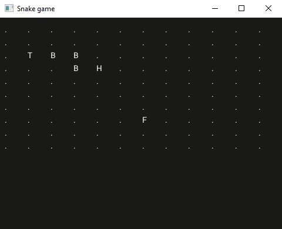

# Step 3

## Drawing the grid, the fruit, and the snake

We will assign some values to define what entity each cell of our grid can represent. For now, we will map these numeric values to draw a uniquesingle character each foras the visual representation.

| value | entity | character |
|:-----:|---------|:---------:|
| 0     | empty   | `"."`     |
| 1     | fruit   | `"F"`     |
| 2     | head    | `"H"`     |
| 3     | body    | `"B"`     |
| 4     | tail    | `"S"`     |


A snake has a head and a tail, and a body. We can represent these entities as a sequence of coordinates. The first element is the tail, the last one is the head, and everything in between is the body.

=== "EDN"

    ```clojure linenums="1"
    [(int2 1 2) (int2 2 2) (int2 3 2) (int2 3 3) (int2 4 3)] >= .snake
    ```

The fruit, however, occupies a single cell - so we just need one set of coordinates.

Every other cell is empty (or unoccupied) and is represented with a ‘.’.

=== "EDN"

    ```clojure linenums="1"
    (int2 4 4) >= .fruit
    ```

To simplify the layout we will render the grid using a [`(GUI.Table)`](https://docs.fragcolor.xyz/shards/GUI/Table/). We just need to push each value to the next column in a given row and if there's no more space in that row a new row will be added automatically.

=== "EDN"

    ```{.clojure .annotate linenums="1"}
    (defshards render [] ;; (1)
      (GUI.Table
       :Columns grid-cols :Contents
       (ForEach ;; (2)
        (-> (| (GUI.NextColumn))
            (| (Match ;; (3)
                [0 (-> ".") ; empty
                 1 (-> "F") ; fruit
                 2 (-> "H") ; head
                 3 (-> "B") ; body
                 4 (-> "T") ; tail
                 ]false)
               (GUI.Text)))))) ;; (4)
    ```
    
    1. The input of this function will be our grid.
    2. The [`(ForEach)`](https://docs.fragcolor.xyz/shards/General/ForEach/) shard iterates through all elements in our grid and executes an action on each one of them.
    3. In that action, we [`(Match)`](https://docs.fragcolor.xyz/shards/General/Match/) the value to the corresponding character we have chosen.
    4. Then the matched character is displayed in place of that grid element using [`(GUI.Text)`](https://docs.fragcolor.xyz/shards/GUI/Text/).

## Populating the grid

Before we can draw anything we need to update the grid with the fruit and the snake. To update a sequence at a given index, we can use the [`(Assoc)`](https://docs.fragcolor.xyz/shards/General/Assoc/) shard. And since the snake is saved as a sequence itself, we need to iterate through all its elements. However, the head, tail and body are represented by different values, so we will handle them separately.

=== "EDN"

    ```{.clojure .annotate linenums="1"}
    (defshards populate-grid [fruit snake]
      ; saves the input into a variable
      >= .tmp-grid

      ; first the snake tail and body
      snake (Take 0) (get-index) >= .tail-index ;; (1)
      [.tail-index 4] (Assoc .tmp-grid) ;; (2)
      snake (Slice 1 -1) ;; (3)
      (ForEach
       (-> (get-index) >= .limb-index
           [.limb-index 3] (Assoc .tmp-grid)))

      ; then the fruit
      fruit (get-index) >= .fruit-index
      [.fruit-index 1] (Assoc .tmp-grid)

      ; finally the snake head
      snake (RTake 0) (get-index) >= .head-index ;; (4)
      [.head-index 2] (Assoc .tmp-grid)

      ; return the populated grid
      .tmp-grid)
    ```
    
    1. We have already seen `(Take)` and `get-index` in [step 2](./step-2.md).
    2. Assoc lets us update the sequence.
    3. [`(Slice)`](https://docs.fragcolor.xyz/shards/General/Slice/) gives a part of a sequence in a range. `1` means we start at the second element of the sequence (in other words, we skip `1` element), and `-1` means we stop at one element before the last (in other words, we skip `1` element from the end).
    4. [`(RTake)`](https://docs.fragcolor.xyz/shards/General/RTake/)  is similar to [`(Take)`](https://docs.fragcolor.xyz/shards/General/Take/) , except it starts from the end of the sequence instead of the beginning (i.e. "reverse take").

This new function `populate-grid` will take our empty-grid as input and return a populated grid. That is why we need a temporary variable inside the function (`.tmp-grid`).

??? note
    Another alternative would have been, to have a single grid and erase the previous positions of the fruit and the snake before updating to their new positions. We find it easier to just update the whole grid at once for this tutorial.

## Let's try it out!

Let's put into practice all that we have seen so far.

=== "EDN"

    ```clojure linenums="1"
    (def grid-cols 12)
    (def grid-rows 10)
    (def empty-grid
      [0 0 0 0 0 0 0 0 0 0 0 0
       0 0 0 0 0 0 0 0 0 0 0 0
       0 0 0 0 0 0 0 0 0 0 0 0
       0 0 0 0 0 0 0 0 0 0 0 0
       0 0 0 0 0 0 0 0 0 0 0 0
       0 0 0 0 0 0 0 0 0 0 0 0
       0 0 0 0 0 0 0 0 0 0 0 0
       0 0 0 0 0 0 0 0 0 0 0 0
       0 0 0 0 0 0 0 0 0 0 0 0
       0 0 0 0 0 0 0 0 0 0 0 0])

    (defshards get-index []
      (| (Take 0) >= .x)
      (| (Take 1) >= .y)
      .y (Math.Multiply grid-cols) (Math.Add .x))

    (defshards populate-grid [fruit snake]
      ; saves the input into a variable
      >= .tmp-grid

      ; first the snake tail and body
      snake (Take 0) (get-index) >= .tail-index
      [.tail-index 4] (Assoc .tmp-grid)
      snake (Slice 1 -1)
      (ForEach
       (-> (get-index) >= .limb-index
           [.limb-index 3] (Assoc .tmp-grid)))

      ; then the fruit
      fruit (get-index) >= .fruit-index
      [.fruit-index 1] (Assoc .tmp-grid)

      ; finally the snake head
      snake (RTake 0) (get-index) >= .head-index
      [.head-index 2] (Assoc .tmp-grid)

      ; return the populated grid
      .tmp-grid)

    (defshards render []
      (GUI.Table
       :Columns grid-cols :Contents
       (ForEach
        (-> (| (GUI.NextColumn))
            (| (Match
                [0 (-> ".") ; empty
                 1 (-> "F") ; fruit
                 2 (-> "H") ; head
                 3 (-> "B") ; body
                 4 (-> "T") ; tail
                 ]false)
               (GUI.Text))))))

    (defloop main-wire
      ; logic
      [(int2 1 2) (int2 2 2) (int2 3 2) (int2 3 3) (int2 4 3)] >= .snake
      (int2 6 7) >= .fruit
      empty-grid (populate-grid .fruit .snake) >= .grid
      ; window
      (GFX.MainWindow
       :Title "Snake game" :Width 480 :Height 360
       :Contents
       (-> (GUI.Window
            :Title "canvas" :Width 1.0 :Height 1.0 :Pos (int2 0 0)
            :Flags [GuiWindowFlags.NoTitleBar GuiWindowFlags.NoResize
                    GuiWindowFlags.NoMove GuiWindowFlags.NoCollapse]
            :Contents
            (-> .grid (render))))))

    (defmesh root)
    (schedule root main-wire)
    (run root (/ 1.0 60))
    ```

=== "Result"

    

--8<-- "includes/license.md"
