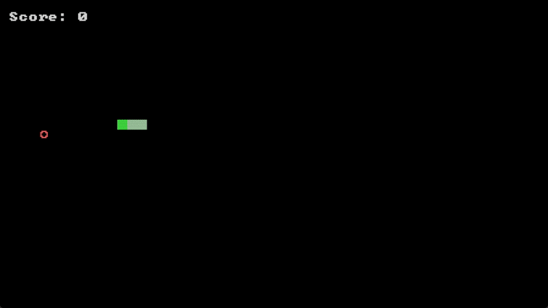

# Step 4

In this step we will wrap up our snake game. We will,

1. Add positive feedback when we collect a fruit and negative feedback when we lose the game

2. Create a way to reset the game

# 4.1 Using external scripts

When you eat a fruit, we’ll give positive feedback by briefly flashing the background.
This is a perfect chance to learn how to use external scripts—a huge part of real-world coding is reusing good, existing pieces.

We’ve prepared two small files you’ll plug in:

1. post.wgsl — a tiny post-process shader that tints/brightens the screen based on the color provided.

2. post.shs — a Shards setup that hooks this shader into your render pipeline and exposes a terminal-bg-color parameter you can set from your game logic.

First, add these two [scripts](https://drive.google.com/drive/folders/10xKPHM0XazVQE-F0JoeEMtDKAHdEMbaM?usp=drive_link) into your folder, on the same level as your snake game script.

Next, to include `post.shs` into our game script, we use `@include`

=== "Code Added"

    ```shards
    @include("post.shs")
    ```

Now to flash the screen, we just have to change `terminal-bg-color`. First, let's initialize it in our main wire

=== "Code Added"

    ```shards
    @f4(0.0 0.0 0.0 1.0) | Set(Name: terminal-bg-color Global: true)
    ```

Next, let's create a `@wire` which we can easily call, that will very quickly call using `Detach` to change it to a specified colour then very quickly change it back to its original colour. We can do this by using `Lerp` which will linearly interpolate between two values. Then when used in combination with `Animation.Timer`, we can interpolate from one value to another within a specified time.

=== "Code Added"

    ```shards
		@f4(0.0 0.0 0.0 1.0) >= original-color
		original-color | Set(Name:terminal-bg-color Global: true)

    @wire(pulse-bg { ;; flashes the sreen
			{Take("duration") = pulse-dur}
			{Take("color") = pulse-color}
			Animation.Timer(Duration: pulse-dur Action: {
			original-color > terminal-bg-color
			Stop
			}) | Div(pulse-dur)
			Lerp(First: pulse-color Second: original-color) > terminal-bg-color
    } Looped: true)
    ```

Then, lastly, we call our `pulse-bg` wire using `Detach` and provide the necessary information, duration and color, as a table.

=== "Code Added"

    ```shards
		{duration: 0.35 color: @f4(1.0 1.0 1.0 1.0)}
		Detach(pulse-bg)
    ```

=== "Full Code so far"

    ```shards
		@include("post.shs")

		@wire(pulse-bg { ;; flashes the sreen
			{Take("duration") = pulse-dur}
			{Take("color") = pulse-color}
			Animation.Timer(Duration: pulse-dur Action: {
			original-color > terminal-bg-color
			Stop
			}) | Div(pulse-dur)
			Lerp(First: pulse-color Second: original-color) > terminal-bg-color
		} Looped: true)

		@wire(snake-game-logic {
			;; move snake

			Inputs.KeyDown("right" {
				0 | Update(input-state "direction")
			})
			Inputs.KeyDown("down" {
				1 | Update(input-state "direction")
			})
			Inputs.KeyDown("left" {
				2 | Update(input-state "direction")
			})
			Inputs.KeyDown("up" {
				3 | Update(input-state "direction")
			})

			snake-direction >= prev-dir
			input-state | Take("direction")
			Match([ ;; takes what was given from input
				0 {; right
					prev-dir:0 | When(Is(0) { ;; prev-dir:0 is taking the x
						@i2(1 0) > snake-direction ;; if player pressed right and snake was previously not moving left or right, then change direction to move right
					})
				}
				1 {; down
					prev-dir:1 | When(Is(0) { ;; 
						@i2(0 1) > snake-direction ;; if player pressed down and snake was previously not moving up or down, then change direction to move down
					})
				}
				2 {; left
					prev-dir:0 | When(Is(0) {
						@i2(-1 0) > snake-direction ;; if player pressed left and snake was previously not moving left or right, then change direction to move left
					})
				}
				3 {; up
					prev-dir:1 | When(Is(0) {
						@i2(0 -1) > snake-direction ;; if player pressed down and snake was previously not moving up or down, then change direction to move down
					})
				}
			])

			Animation.Timer(
				Duration: move-duration
				Looped: true
				Action: {
					
					
					snake-segments | RTake(0) ;; take the last element in the sequence which is the snake head
					Math.Add(snake-direction) = new-snake-head

					new-snake-head >> snake-segments

					;; food collision logic
					food-pos
					If(Predicate: {
						IsNotNone
						And
						new-snake-head | Is((food-pos | ToInt2))
					} Then: {
						none > food-pos
						score | Math.Add(1) > score
						move-duration | Mul(0.95) > move-duration

						{duration: 0.35 color: @f4(1.0 1.0 1.0 1.0)}
						Detach(pulse-bg)
					} Else: {
						DropFront(snake-segments)
					})

					;; wall collision logic
					(new-snake-head | Take(0))
					When(Predicate: {
						IsMoreEqual(grid-width)
						Or
						(new-snake-head | Take(1)) | IsMoreEqual(grid-length)
						Or
						(new-snake-head | Take(0)) | IsLess(0)
						Or
						(new-snake-head | Take(1)) | IsLess(0)
						Or
						snake-segments | Slice(From: 0 To: (Count(snake-segments) | Math.Subtract(2))) | IsAny(new-snake-head)
					} Action: {
						true > game-over
					})

				}
			)

			food-pos
			When(Predicate: Is(none) Action: {
				; Spawn new food if needed
				RandomInt(grid-width) = food-x
				RandomInt(grid-length) = food-y
				@i2(food-x food-y) > food-pos
			})
		} Looped: true)

		@wire(main-wire {
			GFX.MainWindow(
				Contents: {
					Once({
						; Create render steps
						GFX.BuiltinFeature(BuiltinFeatureId::Transform) >> features
						GFX.BuiltinFeature(BuiltinFeatureId::BaseColor) >> features
						GFX.BuiltinFeature(BuiltinFeatureId::AlphaBlend) >> features
						GFX.DrawQueue = queue

						40 >= font-size
						@read("./snake/Px437_IBM_EGA_8x8.ttf" Bytes: true) | GFX.FontMap = font ;; change the file path to where your font ttf file is stored

						[@i2(10 10) @i2(11 10) @i2(12 10)] >= snake-segments

						{direction: 0} >= input-state
        		@i2(1 0) >= snake-direction

						0.15 >= move-duration

						none | ToAny >= food-pos

						0 >= score
						false >= game-over

						@f4(0.0 0.0 0.0 1.0) >= original-color
						original-color | Set(Name:terminal-bg-color Global: true)

					})
					
					
					GFX.DrawablePass(Features: features Queue: queue) >> render-steps
					Do(post-fx)

					GFX.Viewport = vp ;; gets the screen's left, top, right, btm coordinates
					[vp font-size] | Memoize({
						vp:2 | Sub((vp:0)) | ToFloat = width ;; screen width
						vp:3 | Sub((vp:1)) | ToFloat = height ;; screen height
						@f2(width height) | Math.Multiply(@f2(-0.5 -0.5)) >= view-offset ;; makes the grid start from the top left of the screen

						font | GFX.FontSpaceSize(font-size) | ToFloat2 = font-cell-size
						font-cell-size | Take(0) = font-size-width
						font-cell-size | Take(1) = font-size-height
						width | Math.Mod((font-size-width)) | Math.Multiply(0.5) = offset-x
						height | Math.Mod((font-size-height)) | Math.Multiply(0.5) = offset-y 

						width | Div((font-size-width | ToFloat)) | ToInt | Max(1) = grid-width ;; dividing the screen into a grid based on font.
						height | Div((font-size-height | ToFloat)) | ToInt | Max(1) = grid-length ;; Max ensures at least 1 cell in the grid

						@f2(offset-x offset-y) | Add(view-offset) > view-offset
							
						view-offset | ToFloat3 | Math.Translation = view-transform ;; final view transform
					})
					GFX.View(View: view-transform OrthographicSize: @f2(1.0 -1.0) OrthographicSizeType: OrthographicSizeType::PixelScale) = view

					;; game logic
					game-over
					When(Predicate: Is(false) Action: {
						Step(snake-game-logic)
					})

					;; draw game
					GFX.DynMesh = dmesh

					0 >= repeat-idx
					snake-segments ;; snake body segments
					Repeat(
						Action: {
							snake-segments | Take(repeat-idx)
							= coord
								"█" | GFX.DynDrawText(
								Font: font
								FontSize: font-size
								Output: dmesh
								Offset: (coord | ToFloat3 | Math.Multiply((font-cell-size | ToFloat3)))
								Scale: 1.0
								Color: @f4(0.5 0.8 0.5 1.0)
								VAlign: 1.0
							)

							repeat-idx | Math.Add(1) > repeat-idx
						}

						Until: {
							repeat-idx | Is((Count(snake-segments) | Math.Subtract(1))) ;; repeat only until the second last segment
						}
					)

					snake-segments | RTake(0) ;; snake head
					= head-coord
					"█" | GFX.DynDrawText(
						Font: font
						FontSize: font-size
						Output: dmesh
						Offset: (head-coord | ToFloat3 | Math.Multiply((font-cell-size | ToFloat3)))
						Scale: 1.0
						Color: @f4(0.1 1.0 0.1 1.0)
						VAlign: 1.0
					)

					;; draw food
					food-pos | When(Predicate: IsNotNone Action: {
						"○" | GFX.DynDrawText(
							Font: font
							FontSize: font-size
							Output: dmesh
							Offset: (food-pos | ToFloat3 | Math.Multiply((font-cell-size | ToFloat3)))
							Scale: 1.0
							Color: @f4(1.0 0.2 0.2 1.0) ;; red color
							VAlign: 1.0
						)
					})

					;; display score
					["Score: " score] | String.Format | GFX.DynDrawText(
						Font: font
						FontSize: font-size
						Output: dmesh
						Offset: (@f3(1.0 1.0 0.0) | Math.Multiply((font-cell-size | ToFloat3)))
						Scale: 1.0
						Color: @f4(1.0 1.0 1.0 1.0) ;; white
						VAlign: 1.0
					)

					"Game Over" = game-over-string
					(grid-width | Math.Divide(2)) | ToFloat = grid-width-center
					(grid-length| Math.Divide(2)) | ToFloat = grid-length-center
					Count(game-over-string) | Math.Divide(2) | ToFloat = str-center

					;; display game over
					game-over
					When(Predicate: Is(true) Action: {
						game-over-string | GFX.DynDrawText(
							Font: font
							FontSize: font-size
							Output: dmesh
							Offset: (@f3((grid-width-center | Math.Subtract(str-center)) grid-length-center 0.0) | Math.Multiply((font-cell-size | ToFloat3)))
							Scale: 1.0
							Color: @f4(1.0 1.0 1.0 1.0) ;; white
							VAlign: 1.0
						)
					})

					dmesh | GFX.DynToMesh | DoMany({
						{Take("mesh") = mesh}
						{Take("texture") = texture}
						Math.MatIdentity | GFX.Drawable(mesh Params: {baseColorTexture: texture}) | GFX.Draw(queue)
					} ComposeSync: true)

					GFX.Render(render-steps view)
			})
		} Looped: true)

		@mesh(main)
		@schedule(main main-wire)
		@run(main FPS: 60)
    ```

!!! note "Global"

		`Detach` normally only uses a snapshot copy of it's parent's variables. But if it is a global variable, it will use the original variable and thus the changes will be reflected in the parent wire. Because we want the changes to `terminal-bg-color` to be reflected in the parent wire, we set it as `Global: true`

If you try running the code and collect fruits, you will notice the the screen flashing white. You might also notice the game looking slightly different! Don't worry, its a filter that we added in `post.shs` too, to elevate the overall aesthetic of the game!

Now to flash the screen red whenever we collide with the walls or snake body, we simply have to call the wire again and modify the wire's input.

=== "Code Added"

		```shards
		{duration: 0.20 color: @f4(1.0 0.0 0.0 1.0)}
    Detach(pulse-bg)
		```

{ width=500 }

## 4.2 Resetting the game

Lastly, we want to be able to reset our game whenever we lose. First let's add to our game over text, to prompt the user to his "r", when they lose the game.

=== "Code Added"

    ```shards
		"press r to reset" = reset-string
    Count(reset-string) | Math.Divide(2) | ToFloat = reset-str-center

		reset-string | GFX.DynDrawText(
			Font: font
			FontSize: font-size
			Output: dmesh
			Offset: (@f3((grid-width-center | Math.Subtract(reset-str-center)) (grid-length-center | Math.Add(1.0)) 0.0) | Math.Multiply((font-cell-size | ToFloat3)))
			Scale: 1.0
			Color: @f4(1.0 1.0 1.0 1.0) ;; white
			VAlign: 1.0
		)
    ```

Then when the player presses "r", we will reset all the important variables, like `score`, `snake-segments` , `move-duration` to their original values. We can then change our `When` conditional to an `If` to run the snake logic when `game-over` is `false` and run the `Inputs.Keydown` to reset the code when `game-over` is `true`.

=== "Code Added"

    ```shards
		game-over
		If(Predicate: Is(false) Then: {
			Step(snake-game-logic)
		} Else: {
			Inputs.KeyDown("r" {
				false > game-over

				0 > score

				[@i2(10 10) @i2(11 10) @i2(12 10)] > snake-segments

				0.15 > move-duration

				none > food-pos

				@i2(1 0) > snake-direction

				{direction: 0} > input-state
			})
		})
    ```

=== "Full Code so far"

    ```shards
		@include("post.shs")

    @wire(pulse-bg { ;; flashes the sreen
      {Take("duration") = pulse-dur}
      {Take("color") = pulse-color}
      Animation.Timer(Duration: pulse-dur Action: {
      original-color > terminal-bg-color
      Stop
      }) | Div(pulse-dur)
      Lerp(First: pulse-color Second: original-color) > terminal-bg-color
    } Looped: true)

    @wire(snake-game-logic {
      ;; move snake

      Inputs.KeyDown("right" {
        0 | Update(input-state "direction")
      })
      Inputs.KeyDown("down" {
        1 | Update(input-state "direction")
      })
      Inputs.KeyDown("left" {
        2 | Update(input-state "direction")
      })
      Inputs.KeyDown("up" {
        3 | Update(input-state "direction")
      })

      snake-direction >= prev-dir
      input-state | Take("direction")
      Match([ ;; takes what was given from input
        0 {; right
          prev-dir:0 | When(Is(0) { ;; prev-dir:0 is taking the x
            @i2(1 0) > snake-direction ;; if player pressed right and snake was previously not moving left or right, then change direction to move right
          })
        }
        1 {; down
          prev-dir:1 | When(Is(0) { ;; 
            @i2(0 1) > snake-direction ;; if player pressed down and snake was previously not moving up or down, then change direction to move down
          })
        }
        2 {; left
          prev-dir:0 | When(Is(0) {
            @i2(-1 0) > snake-direction ;; if player pressed left and snake was previously not moving left or right, then change direction to move left
          })
        }
        3 {; up
          prev-dir:1 | When(Is(0) {
            @i2(0 -1) > snake-direction ;; if player pressed down and snake was previously not moving up or down, then change direction to move down
          })
        }
      ])

      Animation.Timer(
        Duration: move-duration
        Looped: true
        Action: {
          
          
          snake-segments | RTake(0) ;; take the last element in the sequence which is the snake head
          Math.Add(snake-direction) = new-snake-head

          new-snake-head >> snake-segments

          ;; food collision logic
          food-pos
          If(Predicate: {
            IsNotNone
            And
            new-snake-head | Is((food-pos | ToInt2))
          } Then: {
            none > food-pos
            score | Math.Add(1) > score
            move-duration | Mul(0.95) > move-duration

            {duration: 0.35 color: @f4(1.0 1.0 1.0 1.0)}
            Detach(pulse-bg)
          } Else: {
            DropFront(snake-segments)
          })

          ;; wall collision logic
          (new-snake-head | Take(0))
          When(Predicate: {
            IsMoreEqual(grid-width)
            Or
            (new-snake-head | Take(1)) | IsMoreEqual(grid-length)
            Or
            (new-snake-head | Take(0)) | IsLess(0)
            Or
            (new-snake-head | Take(1)) | IsLess(0)
            Or
            snake-segments | Slice(From: 0 To: (Count(snake-segments) | Math.Subtract(2))) | IsAny(new-snake-head)
          } Action: {
            true > game-over

            {duration: 0.20 color: @f4(1.0 0.0 0.0 1.0)}
            Detach(pulse-bg)
          })

        }
      )

      food-pos
      When(Predicate: Is(none) Action: {
        ; Spawn new food if needed
        RandomInt(grid-width) = food-x
        RandomInt(grid-length) = food-y
        @i2(food-x food-y) > food-pos
      })
    } Looped: true)

    @wire(main-wire {
      GFX.MainWindow(
        Contents: {
          Once({
            ; Create render steps
            GFX.BuiltinFeature(BuiltinFeatureId::Transform) >> features
            GFX.BuiltinFeature(BuiltinFeatureId::BaseColor) >> features
            GFX.BuiltinFeature(BuiltinFeatureId::AlphaBlend) >> features
            GFX.DrawQueue = queue

            40 >= font-size
            @read("./snake/Px437_IBM_EGA_8x8.ttf" Bytes: true) | GFX.FontMap = font ;; change the file path to where your font ttf file is stored

            [@i2(10 10) @i2(11 10) @i2(12 10)] >= snake-segments

            @i2(1 0) >= snake-direction
            {direction: 0} >= input-state

            0.15 >= move-duration

            none | ToAny >= food-pos

            0 >= score
            false >= game-over

            @f4(0.0 0.0 0.0 1.0) >= original-color
            original-color | Set(Name:terminal-bg-color Global: true)
          })
          
          
          GFX.DrawablePass(Features: features Queue: queue) >> render-steps
          Do(post-fx)

          GFX.Viewport = vp ;; gets the screen's left, top, right, btm coordinates
          [vp font-size] | Memoize({
            vp:2 | Sub((vp:0)) | ToFloat = width ;; screen width
            vp:3 | Sub((vp:1)) | ToFloat = height ;; screen height
            @f2(width height) | Math.Multiply(@f2(-0.5 -0.5)) >= view-offset ;; makes the grid start from the top left of the screen

            font | GFX.FontSpaceSize(font-size) | ToFloat2 = font-cell-size
            font-cell-size | Take(0) = font-size-width
            font-cell-size | Take(1) = font-size-height
            width | Math.Mod((font-size-width)) | Math.Multiply(0.5) = offset-x
            height | Math.Mod((font-size-height)) | Math.Multiply(0.5) = offset-y 

            width | Div((font-size-width | ToFloat)) | ToInt | Max(1) = grid-width ;; dividing the screen into a grid based on font.
            height | Div((font-size-height | ToFloat)) | ToInt | Max(1) = grid-length ;; Max ensures at least 1 cell in the grid

            @f2(offset-x offset-y) | Add(view-offset) > view-offset
              
            view-offset | ToFloat3 | Math.Translation = view-transform ;; final view transform
          })
          GFX.View(View: view-transform OrthographicSize: @f2(1.0 -1.0) OrthographicSizeType: OrthographicSizeType::PixelScale) = view

          ;; game logic
          game-over
          If(Predicate: Is(false) Then: {
            Step(snake-game-logic)
          } Else: {
            Inputs.KeyDown(Key: "r" Action: {
              false > game-over

              0 > score

              [@i2(10 10) @i2(11 10) @i2(12 10)] > snake-segments

              0.15 > move-duration

              none > food-pos

              @i2(1 0) > snake-direction

              {direction: 0} > input-state
            })
          })

          ;; draw game
          GFX.DynMesh = dmesh

          0 >= repeat-idx
          snake-segments ;; snake body segments
          Repeat(
            Action: {
              snake-segments | Take(repeat-idx)
              = coord
                "█" | GFX.DynDrawText(
                Font: font
                FontSize: font-size
                Output: dmesh
                Offset: (coord | ToFloat3 | Math.Multiply((font-cell-size | ToFloat3)))
                Scale: 1.0
                Color: @f4(0.5 0.8 0.5 1.0)
                VAlign: 1.0
              )

              repeat-idx | Math.Add(1) > repeat-idx
            }

            Until: {
              repeat-idx | Is((Count(snake-segments) | Math.Subtract(1))) ;; repeat only until the second last segment
            }
          )

          snake-segments | RTake(0) ;; snake head
          = head-coord
          "█" | GFX.DynDrawText(
            Font: font
            FontSize: font-size
            Output: dmesh
            Offset: (head-coord | ToFloat3 | Math.Multiply((font-cell-size | ToFloat3)))
            Scale: 1.0
            Color: @f4(0.1 1.0 0.1 1.0)
            VAlign: 1.0
          )

          ;; draw food
          food-pos | When(Predicate: IsNotNone Action: {
            "○" | GFX.DynDrawText(
              Font: font
              FontSize: font-size
              Output: dmesh
              Offset: (food-pos | ToFloat3 | Math.Multiply((font-cell-size | ToFloat3)))
              Scale: 1.0
              Color: @f4(1.0 0.2 0.2 1.0) ;; red color
              VAlign: 1.0
            )
          })

          ;; display score
          ["Score: " score] | String.Format | GFX.DynDrawText(
            Font: font
            FontSize: font-size
            Output: dmesh
            Offset: (@f3(1.0 1.0 0.0) | Math.Multiply((font-cell-size | ToFloat3)))
            Scale: 1.0
            Color: @f4(1.0 1.0 1.0 1.0) ;; white
            VAlign: 1.0
          )

          "Game Over" = game-over-string
          (grid-width | Math.Divide(2)) | ToFloat = grid-width-center
          (grid-length| Math.Divide(2)) | ToFloat = grid-length-center
          Count(game-over-string) | Math.Divide(2) | ToFloat = str-center

          "press r to reset" = reset-string
          Count(reset-string) | Math.Divide(2) | ToFloat = reset-str-center

          ;; display game over
          game-over
          When(Predicate: Is(true) Action: {
            game-over-string | GFX.DynDrawText(
              Font: font
              FontSize: font-size
              Output: dmesh
              Offset: (@f3((grid-width-center | Math.Subtract(str-center)) grid-length-center 0.0) | Math.Multiply((font-cell-size | ToFloat3)))
              Scale: 1.0
              Color: @f4(1.0 1.0 1.0 1.0) ;; white
              VAlign: 1.0
            )

            reset-string | GFX.DynDrawText(
              Font: font
              FontSize: font-size
              Output: dmesh
              Offset: (@f3((grid-width-center | Math.Subtract(reset-str-center)) (grid-length-center | Math.Add(1.0)) 0.0) | Math.Multiply((font-cell-size | ToFloat3)))
              Scale: 1.0
              Color: @f4(1.0 1.0 1.0 1.0) ;; white
              VAlign: 1.0
            )
          })

          dmesh | GFX.DynToMesh | DoMany({
            {Take("mesh") = mesh}
            {Take("texture") = texture}
            Math.MatIdentity | GFX.Drawable(mesh Params: {baseColorTexture: texture}) | GFX.Draw(queue)
          } ComposeSync: true)

          GFX.Render(render-steps view)
      })
    } Looped: true)

    @mesh(main)
    @schedule(main main-wire)
    @run(main FPS: 60)
    ```

Congratulations! You have successfully coded your first snake game!

{ width=500 }

--8<-- "includes/license.md"
