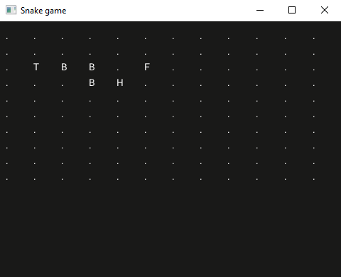

# Step 4

## Moving the fruit

When the snake eats a fruit we will need another unoccupied location for the new fruit.

Let's first compute the list of locations that are unoccupied.

=== "EDN"

    ```{.clojure .annotate linenums="1"}
    (defblocks get-free-locations [snake fruit]
      [] >= .locations ;; (1)
      (ForRange ;; (2)
       :From 0 :To (- grid-cols 1) :Action ;; (3)
       (-> >= .a
           (ForRange
            :From 0 :To (- grid-rows 1) :Action
            (-> >= .b
                [.a .b] (ToInt2) >= .location
                (When (-> snake (IndexOf .location) (Is -1) (And) fruit (IsNot .location)) ;; (4) (5) (6)
                      (-> .location (Push .locations))))))) ;; (7)
      .locations)
    ```

    1. `[]` is an empty sequence.
    2. [`(ForRange)`](https://docs.fragcolor.xyz/blocks/General/ForRange/) iterates a range of values (including both `:From` and `:To` ends).
    3. `(- a b)` is a built-in function that can act on constant values (as opposed to [`(Math.Subtract)`](https://docs.fragcolor.xyz/blocks/Math/Subtract/) that can act on constants and variables).
    4. [`(When)`](https://docs.fragcolor.xyz/blocks/General/When/) is similar to [`(If)`](https://docs.fragcolor.xyz/blocks/General/If/), except it is "passthrough" by default (don't worry about that concept for now).
    5. [`(Is)`](https://docs.fragcolor.xyz/blocks/General/Is/) and [`(IsNot)`](https://docs.fragcolor.xyz/blocks/General/IsNot/) compare two values.
    6. [`(And)`](https://docs.fragcolor.xyz/blocks/General/And/) is a logic operator.
    7. [`(Push)`](https://docs.fragcolor.xyz/blocks/General/Push/) adds a value to a sequence.

The function takes the positions of the snake body (incl. head and tail) and the current fruit position. It then iterates through all possible coordinates skipping the ones that are either occupied by the snake or the current fruit. The sequence of potential locations is then returned as the function's output.

Now all we need to do is select a random position from this sequence and that will be our next fruit position.

=== "EDN"

    ```{.clojure .annotate linenums="1"}
    (defblocks move-fruit [fruit snake]
      (get-free-locations fruit snake) >= .free-loc
      (Count .free-loc) >= .max ;; (1)
      (RandomInt .max) >= .next-fruit-loc ;; (2)
      .free-loc (Take .next-fruit-loc) (ToInt2)) ;; (3) (4)
    ```

    1. [`(Count)`](https://docs.fragcolor.xyz/blocks/General/Count/) returns the number of elements in a sequence.
    2. [`(RandomInt)`](https://docs.fragcolor.xyz/blocks/General/RandomInt/) returns a random value between 0 and the given maximum (exclusive).
    3. We have already seen `(Take)` in [step 2](./step-2.md).
    4. [`(ToInt2)`](https://docs.fragcolor.xyz/blocks/General/ToInt2/) ensures that we return an `int2` value.

## Moving the snake

In the snake game, the snake moves by one cell either horizontally or vertically. We could "move" every cell of its body one by one, but there is a clever trick we can use: we can just remove the first element (tail) from the snake's sequence and add one for the new head position.

When the snake is growing (after eating a fruit) we only add the new head (in place of the fruit element) but keep the tail such that snake seems to grow in the direction of the fruit it just ate.

=== "EDN"

    ```{.clojure .annotate linenums="1"}
    (defblocks move-snake [snake offset grow]
      snake (RTake 0) (Math.Add offset) (Push snake) ;; (1)
      (WhenNot (-> grow) (DropFront snake))) ;; (2) (3)
    ```

    1. We have already seen `(RTake)` in [step 3](./step-3.md).
    2. [`(WhenNot)`](https://docs.fragcolor.xyz/blocks/General/WhenNot/) is similar to [`(When)`](https://docs.fragcolor.xyz/blocks/General/When/) but with the opposite logic.
    3. [`(DropFront)`](https://docs.fragcolor.xyz/blocks/General/DropFront/) removes the first element of a sequence.


Now we need the snake to move at a regular interval in the direction chosen by the player.

Let's first listen to the player input. We will use the keyboard's arrow keys (up, down, left, right) for this.

=== "EDN"

    ```{.clojure .annotate linenums="1"}
    (Inputs.KeyDown "up" (-> "up" > .direction)) ;; (1)
    (Inputs.KeyDown "right" (-> "right" > .direction))
    (Inputs.KeyDown "down" (-> "down" > .direction))
    (Inputs.KeyDown "left" (-> "left" > .direction))
    ```

    1. [`(Inputs.KeyDown)`](https://docs.fragcolor.xyz/blocks/Inputs/KeyDown/) executes an action when a key is down. It has a sibling event: [`(Inputs.KeyUp)`](https://docs.fragcolor.xyz/blocks/Inputs/KeyUp/). `(>)` is an alias for [`Push`](https://docs.fragcolor.xyz/blocks/General/Push/).

We also want to prevent the player from accidentally selecting the opposite direction (e.g. down while the snake is going up) since that would immediately end the game (as the snake would immediately turn backwards eat its own body, i.e. the neck). One easy way to do this is to compare the newly chosen direction with the previous one.

=== "EDN"

    ```clojure linenums="1"
    (Inputs.KeyDown
     "up"
     (When (-> .prev-direction (IsNot "down"))
           (-> "up" > .direction)))
    (Inputs.KeyDown
     "right"
     (When (-> .prev-direction (IsNot "left"))
           (-> "right" > .direction)))
    (Inputs.KeyDown
     "down"
     (When (-> .prev-direction (IsNot "up"))
           (-> "down" > .direction)))
    (Inputs.KeyDown
     "left"
     (When (-> .prev-direction (IsNot "right"))
           (-> "left" > .direction)))
    ```

Finally, the snake will move at a regular interval. We can do that by comparing the current time and the time since the last update.

=== "EDN"

    ```{.clojure .annotate linenums="1"}
     (When (-> (Time.Now) (Math.Subtract .last-tick) (IsMoreEqual 0.50)) ;; (1)
           (-> (Time.Now) > .last-tick
               ; move the snake
               .direction (Match ["up" (move-snake .snake (int2 0 -1) .grow)
                                  "right" (move-snake .snake (int2 1 0) .grow)
                                  "down" (move-snake .snake (int2 0 1) .grow)
                                  "left" (move-snake .snake (int2 -1 0) .grow)])))
    ```

    1. [`(Time.Now)`](https://docs.fragcolor.xyz/blocks/Time/Now/) returns the time elapsed since the start of the game.

Now the snake will move every half a second. We could change this value to vary the difficulty of the game.

## Let's try it out!

Putting together all that we have seen so far, and adding a bit of initialization (that we conveniently put in its own function to allow us to reinitialize the game if the player hits the space bar), we have the following code.

=== "EDN"

    ```clojure linenums="1"
    --8<-- "tutorials/snake/steps/step-4.edn"
    ```

=== "Result"

    

??? note
    [`(Once)`](https://docs.fragcolor.xyz/blocks/General/Once/) is executed only once and thus is not repeated every frame.

--8<-- "includes/license.md"
