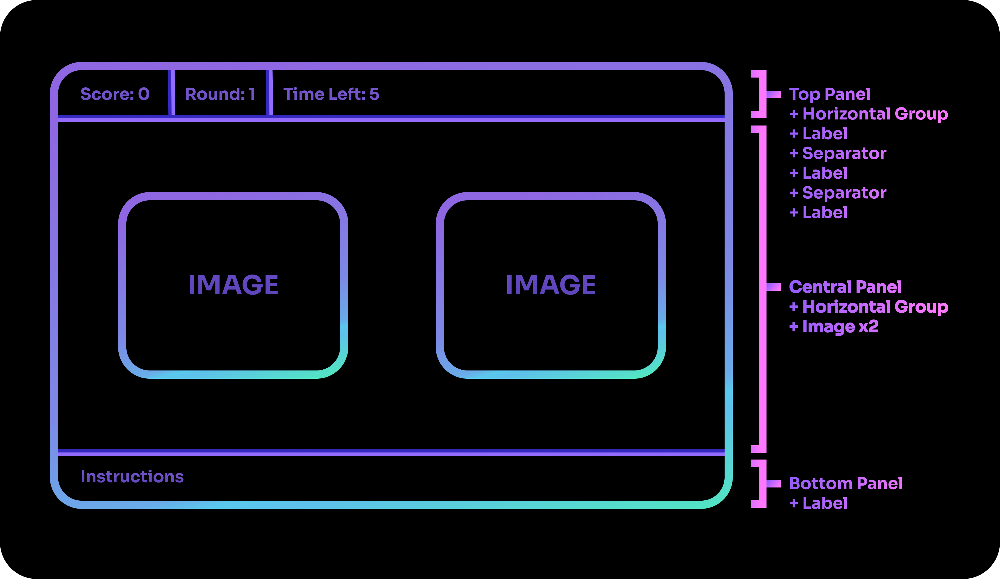
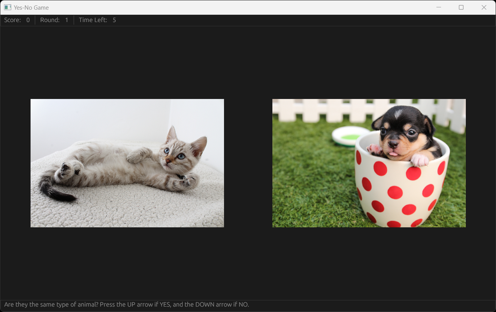

# Step 2

## The UI Template

In order to start drawing the UI in shards, we will first have to ready the GFX window which serves as the base for our UI operations. It follows a fixed template that should be placed within our `ui-loop`. 

=== "Code"
    
    ```clojure linenums="1"
    (defshards main-game-ui [])     ; Add your UI shards here

    (defloop ui-loop
      (GFX.MainWindow
       :Title "Yes-No Game"
       :Width 1280 :Height 768
       :Contents
       (->
        (Setup
         (GFX.DrawQueue) >= .ui-draw-queue
         (GFX.UIPass .ui-draw-queue) >> .render-steps)
        (| .ui-draw-queue (GFX.ClearQueue))
        (UI .ui-draw-queue (main-game-ui))
        (GFX.Render :Steps .render-steps))))
    ```

??? "What does the GFX code mean?"
    How the GFX window works is beyond the scope of this tutorial. The rough idea is that we are giving instructions to the computer on what to draw to the screen. For more information, check out the documentation on the [UI](https://docs.fragcolor.xyz/docs/shards/UI/) class.

## Planning the UI

Before writing code for the UI, it is good to have a design in mind. For this tutorial, we have prepared a simple design to follow:


With a design plan, it will be easier to identify the elements that will make up your UI. You can then implement the appropriate shards to draw them.



## The Bottom Panel

Let us start with the simplest panel, the Bottom Panel with a single Label. We will pass a string of instructions into the Label shard, which we then pass into the Bottom Panel shard as its content.

=== "Code"
    
    ```clojure linenums="1"
    (UI.BottomPanel
     :Contents (-> "Are they the same type of animal? Press the UP arrow if YES, and the DOWN arrow if NO." (UI.Label)))
    ```

??? "UI.BottomPanel"
    [`UI.BottomPanel`](https://docs.fragcolor.xyz/docs/shards/UI/BottomPanel/) is a UI element to hold other UI elements within it. It starts from the bottom of the Window.

??? "UI.Label"
    [`UI.Label`](https://docs.fragcolor.xyz/docs/shards/UI/Label/) is a UI element to hold text.

## The Top Panel

For the Top Panel, it is a sequence of Labels and Separators in a Horizontal Group so that they are naturally aligned from left to right.

=== "Code"
    
    ```clojure linenums="1" 
    (UI.TopPanel
     :Contents
     (->
      (UI.Horizontal
       :Contents
        (->
         "Score: 0" (UI.Label)
         (UI.Separator)
         "Round: 1" (UI.Label)
         (UI.Separator)
         "Time Left: 5" (UI.Label)))))
    ```

??? "UI.Horizontal"
    [`UI.Horizontal`](https://docs.fragcolor.xyz/docs/shards/UI/Horizontal/) is a UI element to hold other UI elements within it. It aligns its elements horizontally, from left to right. 

??? "UI.Separator"
    [`UI.Separator`](https://docs.fragcolor.xyz/docs/shards/UI/Separator/) is a UI element that appears as a horizontal line within a vertical layout, and appears as a vertical line within a horizontal layout.

However, we will want to be able to change the values used for Score, the Round Number and Time Left. This is where variables come in. We will be defining our variables in the `initialize-variables` shard created [earlier](../step-1/#the-setup-zone). 

Let's define the variables `.total-score`, `.current-round` and `.time-remaining`, along with the constants `total-rounds` and `max-timer`. These values are declared as constants since they are fixed values that will remain the same throughout the game.

??? "Declaring Constants"
    Constants are values that cannot be changed. 
    
    In Shards, you can declare named constants by using the macro [`def`](https://docs.fragcolor.xyz/docs/functions/macros/#def), which is used to give an alias to a value. Unnamed constants can be declared with [`Const`](https://docs.fragcolor.xyz/docs/shards/General/Const/).

=== "Code"
    
    ```clojure linenums="1" 

    (def total-rounds 10)
    (def max-timer 5)

    (defshards initialize-variables []
      0 >= .total-score
      1 >= .current-round
      max-timer >= .time-remaining)
    ```

We can now replace the fixed string numbers in our UI code with variables that will be updated as their values change.

=== "Code"

    ```clojure linenums="1" 
    (UI.TopPanel
     :Contents
     (->
      (UI.Horizontal
       :Contents
        (->
         "Score: " (UI.Label)
         .total-score (ToString) (UI.Label)
         (UI.Separator)
         "Round: " (UI.Label)
         .current-round (ToString) (UI.Label)
         (UI.Separator)
         "Time Left: " (UI.Label)
         .time-remaining (ToString) (UI.Label)))))
    ```

??? "ToString"
    [`ToString`](https://docs.fragcolor.xyz/docs/shards/General/ToString/) converts values into strings. In the code above, `UI.Label` expects a string input, which is why we have to convert the integer variables into strings.

## The Central Panel

The central panel shows two images side by side. In order to draw the images onto the screen, we will first have to load them into our game's resources. We will be doing so in the `load-resources` shard created [earlier](../step-1/#the-setup-zone). Create a folder named "data" at the directory where your game's script is located - we will be placing our images here.

!!! note
    For this tutorial, we will be using 5 images of dogs, cats and penguins each. You are free to choose the animals of your own accord though!

    Our images have been standardized to have a height of 400 pixels for vertical images, and a length of 400 pixels for horizontal images. You can use an image editing tool to resize your images for consistency.

To keep our resources organized, each animal type will have their own sequence to store their images (i.e., cat images will be stored in the `.cat-images` sequence and so on). Use the `Push` shard to push the images into their respective sequences.

=== "Code"
    
    ```clojure linenums="1" 
    (defshards load-resources []
      (LoadImage "data/cats/cat01.png") (Push :Name .cat-images)
      (LoadImage "data/cats/cat02.png") (Push :Name .cat-images)
      (LoadImage "data/cats/cat03.png") (Push :Name .cat-images)
      (LoadImage "data/cats/cat04.png") (Push :Name .cat-images)
      (LoadImage "data/cats/cat05.png") (Push :Name .cat-images)
      (LoadImage "data/dogs/dog01.png") (Push :Name .dog-images)
      (LoadImage "data/dogs/dog02.png") (Push :Name .dog-images)
      (LoadImage "data/dogs/dog03.png") (Push :Name .dog-images)
      (LoadImage "data/dogs/dog04.png") (Push :Name .dog-images)
      (LoadImage "data/dogs/dog05.png") (Push :Name .dog-images)
      (LoadImage "data/penguins/penguin01.png") (Push :Name .penguin-images)
      (LoadImage "data/penguins/penguin02.png") (Push :Name .penguin-images)
      (LoadImage "data/penguins/penguin03.png") (Push :Name .penguin-images)
      (LoadImage "data/penguins/penguin04.png") (Push :Name .penguin-images)
      (LoadImage "data/penguins/penguin05.png") (Push :Name .penguin-images))
    ```

??? "Push"
    [`Push`](https://docs.fragcolor.xyz/docs/shards/General/Push/) adds elements to the back of a sequence. It will create the sequence if it does not exist.

??? "LoadImage"
    [`LoadImage`](https://docs.fragcolor.xyz/docs/shards/General/LoadImage/) is used to load images into your game's resources.

We will write the code for randomizing the images shown when tackling the logic of the game later. For now, let us display the first image in the dog and cat sequences as a placeholder.

To better control where the images are drawn, we place each image in a `UI.Area` and specify its position.

=== "Code"
    
    ```clojure linenums="1" 
    (UI.CentralPanel
        :Contents
        (->
         (UI.Horizontal
          :Contents
          (->
            (UI.Area
             :Position (float2 -250.0, 0.0)         ; Minus 250 pixels from the center on the x-axis
             :Anchor Anchor.Center
             :Contents
             (-> .cat-images (Take 0) (UI.Image)))
            (UI.Area
             :Position (float2 250.0, 0.0)          ; Add 250 pixels from the center on the x-axis
             :Anchor Anchor.Center
             :Contents
             (-> .dog-images (Take 0) (UI.Image)))))))
    ```
??? "UI.Area"
    [`UI.Area`](https://docs.fragcolor.xyz/docs/shards/UI/Area/) is a UI element that is used to place its contents at a specific position.

??? "Take"
    [`Take`](https://docs.fragcolor.xyz/docs/shards/General/Take/) is used to retrieve the element stored at a specified index of a sequence.

!!! caution
    When using panels, ensure that `UI.CentralPanel` is always the last of the panels to be drawn to prevent errors.

## Outcome

The game's base UI is now ready! Try running the code to see your results.



=== "Code"
    
    ```clojure linenums="1" 
    (def total-rounds 10)
    (def max-timer 5)

    (defshards load-resources []
      (LoadImage "data/cats/cat01.png") (Push :Name .cat-images)
      (LoadImage "data/cats/cat02.png") (Push :Name .cat-images)
      (LoadImage "data/cats/cat03.png") (Push :Name .cat-images)
      (LoadImage "data/cats/cat04.png") (Push :Name .cat-images)
      (LoadImage "data/cats/cat05.png") (Push :Name .cat-images)
      (LoadImage "data/dogs/dog01.png") (Push :Name .dog-images)
      (LoadImage "data/dogs/dog02.png") (Push :Name .dog-images)
      (LoadImage "data/dogs/dog03.png") (Push :Name .dog-images)
      (LoadImage "data/dogs/dog04.png") (Push :Name .dog-images)
      (LoadImage "data/dogs/dog05.png") (Push :Name .dog-images)
      (LoadImage "data/penguins/penguin01.png") (Push :Name .penguin-images)
      (LoadImage "data/penguins/penguin02.png") (Push :Name .penguin-images)
      (LoadImage "data/penguins/penguin03.png") (Push :Name .penguin-images)
      (LoadImage "data/penguins/penguin04.png") (Push :Name .penguin-images)
      (LoadImage "data/penguins/penguin05.png") (Push :Name .penguin-images))

    (defshards initialize-variables []
      0 >= .total-score
      1 >= .current-round
      max-timer >= .time-remaining)

    (defshards main-game-ui []
      (UI.BottomPanel
       :Contents (-> "Are they the same type of animal? Press the UP arrow if YES, and the DOWN arrow if NO." (UI.Label)))

      (UI.TopPanel
       :Contents
       (->
        (UI.Horizontal
        :Contents
         (->
          "Score: " (UI.Label)
          .total-score (ToString) (UI.Label)
          (UI.Separator)
          "Round: " (UI.Label)
          .current-round (ToString) (UI.Label)
          (UI.Separator)
          "Time Left: " (UI.Label)
          .time-remaining (ToString) (UI.Label)))))

      (UI.CentralPanel
       :Contents
       (->
        (UI.Horizontal
         :Contents
         (->
          (UI.Area
           :Position (float2 -250.0, 0.0)
           :Anchor Anchor.Center
           :Contents
           (-> .cat-images (Take 0) (UI.Image)))
          (UI.Area
           :Position (float2 250.0, 0.0)
           :Anchor Anchor.Center
           :Contents
           (-> .dog-images (Take 0) (UI.Image))))))))     

    (defloop ui-loop
      (GFX.MainWindow
       :Title "Yes-No Game"
       :Width 1280 :Height 768
       :Contents
       (->
        (Setup
         (GFX.DrawQueue) >= .ui-draw-queue
         (GFX.UIPass .ui-draw-queue) >> .render-steps)
        (| .ui-draw-queue (GFX.ClearQueue))
        (UI .ui-draw-queue (main-game-ui))
        (GFX.Render :Steps .render-steps))))

    (defloop logic-loop)

    (defloop game-loop
      (Setup (load-resources) (initialize-variables))
      (Branch [ui-loop, logic-loop]))

    (defmesh main)
    (schedule main game-loop)
    (run main (/ 1.0 60.0))

    ```
--8<-- "includes/license.md"
