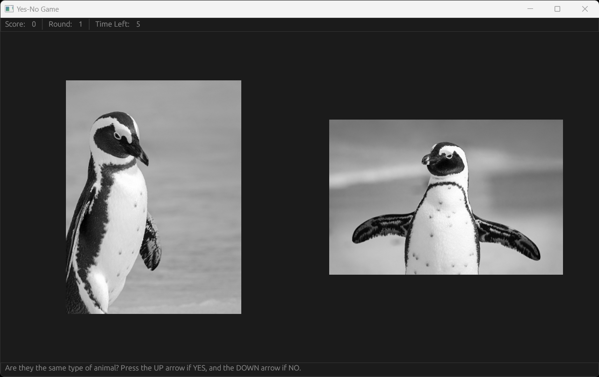
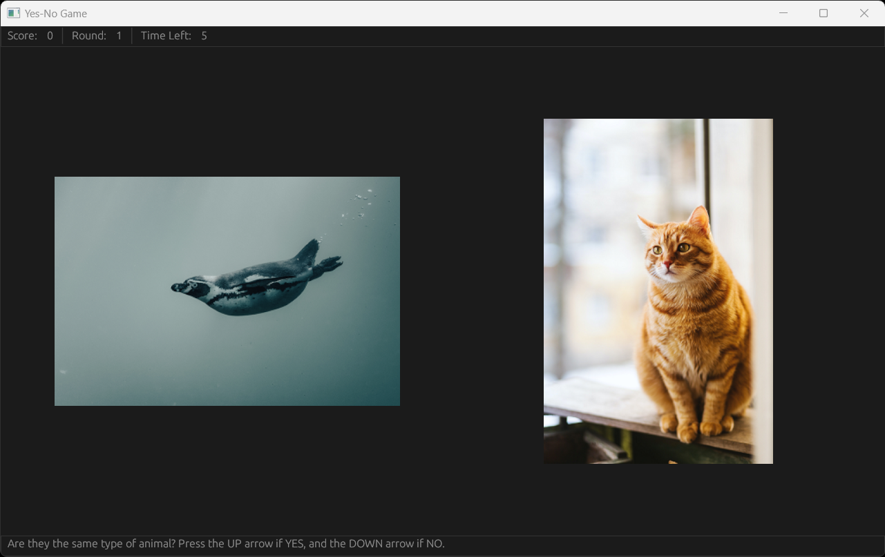

# Step 3

## Initializing each Round

Let us first create a shard named `initialize-round`.

=== "Code"
    
    ```clojure linenums="1"
    (defshards initialize-round [])
    ```

Place the new shard into the `logic-loop`. Wrap it within a `Setup` shard to ensure it only runs once (for now).
=== "Code"

    ```clojure linenums="1"
    (defloop logic-loop
      (Setup (initialize-round)))
    ```

## Selecting the Images

We will need to determine if the same animal type will be used for both images. 

In `initialize-variables`, create a variable named `.same-animals`.

=== "Code"

    ```clojure linenums="1" 
    (defshards initialize-variables []
      true >= .same-animals          ; Tracks whether the same animal type will be used

      0 >= .total-score
      1 >= .current-round
      max-timer >= .time-remaining)
    ```

We can use the `RandomInt` shard to randomly output 0 or 1, which we can associate with the choice to use the same animal type or not.

=== "Code"

    ```{.clojure .annotate linenums="1"}
    (defshards initialize-round []      
      (If                                           ; (1) Determine if the images on the left and right will be the same or different
       :Predicate (-> (RandomInt :Max 2) (Is 0))    ; (2) Checks whether the RandomInt shard returns a 0
       :Then (-> true > .same-animals)              ; If it is 0, save the value true to .same-animals
       :Else (-> false > .same-animals))            ; If it is 1, save the value false to .same-animals
    ```

    1. [`If`](https://docs.fragcolor.xyz/docs/shards/General/If/) checks the `Predicate` given and runs the code within `Then` if it is true. If false, the code within `Else` is run instead.
    2. [`RandomInt`](https://docs.fragcolor.xyz/docs/shards/General/RandomInt/) will randomly output a number from 0 to the number before the maximum value specified. 

    For example, `(RandomInt :Max 2)` will randomly choose a number from 0 to 1.

Next, we have to select the animal type to be used. Push the image sequences into one "master" sequence to associate each animal type with a fixed index. For example, if the `.cat-images` sequence is pushed into the "master" sequence first, it will always be associated with index 0 of the "master" sequence. 

Navigate to where the images are loaded in `load-resources` and push the animal sequences into a new sequence named `.all-images`.

=== "Code"

    ```clojure linenums="1" 
    (defshards load-resources []
      (LoadImage "data/cats/cat01.png") (Push :Name .cat-images)
      ...
      (LoadImage "data/penguins/penguin05.png") (Push :Name .penguin-images)
      
      .cat-images (Push :Name .all-images)          ; .cat-images is now stored in index 0 of the .all-images sequence
      .dog-images (Push :Name .all-images)          ; .dog-images is now stored in index 1 of the .all-images sequence
      .penguin-images (Push :Name .all-images)      ; .penguin-images is now stored in index 2 of the .all-images sequence
    )
    ```

Create some variables to keep track of values that we will be using to determine the images shown. 

Navigate back to the shard `initialize-variables`. Define new variables for the animal types and the index of images to be used. 

We will also define variables to hold the size of each sequence as we will need them for the `Max` parameter in `RandomInt`.

=== "Code"

    ```clojure linenums="1" 
    (defshards initialize-variables []
      0 >= .left-animal-type                        ; The index in .all-images for the animal type of the left image
      0 >= .right-animal-type                       ; The index in .all-images for the animal type of the right image
      0 >= .left-image-index                        ; The index in the chosen animal type's sequence for the left image
      0 >= .right-image-index                       ; The index in the  chosen animal type's sequence for the right image

      (Count .all-images) >= .total-animal-types    ; The total number of animal types
      0 >= .left-images-count                       ; The total number of images for the chosen animal type of the left image
      0 >= .right-images-count                      ; The total number of images for the chosen animal type of the right image

      (Sequence .left-images :Types Type.Image)     ; The left images
      (Sequence .right-images :Types Type.Image)    ; The right images
      (Sequence .chosen-indices :Types Type.Int)    ; The indices for each image chosen
      
      true >= .same-animals
      
      0 >= .total-score
      1 >= .current-round
      max-timer >= .time-remaining)
    ```

Now that we have our variables ready, we can start coding the logic once more in the shard `initialize-round`. 

Start with obtaining the values required to display the left image.

=== "Code"

    ```clojure linenums="1" 
    (defshards initialize-round []
      (If
       :Predicate (-> (RandomInt :Max 2) (Is 0))
       :Then (-> true > .same-animals)
       :Else (-> false > .same-animals))

       (RandomInt :Max .total-animal-types)         ; Randomly selects the animal type to be used for the left side
       > .left-animal-type

       .all-images (Take .left-animal-type)         ; Retrieve the images of the chosen animal type for the left image
       > .left-images

       (Count .left-images) > .left-images-count    ; The total number of images for the chosen animal type of the left image

       (RandomInt :Max .left-images-count)          ; Randomly selects the index of the image to be used on the left
       > .left-image-index
       
    ```

Great job so far! You have now determined the image to be used on the left. With the chosen index, you can display the image with `UI.Image`.

Previously we used a placeholder to always show the first image stored in `.cat-images`. With the selection logic implemented, we can display a random image instead.

Replace
=== "Code"

    ```clojure linenums="1" 
    .cat-images (Take 0) (UI.Image)
    ```

With
=== "Code"

    ```clojure linenums="1" 
    .all-images (Take .left-animal-type)        ; Retrieves the sequence of animal images to use
    (Take .left-image-index) (UI.Image)         ; Retrieve the chosen image from the sequence
    ```

However, we now have a problem to consider. In order to display the right image, we need to know whether that image should be of the same animal type. If it is, we have to ensure a different image of the same animal type is used. If it is not, we have to ensure a different animal type is used. 

To achieve this, we need the two randomly chosen indices to be different from each other. For this tutorial, we will be employing the *Fisher-Yates shuffle* technique to randomize the entries in our sequences. 

## Randomizing the Indices

If you are curious as to how the shuffle technique works, check out our tutorial for it [here](../../fisher-yates-shuffle/index.md). Otherwise, you can simply copy the code below and add it to your script to gain access to the `fisher-yates-shuffle` wire. One of the beauty of Shards is how they can be shared around easily after all!

=== "Code"

    ```clojure linenums="1" 
    (defwire fisher-yates-shuffle
      (ExpectSeq) = .sequence
      (Setup (int 0) >= .max-index)
      (Count .sequence) (Math.Subtract 1) > .max-index      ; -1 from the sequence size to get the max index number

      (Repeat
      (-> (RandomInt :Max .max-index) >= .random-index      ; Select an index of the sequence randomly, the last index will never be chosen as :Max is not inclusive
           .sequence
           (| (Take .random-index) &> .chosen-value)        ; Obtains the value stored at the random index of the sequence
           (| (Take .max-index) &> .last-value)             ; Obtains the last value in the sequence

                                                            ; Swaps the values in the last index of the sequence with the chosen index
           [.random-index .last-value] (Assoc .sequence)    ; Updates the random index selected with the last value of the sequence
           [.max-index .chosen-value] (Assoc .sequence)     ; Updates the last index of the sequence with the value of the index randomly chosen

           (Math.Dec .max-index)                            ; Decreases the max index value so that the shuffle will leave 
                                                            ; the newly swapped value of the current max index alone for the next iteration 
           )
       :Forever true
       :Until (-> .max-index (Is 0)))                       ; Loops until the there are no two values left to swap between

      .sequence)                                            ; Returns the newly shuffled sequence
    ```

??? "Wire or Function?"
    You might be wondering why is the `fisher-yates-shuffle` a wire instead of a function created with defn. 
    
    The key difference is that a wire's internal state persists. Variables defined within a wire persist even after it has been executed. 
    
    If your function requires variables to be defined within it, we recommend that you employ a wire instead to remove the need for variables to be redefined every time the function is called.

We will be feeding an array of indices into the `fisher-yates-shuffle` wire to have their order randomized. From there, we will select the first two entries to be the "chosen indices".

For example, if we know that a sequence has 3 entries and we want to randomly select 2 unique entries from it, we first create an array of the indices `[0, 1, 2]` and pass it into the `fisher-yates-shuffle` wire. We are returned a random result of say `[1, 2, 0]`. Choosing the first two entries means that we will be using the indices 1 and 2.

Create a wire named `select-two-indices` to execute this logic.

=== "Code"

    ```{.clojure .annotate linenums="1"}
    (defwire select-two-indices
      = .sequence-length                            ; Input passed into the wire is saved to the variable .sequence-length

      (Setup
       (Sequence .indices-sequence)                 ; Initialize a variable to hold the sequence of indices
       0 >= .index)                                 ; Initialize a variable to be used as a counter when filling the sequence

      (Clear .indices-sequence)                     ; Empty the sequence in case it contains values from previous iterations
      0 > .index                                    ; Reset the variable in case it has changed from previous iterations

      (Repeat                                       ; (1)
       :Action
       (->
        .index (Push .indices-sequence)             ; Push the counter into the new sequence
        (Math.Inc .index))                          ; (2) Increase the counter's value
       :Times .sequence-length)                     ; Repeat for as long as the sequence length

      .indices-sequence (Do fisher-yates-shuffle)   ; (3) Shuffle the order in the sequence of indices
      (Take [0 1]))                                 ; Retrieve and output the first and second entries

    ```

    1. [`Repeat`](https://docs.fragcolor.xyz/docs/shards/General/Repeat/) repeats the `Action` passed in by the number of `Times` indicated or when the condition specified in `Until` is no longer true.
    2. [`Math.Inc`](https://docs.fragcolor.xyz/docs/shards/Math/Inc/) increases the value passed in by 1.
    3. [`Do`](https://docs.fragcolor.xyz/docs/shards/General/Do/) runs an unscheduled Wire inline, similar to how a function is called.

Now that we have the means to obtain two random values from a sequence, we can implement the code to choose the right image.

!!! note
    The code to select the left image has been shifted into the `If` shard to account for conditionals.

=== "Code"

    ```clojure linenums="1" 
    (defshards initialize-round []
      (If
       :Predicate (-> (RandomInt :Max 2) (Is 0))
       :Then (-> true > .same-animals)
       :Else (-> false > .same-animals))
       
      (If
       :Predicate (-> .same-animals (Is true))             ; If both images should show the same animal type
       :Then
       (->
        (RandomInt :Max .total-animal-types)               ; Randomly select the animal type to be used for the left side
        > .left-animal-type

        .left-animal-type > .right-animal-type             ; Copy the animal type chosen for the left image to the right too

        .all-images (Take .left-animal-type)               ; Retrieve the images of the chosen animal type for the left image
        > .left-images

        (Count .left-images) > .left-images-count          ; The total number of images for the chosen animal type of the left image

        .left-images-count (Do select-two-indices)         ; Randomly select two indices for the selected animal's image sequence
        (ExpectIntSeq) > .chosen-indices

        .chosen-indices (Take 0) > .left-image-index       ; Save the first index retrieved for the left image
        .chosen-indices (Take 1) > .right-image-index)     ; Save the second index retrieved for the right image

       :Else                                               ; If both images should show different animal types
       (->
        .total-animal-types (Do select-two-indices)        ; Randomly select two indices for the animal types sequence
        (ExpectIntSeq) > .chosen-indices

        .chosen-indices (Take 0) > .left-animal-type       ; Save the first index retrieved for the left animal type
        .chosen-indices (Take 1) > .right-animal-type      ; Save the second index retrieved for the right animal type

        .all-images (Take .left-animal-type)               ; Retrieve the images of the chosen animal type for the left image
        > .left-images
         
        .all-images (Take .right-animal-type)              ; Retrieve the images of the chosen animal type for the right image
        > .right-images
         
        (Count .left-images) > .left-images-count          ; The total number of images for the chosen animal type of the left image
        (Count .right-images) > .right-images-count        ; The total number of images for the chosen animal type of the right image
         
        (RandomInt :Max .left-images-count)                ; Randomly select an index for the left image
        > .left-image-index
         
        (RandomInt :Max .right-images-count)               ; Randomly select an index for the right image
        > .right-image-index)))
       
    ```

With the animal type and image indices retrieved, we can update our UI drawing code to display our randomly selected images.

=== "Code"

    ```clojure linenums="1" 
    (UI.CentralPanel
        :Contents
        (->
         (UI.Horizontal
          :Contents
          (->
            (UI.Area
             :Position (float2 -250.0, 0.0)
             :Anchor Anchor.Center
             :Contents
             (-> .all-images (Take .left-animal-type) (Take .left-image-index) (UI.Image)))
            (UI.Area
             :Position (float2 250.0, 0.0)
             :Anchor Anchor.Center
             :Contents
             (-> .all-images (Take .right-animal-type) (Take .right-image-index) (UI.Image)))))))
    ```

## Outcome

Congratulations! Your game can now display random images. 

Try running the code to see how the images change every time the game is run.

=== "Code"

    ```clojure linenums="1" 
    (def total-rounds 10)
    (def max-timer 5)

    (defshards load-resources []
      (LoadImage "data/cats/cat01.png") (Push :Name .cat-images)
      (LoadImage "data/cats/cat02.png") (Push :Name .cat-images)
      (LoadImage "data/cats/cat03.png") (Push :Name .cat-images)
      (LoadImage "data/cats/cat04.png") (Push :Name .cat-images)
      (LoadImage "data/cats/cat05.png") (Push :Name .cat-images)
      (LoadImage "data/dogs/dog01.png") (Push :Name .dog-images)
      (LoadImage "data/dogs/dog02.png") (Push :Name .dog-images)
      (LoadImage "data/dogs/dog03.png") (Push :Name .dog-images)
      (LoadImage "data/dogs/dog04.png") (Push :Name .dog-images)
      (LoadImage "data/dogs/dog05.png") (Push :Name .dog-images)
      (LoadImage "data/penguins/penguin01.png") (Push :Name .penguin-images)
      (LoadImage "data/penguins/penguin02.png") (Push :Name .penguin-images)
      (LoadImage "data/penguins/penguin03.png") (Push :Name .penguin-images)
      (LoadImage "data/penguins/penguin04.png") (Push :Name .penguin-images)
      (LoadImage "data/penguins/penguin05.png") (Push :Name .penguin-images)
      .cat-images (Push :Name .all-images)
      .dog-images (Push :Name .all-images)
      .penguin-images (Push :Name .all-images))

    (defshards initialize-variables []
      0 >= .left-animal-type
      0 >= .right-animal-type
      0 >= .left-image-index
      0 >= .right-image-index
    
      (Count .all-images) >= .total-animal-types
      0 >= .left-images-count
      0 >= .right-images-count

      (Sequence .left-images :Types Type.Image)
      (Sequence .right-images :Types Type.Image)
      (Sequence .chosen-indices :Types Type.Int)

      true >= .same-animals

      0 >= .total-score
      1 >= .current-round
      max-timer >= .time-remaining)

    (defwire fisher-yates-shuffle
      (ExpectSeq) = .sequence
      (Setup (int 0) >= .max-index)
      (Count .sequence) (Math.Subtract 1) > .max-index      ; -1 from the sequence size to get the max index number

      (Repeat
       (-> (RandomInt :Max .max-index) >= .random-index     ; Select an index of the sequence randomly, the last index will never be chosen as :Max is not inclusive
           .sequence
           (| (Take .random-index) &> .chosen-value)        ; Obtains the value stored at the random index of the sequence
           (| (Take .max-index) &> .last-value)             ; Obtains the last value in the sequence
                                                            ; Swaps the values in the last index of the sequence with the chosen index
           [.random-index .last-value] (Assoc .sequence)    ; Updates the random index selected with the last value of the sequence
           [.max-index .chosen-value] (Assoc .sequence)     ; Updates the last index of the sequence with the value of the index randomly chosen

           (Math.Dec .max-index))                           ; Decreases the max index value so that the shuffle will leave 
                                                            ; the newly swapped value of the current max index alone for the next iteration  
       :Forever true
       :Until (-> .max-index (Is 0)))                       ; Loops until the there are no two values left to swap between

      .sequence)                                            ; Returns the newly shuffled sequence

    (defwire select-two-indices
      = .sequence-length

      (Setup
       (Sequence .indices-sequence)
       0 >= .index)

      (Clear .indices-sequence)
      0 > .index

      (Repeat
       :Action
       (->
        .index (Push .indices-sequence)
        (Math.Inc .index))
       :Times .sequence-length)

      .indices-sequence (Do fisher-yates-shuffle) (Take [0 1]))

    ; Determines the images used for the round
    (defshards initialize-round []
      ; Determine if the images on the left and right will be the same or different
      (If
       :Predicate (-> (RandomInt :Max 2) (Is 0))
       :Then (-> true > .same-animals)
       :Else (-> false > .same-animals))

      (If
       :Predicate (-> .same-animals (Is true))

       ; If both images should show the same animal type
       :Then
       (->
        ; Randomly selects the animal type to be used for the left side
        (RandomInt :Max .total-animal-types) > .left-animal-type
        .left-animal-type > .right-animal-type

        ; Retrieve the images of the chosen animal type for the left image
        .all-images (Take .left-animal-type) > .left-images
        (Count .left-images) > .left-images-count

        .left-images-count (Do select-two-indices) (ExpectIntSeq) > .chosen-indices
        .chosen-indices (Take 0) > .left-image-index
        .chosen-indices (Take 1) > .right-image-index)

       ; If both images should show different animal types
       :Else
       (->
        .total-animal-types (Do select-two-indices) (ExpectIntSeq) > .chosen-indices
        .chosen-indices (Take 0) > .left-animal-type
        .chosen-indices (Take 1) > .right-animal-type
        .all-images (Take .left-animal-type) > .left-images
        .all-images (Take .right-animal-type) > .right-images
        (Count .left-images) > .left-images-count
        (Count .right-images) > .right-images-count
        (RandomInt :Max .left-images-count) > .left-image-index
        (RandomInt :Max .right-images-count) > .right-image-index)))

    (defshards main-game-ui []
      (UI.BottomPanel
       :Contents (-> "Are they the same type of animal? Press the UP arrow if YES, and the DOWN arrow if NO." (UI.Label)))

      (UI.TopPanel
       :Contents
       (->
        (UI.Horizontal
         :Contents
         (->
          "Score: " (UI.Label)
          .total-score (ToString) (UI.Label)
          (UI.Separator)
          "Round: " (UI.Label)
          .current-round (ToString) (UI.Label)
          (UI.Separator)
          "Time Left: " (UI.Label)
          .time-remaining (ToString) (UI.Label)))))
  
      (UI.CentralPanel
       :Contents
       (->
        (UI.Horizontal
         :Contents
         (->
          (UI.Area
           :Position (float2 -250.0, 0.0)
           :Anchor Anchor.Center
           :Contents
           (-> .all-images (Take .left-animal-type) (Take .left-image-index) (UI.Image)))
          (UI.Area
           :Position (float2 250.0, 0.0)
           :Anchor Anchor.Center
           :Contents
           (-> .all-images (Take .right-animal-type) (Take .right-image-index) (UI.Image))))))))     

    (defloop ui-loop
      (GFX.MainWindow
       :Title "Yes-No Game"
       :Width 1280 :Height 768
       :Contents
       (->
        (Setup
         (GFX.DrawQueue) >= .ui-draw-queue
         (GFX.UIPass .ui-draw-queue) >> .render-steps)
        (| .ui-draw-queue (GFX.ClearQueue))
        (UI .ui-draw-queue (main-game-ui))
        (GFX.Render :Steps .render-steps))))

    (defloop logic-loop
      (Setup (initialize-round)))

    (defloop game-loop
      (Setup (load-resources) (initialize-variables))
      (Branch [ui-loop, logic-loop]))

    (defmesh main)
    (schedule main game-loop)
    (run main (/ 1.0 60.0))

    ```

=== "Result"

        
    


--8<-- "includes/license.md"
